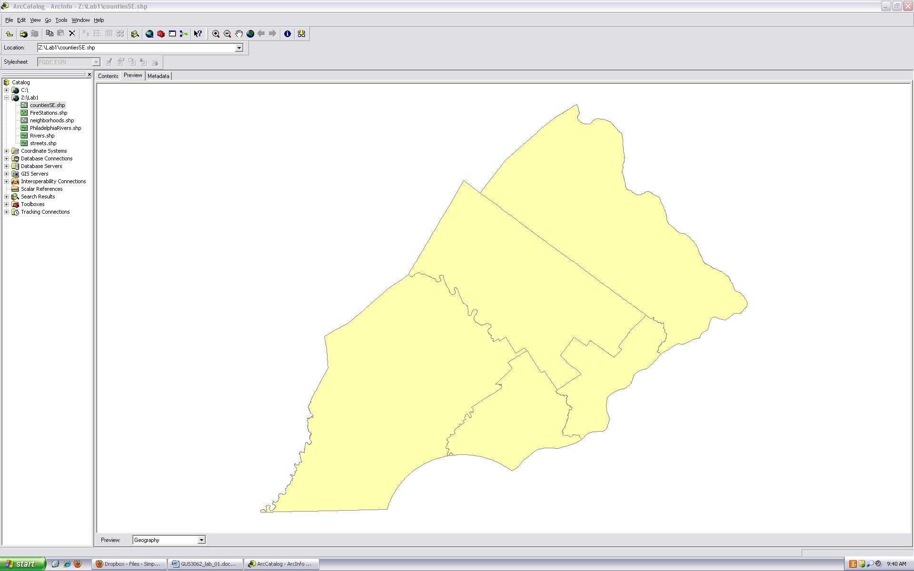
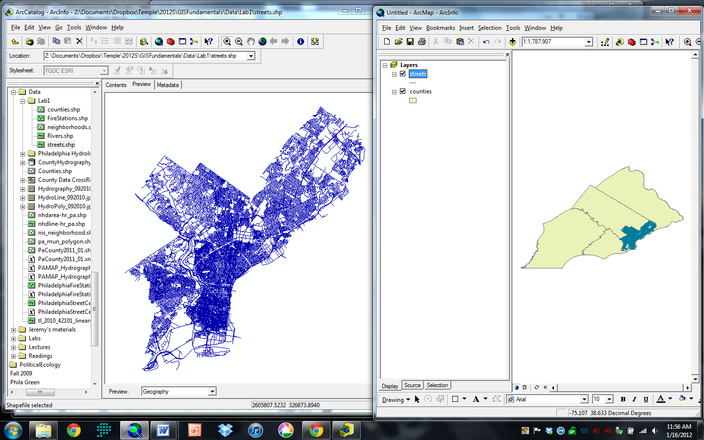
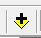
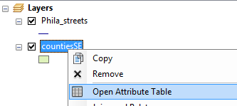
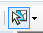
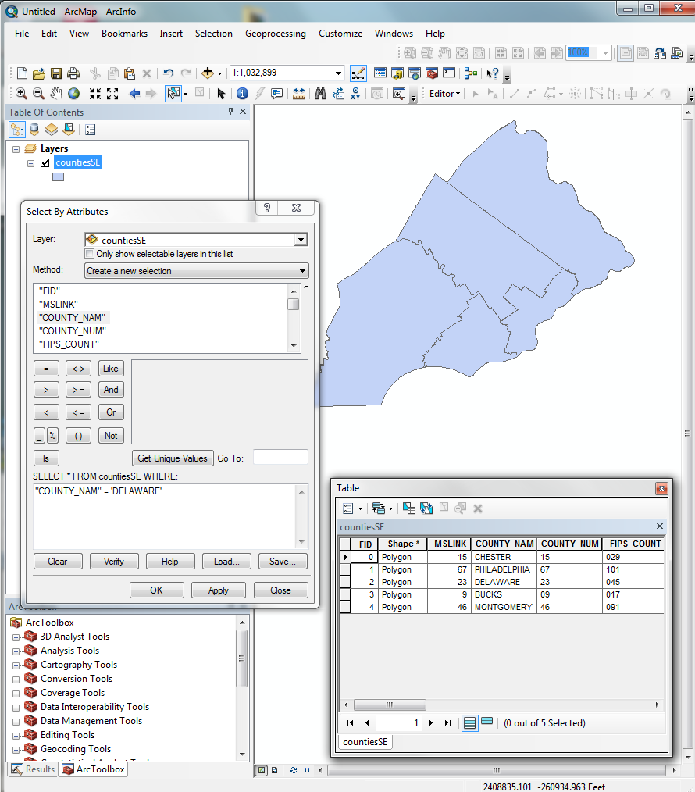

# Introduction to ArcGIS

## Version 1.1

Purpose of the lab: To introduce the ArcGIS software package and its basic data management, display, and analysis components.

# Exploring ArcCatalog

ArcGIS is composed primarily of two individual applications: ArcCatalog and ArcMap.  Open ArcCatalog by double clicking the ESRI ArcGIS Applications icon on the top right of the screen and then double click ArcCatalog.  Maximize the ArcCatalog window.

ArcCatalog is used for data management.  It is similar to a file manager ("My Computer" in Windows) but is customized for managing geospatial data.  On the left side of the screen folders and data files appear.  On the right side of the screen information about individual data files appear.

Click the "Connect to Folder" button with the yellow arrow pointing to the right, and navigate to `S:\GUS_3062_Pearsall` and click OK.  This directory will appear as a folder on the left side of the window.  This folder contains all the data for the course labs.

Every time you begin a new lab, you will need to "Connect to Folder" to access the data for the lab. Please make a note of this step!

Once you are connected, navigate to the `Lab_data` folder, then the `Philadelphia_only` subfolder using the Catalog Tree on the left-hand side of ArcCatalog. You will be able to see all of the files in the main ArcCatalog window.  Note the different graphic symbols for different types of files.  The files are point, line, and polygon files in the shapefile format.  As you will see, most GIS data are encoded geometrically as sets of either points, lines, or polygons.  We will learn more about different file formats later.

Now expand the `SE_Pennsylvania` folder on the left hand side window and select `countiesSE` file by clicking once on the file name in the Catalog Tree.  Note the three tabs on the top right side of the window. Click on the "Contents" tab.  On the right side of the window it now shows the name and type of the file.  Note that this is a polygon shapefile, a type of spatial data file format.

Click on the "Preview" tab.  You should see a map of the southeastern Pennsylvania counties appear on the right side of the window, like this:

This is the spatial data part of the shapefile, displayed as a map.  At the bottom of the right side of the window there is a drop down menu labeled "Preview" with the item "Geography" selected.  Change this selection to "Table".  Now, you see the attribute data part of the shapefile, displayed as a table.  Scroll to the right to see the full table.  Note that each row in the table represents one county.

Now bring up the Geography Preview of the `Phila_streets` shapefile, located in the `Philadelphia_only` folder.  This is a line shapefile.  Zoom in for a closer look at certain areas by using the "Zoom In" button with the magnifying glass and the "+" on it.  Use the three buttons to the right of the "Zoom In" button to zoom out, pan, and go back to the full spatial extent of the shapefile.

Now bring up the Geography Preview of the `Phila_firestations` shapefile.  This layer contains point data.

These data layers have been downloaded from the Pennsylvania Spatial Data Access (PASDA) website: <http://www.pasda.psu.edu>

Navigate to the PASDA website, select the "Download Data" tab, and begin to explore the different types of data layers. Use the search tool to find the layers for Philadelphia. Take a few minutes to explore a few of the data layers, including the description and metadata.

# Displaying Data in ArcMap

ArcMap is for displaying and analyzing spatial data.

From ArcCatalog you can launch ArcMap. Press the button with the magnifying glass on a picture of the earth on it.  Press OK to start with a new empty map. The left side of the ArcMap window is the "Table of Contents" where you view the names of loaded data files; the right side is the view window.

Arrange your screen so you can see ArcCatalog and ArcMap simultaneously.  Drag and drop the `countiesSE` shapefile by selecting and dragging the file name from the Catalog Tree in ArcCatalog into the view window of ArcMap.  Now do the same for the `Phila_streets` shapefile.  Your screen should look something like Figure \ref{figure}.

In ArcMap, turn the streets layer off and on by clicking on the check mark in the Table of Contents. The order of the shapefiles in the Table of Contents determines the order in which they are layered in the view window.  Click the List by Drawing Order button at the top left of the Table of Contents. (Note, this is the default for new projects and will probably already be selected, but over over the button to confirm that it says List by Drawing Order.) With both shapefiles turned on, drag the counties shapefile above the streets in the Table of Contents.  See how the streets shapefile is visually obscured in the view window by the counties.

Remove the streets shapefile from ArcMap by right clicking it and choosing "Remove". 

You can also add layers in ArcMap by selecting the Add Data button  from the tool bar in ArcMap. Use the Add Data button to add the streets layer back to ArcMap. 

# Selection in ArcMap

You can retrieve attribute data for any feature in a spatial data layer by using the Identify tool . This tool allows you to ask the question "What attribute is in this location?" Click on the blue "i" button in the tool bar and then click on any county to retrieve information on that county.

The spatial data and attribute data are linked together.  Open the attribute table for the `countiesSE` shapefile by right clicking the `countiesSE` name in the Table of Contents and choosing "Open Attribute Table".

 

Arrange your windows so you can see the counties map and attribute table at the same time.  Choose the "Select Features" button  and click on a county in the view window.  The county's outline should turn blue, indicating it has been selected, and the appropriate row in the attribute table should also turn blue.  Select multiple counties in the view window by clicking and dragging a box around counties in the countiesSE shapefile with the "Select Features" button.  Likewise, you can select a row in the table by clicking on the far left of that row, and the appropriate county in the map will also be selected.

Selection can also be by an attribute query.  An attribute query allows you to ask the question "What locations have this attribute?" 

Click the "Select by Attributes" button at the top of the Table window to open a dialog box. 

By double clicking the words and buttons in the calculator-like interface enter the expression `"COUNTY_NAM" = 'Delaware'`. You can type this in directly, but you can also use tools in the dialog to build the expression with the mouse. First, double-click on `"COUNTY_NAM"`. Next, double-click on the equals sign. Next, select the "Get Unique Values" button and all of the county names will be entered in the box directly above the button. Double-click on `'Delaware'`. Your screen should look something like Figure \ref{attributes}. Press the "Apply" button.  Now, Delaware County is selected.

You can also create a compound query by using `OR` and `AND`. For example, try the expression `"COUNTY_NAM" = 'Delaware' OR "COUNTY_NAM" = 'Bucks'` to select those two counties. Multiple `OR`s can also be combined by using the `IN` keyword. The same result could be achieved with `"COUNTY_NAM" IN ('Delaware', 'Bucks')`. For a long list, using the `IN` keyword leads to an expression that is more succinct and more easily understood.

To show only those counties that are selected, press the Show Selected Records  button at the bottom of the window.

Close the "Select by Attribute" and the Table windows. Clear your selection by going to the "Selection" menu item in the main ArcMap window and choosing "Clear Selected Features" from the drop down menu.

Selection can also be performed using a spatial query. Add the `RiversSE` shapefile from the `Lab_data` folder to ArcMap.  Using an attribute query, select those rivers where `"FNAME" = 'Cobbs Creek'`.

Next, go to the "Selection" drop down menu and choose "Select by Location".  Choose the drop down list options as shown in Figure \ref{location}

Please be sure that the "Use selected features" box is checked under RiversSE.

Press the "Apply" button.  Only those counties that are spatially coincident with, or spatially intersect, Cobbs Creek, are now selected.

Clear your selections and close the spatial query window. Remove the Rivers shapefile.

# Controlling Symbology in ArcMap

Right click (or just double-click) the `countiesSE` shapefile and choose "Properties" from the drop down menu.  Click on the "Symbology" tab.  Change the color of the counties by clicking on the large colored button and choosing a different color, then clicking OK back through the two windows.

Open the Layer Properties→Symbology window again.  This time, click on the word "Categories" on the left side of the window and select "Unique Values".  Go to the "Value Field" drop down list and choose `COUNTY_NAM`.  Then press the "Add All Values" button.  Click OK.  The map should now show a unique color for each county.  Press OK.

# ASSIGNMENT

## Objective

For this assignment, assume you are an urban farmer interested in finding a greened vacant lot to convert into a farm near your home or near Temple. Your home is located in Council District #2, and Temple is located in Council District #5.  The objective of this assignment is to identify zipcodes in Philadelphia in Council District #2 and #5 that contain greened vacant lots.

## Deliverables

You should turn in a report in the style detailed in the course syllabus.  This report should provide information that meets the above objective.  The report should provide the following:

1. A separate list, for each Council District, of the 5-digit zip code that has greened vacant lots in the Council District.  
2. A map distinguishing those zip codes in Council Districts #2 and #5 that contain gardens from those that do not.  

## Getting Started

Consider the kinds of data layers you will need to complete this assignment (i.e. council districts, zipcodes, and greened vacant lots), and add the layers to ArcGIS.

You should perform this analysis by using the GIS operations you used in the exercise portion of the lab above (e.g. selection).  Do not simply "guess" the answer by graphically displaying the vacant lots and zipcodes on the screen without performing any GIS operations.  Based on the lab exercise instructions, think about what operations you will need to perform to meet the objective of the assignment. You do not need to use ArcToolbox for this assignment.

There are three general operations you should perform:

1. Select Council Districts #2 or #5. Hint: Use the Dist_Num attribute (a select by attribute operation)
2. Select those vacant lots that intersect the selected Council Districts (a select by location operation)
3. Select those zip codes that intersect those vacant lots (a select by location operation)

Please note that you will have to repeat this series of steps to generate one list for each of the Council Districts, as well as one map that displays all selected zipcodes simultaneously.

Additional notes: For your final map, you can export your map as a .jpg and insert the map into your Word document. Go to the File menu and select Export Map. Browse to the location for your map to be saved (e.g. your flashdrive), give your map a name, and choose the "save as type" to be JPEG (.jpg). Once your map has exported, you can return to your Word document, choose insert, select your .jpg, and insert the file into your lab report.

## Requirements

1. Analysis: 
    * Report includes correct list of zip codes for each Council District.
    * Report describes correct approach for identifying zip codes for each Council District.
2. Writing: Report thoroughly addresses all sections, employs appropriate technical language, and is free of grammatical mistakes.
3. Figures: Final map displays zip codes in Philadelphia that have gardens in Council Districts #2 or #5.
