Introduction to Raster GIS
==========================

Version 1.0
-----------

Purpose of the lab:

-   To introduce basic features and manipulation of raster data and to integrate vector and raster operations.

Tutorial
========

Get Your Data
-------------

The data should previously have been copied from the course network drive. Raster data formats often use entire folders. The files we will be using (all in the `Lab_data` folder heirarchy) are:

-   For the tutorial:
    -   `NED` (folder)
    -   `landuse06` (folder)
    -   `impervious` (folder)
    -   `SE_Pennsylvania\sch_districts_utm.shp`
    -   `SE_Pennsylvania\rivers.shp`
-   For the exercise, as above plus:
    -   `Philadelphia_only\neighborhoods_NAD.shp`
    -   `Philadelphia_only\Phila_rivers.shp`

The `NED` and `landuse06` data were downloaded from the USGS server: <http://viewer.nationalmap.gov/viewer/>.

The `NED` raster grid is an elevation data set in which each grid cell encodes the elevation in meters above mean sea level.

The `landuse06` raster grid is a land cover data set derived from Landsat satellite imagery collected in 2006. Each grid cell encodes a land cover classification. Each pixel represents the landcover in the area contained within the pixel. For this imagery, each pixel has a spatial resolution of 30m.

The `impervious` raster grid is an impervious surface dataset derived from Landsat satellite imagery collected in 2006. Each grid cell encodes the percentage of impervious surface in the area contained within the pixel. For this imagery, each pixel has a spatial resolution of 30m.

Review the associated metadata files by opening them from My Computer. By default, if you double click on the file that ends in `_meta1.html` in My Computer (*not* in ArcCatalog), the file will automatically open in the default browser. For the `landuse06` data this file is named `57493839_meta1.html`. After opening it, click the Entity\_and\_Attribute\_Information link, which explains the land cover classification.

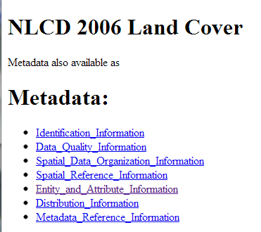 

Turn on Spatial Analyst
-----------------------

ArcGIS can handle both vector or raster data, but many of the tools for working with raster data are located in an extension. Extensions in ArcGIS enable more analytical capabilities than the “core” desktop version. For this lab, you are going to work with the Spatial Analyst Extension.

Launch ArcMap. Select the menu Customize→Extensions. Check Spatial Analyst and Close. **Note:** Spatial Analyst may already be turned on, in which case you do not need to do anything but close the window:

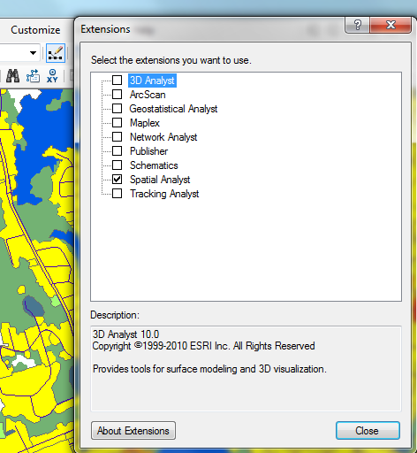 

Transform Coordinates to UTM
----------------------------

In ArcCatalog, transform the coordinates of all files into UTM18N. First begin with the shapefiles (**if necessary!**—remember that you have transformed some of these inputs in previous lab exercises). Remember to first check the coordinate system by examining the properties. If the coordinate system says “unknown,” use the Define Projection tool to first define the projection as NAD1983. Next, use the Project tool to transform the coordinates into UTM18N. If the coordinate system is in a system other than UTM18N (e.g. PA State Plane), use the Project tool to project the coordinates into UTM18N.

You can also transform your grids (raster data) to UTM zone 18N using a similar approach. Check the properties of the three grids (`impervious`, `NED`, and `landuse06`) in ArcMap or ArcCatalog. Right-click the file in ArcCatalog or the layer in ArcMap to check the properties. If using ArcMap, make sure you are on the Source tab. Then scroll down to the Spatial Reference.

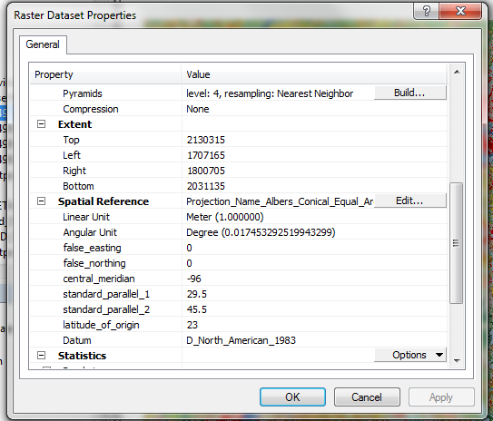 

You will note that they all use the NAD1983 *datum* but are in different *coordinate systems*.

Transform the grids to UTM18N by going to ArcToolbox→Data Management Tools→Projections and Transformations→Raster→Project Raster.

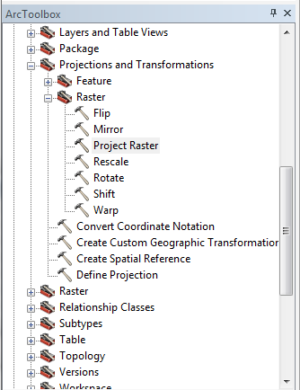 

The steps to reproject a raster are similar to the steps to reprojector vector data (such as shapefiles) as you have done in previous exercises. Please note that grids cannot have more than 13 characters in the file name. Be sure to give your files a meaningful name that is less than 13 characters, such as `ned_utm`, `imp_utm`, `lu06_utm`.

Make sure that the output cell sizes (the X and Y input boxes) are 30 (see below). This is the default for the `impervious` and `landuse06` data, but not the elevation (`NED`) raster. Note also that you can set this value directly in the X and Y input boxes. You do *not* need to use the “Output Cell Size (optional)” dropdown. This dropdown lets you select a raster as the source of the output cell size. You might do this, for example, if you want the cell size of one raster to match that of another raster after reprojection.

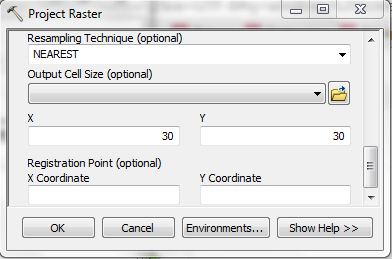 

Masking a Grid
--------------

Masking a grid is analogous to clipping a grid to the boundaries of another data layer, evoking the example of using a cookie cutter to clip the grid. Here, you will mask the `ned_utm` and `lu06_utm` grids to the boundary of the Council Rock School District.

Launch ArcMap and add the `sch_districts_utm.shp` shapefile and the `ned_utm` and `lu06_utm` raster grids (or whatever name you gave them).

Select the Council Rock School District from `sch_districts_utm.shp`.

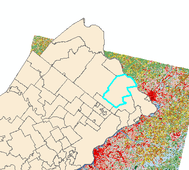 

Go to ArcToolbox→Spatial Analyst Tools→Extraction→Extract by Mask. Set the following parameters

-   **Input raster:** Enter the grid you wish to clip (`lu06_utm`).
-   **Input raster or feature mask data:** Enter the layer you wish to use as your “cookie cutter”. *If you want to clip to a selected feature, make sure to select the layer from the dropdown of loaded layers.* If you select a layer from the file menu, it will clip to the extent of the entire layer because features selections are *not* stored in the underlying data.
-   Output raster: Enter the name of the grid you are about to create on your flash drive or working folder (make sure it is no more than 13 characters with no spaces or spaces in the name of the grid).

Once the tool has completed, add the new file to ArcMap. If you see a message about building pyramids, click “no.”

Repeat this process to clip the NED raster grid to the boundaries of Council Rock School District. You should now have both elevation (NED) and Land Use clipped to the school district boundaries.

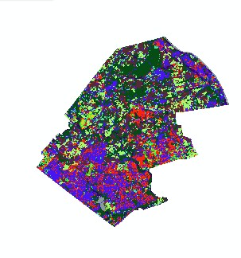 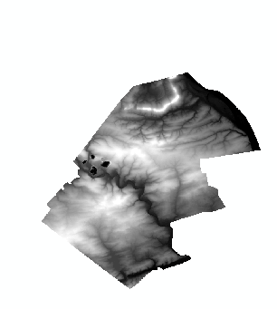 

For the remainder of the tutorial part of the lab, use these new grids that are clipped Council Rock School District.

Create a Hillshade
------------------

A hillshade is a grid that encodes a hypothetical reflectance value off an elevation surface given the position of a virtual light source. It allows for the visual representation of the terrain as though you were viewing the surface from an airplane.

Explore your elevation data by zooming in closely to certain areas and using the Identify tool to retrieve elevation values (of the square cells). What do those numbers represent? What are the units?

To make your hillshade, go to ArcToolbox→Spatial Analyst Tools→Surface→Hillshade. Input the following settings:

-   **Input raster:** Use your clipped elevation grid.
-   **Output raster:** Use the name `hillshade`. Make sure to save this to your flash drive or working folder.

Leave the other defaults and click OK. Add the resulting data to the map. Add the `rivers` shapefile to help you to interpret the hillshade. The rivers should appear to be in “valleys” suggested by the visual display of the hillshade.

You might note the four craters in near the western border of the Council Rock School District. Can you guess what they are? You can search for `"Council Rock School District"` in Google Earth or the satellite view of Google Maps. Zoom out until you see the areas that correspond with the craters in your map.

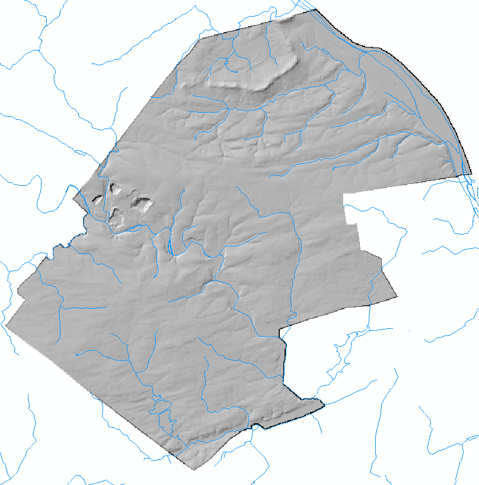 

You can also exaggerate the vertical height to improve the visualization of the terrain. Perform another hillshade but this time change the Z factor to 2 or 3. Experiment with other parameter changes in the hillshade, including the virtual location of the light source by tweaking Altitude and Azimuth settings. Examine the effects of changing parameters on the resulting hillshade layer.

Visualizing Terrain
-------------------

Impressive visualizations of terrain can be easily generated by using the elevation and hillshade grids together. Turn off everything except the elevation and your preferred hillshade grids from your experiments in the last section.

Open the Layer Properties for the elevation grid and select the Symbology tab. (Notice how it differs slightly from the Symbology tab for vector layers that we have been working with in previous lab exercises.) Choose a multi-color color ramp like the one shown here:

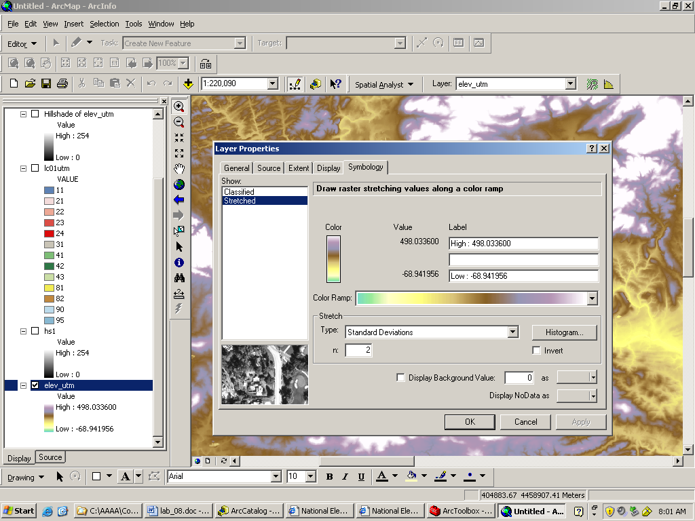 

Now open the Layer Properties for the `hillshade` grid and go to the Display tab. Change the transparency to 30%. Close the Properties dialog, and in the Table of Contents, move `hillshade` above the elevation layer, if it is not already on top. Your display should now look like this:

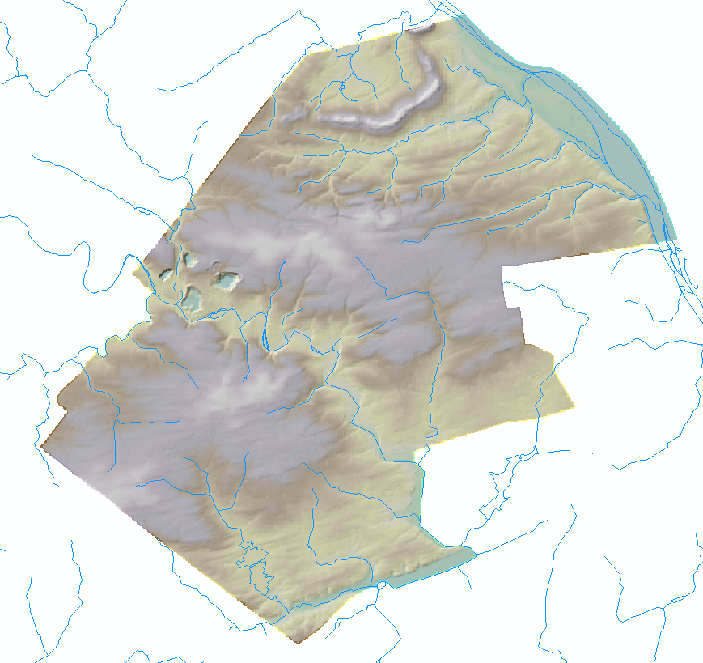 

You can also add land use in the mix. Add the clipped land use layer and move it between the hillshade and elevation grids in the Table of Contents. Experiment with different transparency settings. (Start with land use transparency 40% and hillshade transparency 50%).

Try displaying only the developed area in the land use grid to show where the cities are in relation to the elevation information. You can change this setting in the Symbology tab of the land use Layer Properties. Remove all of the existing values, and add back *only* the value for “Developed, High intensity”, which is encoded as value 24.

Calculating slope
-----------------

The slope operation allows you to derive slope from elevation. Slope is calculated as rise over run, or the gradient of change in elevation, and can be measured in degrees or percent.

Go to ArcToolbox→Spatial Analyst Tools→Surface→Slope. Enter the following settings:

-   **Input raster:** Use the clipped elevation grid
-   **Output raster:** Name your grid `slope`. Make sure to save it to your flash drive or working folder.
-   Leave the output measurement as the default (degree).

Examine the resulting slope grid. Overlay the rivers shapefile. What do you note about the locations of steep slopes in the Council Rock School District?

Performing a Zonal Function to Summarize Slope by Land Use
----------------------------------------------------------

A zonal function allows you to summarize the values of raster grid cells in zones specified in a second file. The zone file can be a raster or vector format. In this exercise, you will calculate the average slope by land use category in the Council Rock School District.

Go to ArcToolbox→Spatial Analyst Tools→Zonal→Zonal Statistics as Table and enter the following settings:

-   **Input raster or feature zone data:** Use the clipped land use layer
-   **Zone field:** Should default to Value, since this is the only data associated with this raster. Note that if you were using a vector data set, you would have to specify the column that uniquely identifies each each zone, such as the actual ZIP Code column in a shapefile of zip codes.
-   **Input value raster:** Use the clipped elevation grid
-   **Output raster:** Name the output `lu_elev`. Make sure to save it to your flash drive or working folder.

The zonal function generates a table in which each record is a land use and the fields contain information on various aggregate functions such as the minimum, maximum, range, mean, standard deviation, and sum (which is not applicable here) of the slope values for each land use. To see the table you must click on the source tab at the bottom of the Table of Contents.

Which land uses have the steepest slopes? The flattest slopes? Remember that the Value columnencodes the land use categories. You can refer to the metadata that you opened at the beginning of the lab to see what value codes refer to what land use.

ASSIGNMENT
==========

Objective
---------

The objective of this assignment is to identify neighborhoods that might be key contributors to stormwater runoff in Philadelphia. These key neighborhoods will have the following characteristics:

1.  a high mean percentage of impervious surface cover (&gt;75%)
2.  low mean elevation (&lt;15m)
3.  intersect a river.

Deliverables
------------

Turn in a report addressing this objective. This report should include an introduction, methods, results, and conclusions section. The results should specify the names of each neighborhood that meet the criteria listed above. Your report should also include a well-designed map that highlights the neighborhoods that meet the criteria and a flow chart that documents the steps you followed. All coordinates should be in UTM.

Getting Started
---------------

To complete this assignment, you will need to use some of the new zonal operations introduced in this lab, as well as some of the vector operations that we have used previously during the semester (e.g. join by attribute, select by attribute, select by location). Think carefully about the data you will need to use: impervious surface, neighborhoods, rivers (note: for rivers, please use the `Phila_rivers.shp` rather than `rivers.shp`) and order of operations you will need to follow for the lab.

Grading Rubric
--------------

-   **Analysis**: Report describes the correct approach and includes the correct list of neighborhoods.
-   **Writing**: Report thoroughly addresses all sections, employs appropriate technical language, and is free of grammatical mistakes.
-   **Figures**: Report includes a well-designed map that displays the key neighborhoods and a flowchart to document the steps followed.

