Lab 1: Introduction to ArcGIS
=============================

**Purpose:** To introduce ArcGIS and its basic data management, display, and analysis components. You will learn how to work with map layers, query attribute tables and geographic features, and create maps.

Throughout the lab you will find questions which appear in boldface and are followed by a blank. Keep track of your answers, as you will submit them for evaluation, along with a map. These questions are repeated at the end of the document.

Exploring ArcMap 10
===================

Opening ArcMap and Adding Map Layers
------------------------------------

1.  Open ArcMap.
2.  The New Document dialog will appear. Click OK to begin with a blank map. **NOTE:** When you are starting with a new map, it doesn't really matter whether you close this dialog by clicking OK, Cancel, or the **X** at the upper right.
3.  Click the Add Data Button .
4.  In the Add Data browser window click 'Connect to Folder' 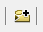
5.  Navigate to the location of the lab1 folder. Select the data folder lab1 and then click OK. **Note:** After you have connected to a data folder you will be able to connect directly to this folder in the future without having to repeat this step.
6.  Double click the census folder and inside the census folder select NJ\_Cities, NJ\_counties, NJ\_tracts\_NAD, and Passenger\_Railroad\_Lines\_in\_New\_Jersey. Hold the Ctrl key down to select more than one file.
7.  Click Add. The files now appear as map **layers** in ArcMap's Table of Contents. These layers include the three kinds of **vector** data: **points** (NJ\_Cities), **lines** (Passenger\_Railroad\_Lines\_in\_New\_Jersey), and **polygons** (NJ\_counties, and NJ\_tracts).

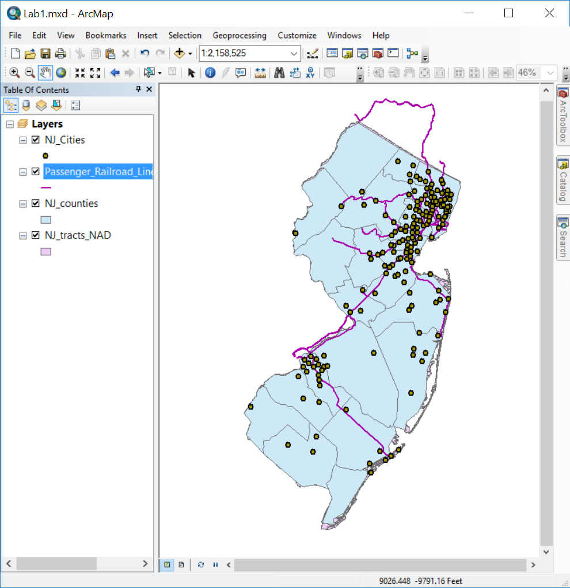 

> **Table of Contents (TOC)**
>
> The left panel of panel in ArcMap is called the "Table of Contents". The TOC lists all the map layers found in the map window and shows what the geographic features in each map layer represent (points, lines, polygons, images, tables). The table of contents helps you manage the display order of map layers and symbols used to represent layers, as well as set the display and other properties (e.g. colors, line thickness) for each map layer. It is also the place where you can easily see the drive paths where your files are physically located on the computer (e.g., C:\\temp\\mygisfiles). \*\*It is very important to remember where your files are located when you are working on a GIS project. In a GIS environment you will be doing a lot of data processing which requires the creation of new files, which must be saved.

Working in the Table Of Contents
--------------------------------

At the top of the TOC is a toolbar that controls how the layers are listed, and what you can do to them. You can hover over the buttons to see tooltips for their function:

-   List By Drawing Order
-   List By Source
-   List By Visibility
-   List By Selection
-   Options

In a new map, the List By Drawing Order button should be selected:

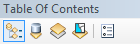 

1.  Select the List By Drawing Order button if it is not already selected (if, for example, you have done the steps out of order, or someone used this computer previously).
2.  Try changing the order of the map layers. Select a map layer (highlight) that you would like to change the order and drag it above or below another map layer. **What happens when you put the counties as the top layer?** \_\_\_\_\_\_
3.  Select the List By Source button.
4.  Note the drive location of the four map layers.

> **What are ArcMap documents? (.mxd files)**
>
> ArcMap documents (which have a .mxd extension) allow desktop users save and share their GIS project with other desktop users or reopen a project at a future time. After an ArcMap document is created and its various map properties are defined (map colors, projection), all of the properties of the GIS map are saved as part of the map document. Remember that the map document file (.mxd) only saves ArcMap document properties and the location of the map layers that are being used and does not save the physical Map/GIS files. The ArcMap document will only reference the location where the files are saved. If you move your Map/GIS files to a different drive path or folder and then open your project you will have to locate the files again.

Saving a Map Document
---------------------

1.  Click File, Save.
2.  Navigate to the lab1 folder and save the project as Lab1.mxd to C:\\lab1\\.
3.  Click Save.
4.  Close the ArcMap software completely.

Opening your ArcMap Document (.mxd file)
----------------------------------------

As with Microsoft Word or other Windows applications, if you have an existing map document, you can open it directly from the desktop. You do not have to have ArcMap already open.

1.  Find your map document file (Lab1.mxd) in File Explorer.
2.  Double-click the file to launch ArcMap and open your existing document.

Again, as with other Windows applications, you can open an existing map document from the File menu. The File menu will also list recently opened documents.

Do *NOT* attempt to open a shapefile by double-clicking in File Explorer. You cannot open shapefiles directly. You must read a shapefile using GIS software such as ArcMap.

Remove Map Layers from Map Document
-----------------------------------

1.  Right-click NJ\_tracts\_NAD TOC. From the popup menu, click Remove.
2.  Close ArcMap completely. Do not save your changes.

> **Organizing GIS data**
>
> One of the most frustrating parts of learning GIS is organizing your files and understanding where they are stored. You will find out in the next few weeks that whenever you perform spatial operations and/or geoprocess your data ArcMap creates new files. You need to stay organized (check you paths and know where the data is being stored). The faster you get this concept the quicker you will learn the more important GIS concepts.
>
> There are many different spatial data formats. Vector data (points, lines and polygons) are commonly stored in **shapefiles**. A shapefile is a simple, nontopological format (topology will be explained later this term) for storing the geometric location and attribute information of geographic features. Geographic features in a shapefile can be represented by points, lines, or polygons.
>
> The shapefile format defines the geometry and attributes of geographically referenced features in three or more files with specific file extensions that should be stored in the same folder. Each file must have the same base name in order for ArcGIS to recognize them as part of the same spatial layer, for example, roads.shp, roads.shx, and roads.dbf.
>
> The following are common shapefile extensions. The first three (.shp, .shx, .dbf) are **required** by the shapefile standard:
>
> -   .shp—The main file that stores the feature geometry; required.
> -   .shx—The index file that stores the index of the feature &gt; geometry; required.
> -   .dbf—The dBASE table that stores the attribute information of features; required.
> -   .prj—The file that stores the coordinate system information. **All** spatial data use **some** CRS (coordinate reference system), but shapefiles are sometimes distributed without the PRJ file. How to deal with that will be demonstrated in a future exercise.
> -   .sbn and .sbx—The files that store the spatial index of the features.
> -   .xml—**Metadata** ("data about data") for ArcGIS—stores information about the shapefile, such as the source of the data, accuracy, publication date, time period, etc.

Copying Shapefiles between Folders
----------------------------------

This section aims to show you that shapefiles are composed of many files that you must transport all together in one group to another location. Additionally, it is important to note where all of the files are stored for each project that you work on.

1.  Open File Explorer in Windows. This can be accessed from the Start Menu, or by clicking This PC on the desktop. But the fastest way to do this is to hit `Win` + `E` on the keyboard.
2.  Navigate to the census folder from lab1. Open the folder and examine the NJ\_counties shapefile. There should be 8 files with the base name NJ\_counties.
3.  **What file extensions are part of the NJ\_counties shapefile?** \_\_\_\_\_\_
4.  Create a new folder within the lab1 folder. Call it 'newcensus'
5.  Select and copy *all* of the NJ\_counties files and paste these files into the 'newcensus' folder.
6.  Open the ArcMap software and add the NJ\_counties shapefile from the 'newcensus' folder to ArcGIS (use the + data button)
7.  Go back to File Explorer and copy the other files (NJ\_Cities, NJ\_tracts\_NAD, Passenger\_Railroad\_Lines\_in\_New\_Jersey) from the census folder to the 'newcensus' folder
8.  Add these files to the map
9.  Save your map document (project) as Lab1v2.mxd. **Always take note of where you are saving files and projects.**
10. Close ArcMap completely.

> **ArcCatalog**
>
> While it is handy to move GIS data using File Explorer, in the next few weeks you will also learn how to more efficiently move files using ArcCatalog. This is a separate application that, like ArcMap, is part of ArcGIS. It is like a File Explorer for geospatial data, and is used to organize and manage various types of geographic information as logical collections—for example, the data, maps, and results of your current GIS project that you work with.

Repairing Broken Data Links
---------------------------

ArcMap should be closed when you begin this section. Your lab1 folder should have a map document named Lab1.mxd which is linked to data in the census subfolder. We are going to break that link and learn how to repair it.

We are going to break the link by renaming the data folder. It could also be broken by moving the data to a new folder. If you don't have relative paths set (see next section), it can also be broken just by plugging your flash drive into a new computer and having it mount on a different drive letter. All of these are very common occurrences, so it is very likely that you will encounter the a broken data link when working with GIS.

1.  In File Explorer, rename the census subfolder to "~census" (that is, add a tilde at the front of the folder name). You can do this by pressing `F2` on your keyboard or by single-clicking on the already selected folder.
2.  Double-click Lab1.mxd to open ArcMap. Notice that the map canvas is empty, and all of the layers have a red exclamation mark next to them. This indicates that a layer is defined in the map document, but the source data is not at the expected location. Any layer properties, such as the color of polygon features, are preserved, even if ArcMap can't find the polygons to display!

    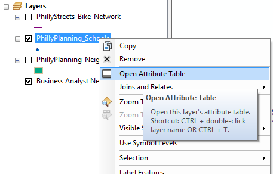 
3.  Right-click on any of the layers in the TOC. From the popup menu select Data → Repair Data Source….
4.  Navigate to the correct shapefile for the layer you clicked on. Select it and hit the Add button.
5.  Notice that ArcMap has repaired the link for not just that layer, but for all the other layers as well. The Repair Data Source feature will check whether other map document layers come from the same data source. In this case, since all of the shapefiles are in the same folder (~Census), all of the data links were repaired.
6.  Close ArcMap ***but do not save your changes***.
7.  Restore the folder name; that is, remove the tilde from the front so the folder is now just named census again.

There is another way to repair a broken link, which involves going into the Layer Properties and changing the path in the Source tab. This would have to be done once for each layer, and is usually less convenient. More information is available at "[Repairing broken data links](http://desktop.arcgis.com/en/arcmap/latest/map/working-with-layers/repairing-broken-data-links.htm)".

Using Relative Paths
--------------------

A file location can be stored using an **absolute** or a **relative** path. In the real world, an absolute path would be a location specified in some address system, like "1801 N. Broad Street". A relative path would be a location specified to your current location, like "walk two blocks, turn left, walk three blocks, and go into the third building on the right".

When you add geographic layers and tables to ArcMap and save the project (.mxd), the software does **NOT** store the data. It stores the *paths* to the data. When you use absolute paths, the data must be at the exact same location in the filesystem. If you work on a lab computer and store your map document and data in C:\\temp\\mystuff, but go home and copy the data to C:\\other\_folder\\mystuff, ArcMap will not find the data, even though it is right there. If you work on a flash drive that is mounted as drive letter E:\\, but then go work on another computer (or even return to the same computer) that happens to mount the flash dirve as drive letter F:\\, ArcMap will not find the data. In order to make sure that you keep your map document connected to your data, you must:

1.  Use relative paths for the map document.
2.  Copy your map document (MXD) and data as a unit. This will be easiest if you keep the data in the same folder as or an immediate subfolder (perhaps named "data") of the map document.

Relative or absolute paths is a property of the map document, so you may choose to have some that use relative paths and some that use absolute paths.

Check the path settings as follows:

1.  Reopen your Lab1v2.mxd map document.
2.  Click File → Map Document Properties.
3.  Confirm that "Store relative pathnames to data sources" is checked. Do not make any changes.

    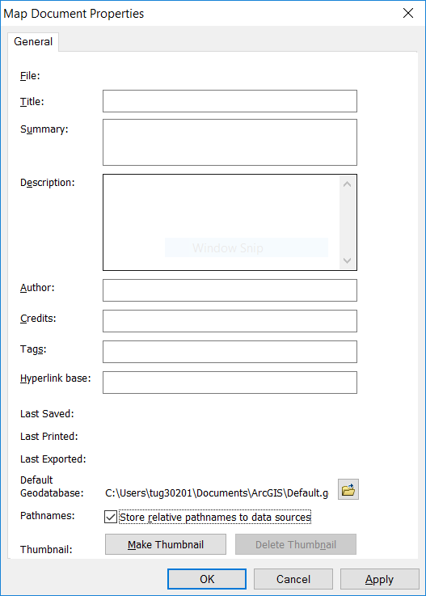 
4.  Close the dialog.

Usually, working with relative paths is preferable, and *the Temple CLA computers are set to use relative paths by default*. If you uncheck the box (i.e., tell ArcMap to use absolute paths), it will only apply to that document.

-   If you install ArcGIS at home, the default will be to use absolute paths. See [Setting ArcMap options](http://desktop.arcgis.com/en/arcmap/latest/map/working-with-arcmap/setting-arcmap-options.htm) in the ArcGIS Desktop online help for information on how to make relative paths the default for all new map documents.
-   See [Paths explained: Absolute, relative, UNC, and URL](http://desktop.arcgis.com/en/arcmap/latest/tools/supplement/pathnames-explained-absolute-relative-unc-and-url.htm) for more information on this topic.

Changing the Symbology of Map Layers
------------------------------------

In ArcGIS it is very easy to change the colors and symbols of map layers. Let's try changing the color and symbols of the map layers in your Lab1v2 map document

### Change County Color

1.  Double click the NJ\_counties layer in the TOC. (You can also right click on the layer and select Properties from the popup menu.)
2.  Select Symbology.

    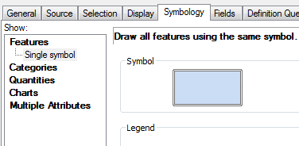 
3.  Click the symbol.
4.  Select 'fill' color and select a color from the color palette.
5.  Select 'outline' color and select a color.
6.  Click OK.

### Change Point Glyph (Symbol) and Color

1.  Double click the NJ\_Cities layer
2.  Select the circle symbol and change the color
3.  Click OK.
4.  *Save your map document (lab1v2.mxd)*

Using the Tools Toolbar to Navigate and Get Information
=======================================================

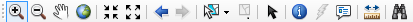 

ArcMap has many toolbars, which can be toggled on and off in the Customize menu. A default installation will start with the following two toolbars visible:

-   **Standard**---This has file management features and actions common to almost all Windows software, including opening and saving files, cut-copy-paste, and undo-redo. We have already used to add spatial data to our map document.
-   **Tools**---This has a number of tools commonly and specifically used for working with geospatial data. We will explore it now.

Zoom and Pan
------------

Using the 'zoom in' or 'zoom out' tool you can navigate to and from close-up views. The pan tool shifts the display in any direction without changing the scale of the map

1.  Try the zoom tools
2.  Try the pan tool

Full Extent, Previous Extent, and Next Extent
---------------------------------------------

The map extent tools allow you to navigate through map extents. A map extent defines the geographic boundaries for displaying map layers within a data frame.

**Try the different map extent tools.**

Identify Features
-----------------

The identify tool allows you to quickly get attribute information about a geographic feature. Let's try to get info about the counties.

1.  Select the 'Identify' tool and click on one of the Counties. The Identify window will appear
2.  If you are not getting info about the counties then you will need to change the "Identify from" layer in the dropdown at the top of the window.
3.  **What field names show up when you click on one of the counties?** \_\_\_\_\_\_
4.  Try using this tool on the other map layers.
5.  Note that when features are close together (as with the roads network), the Identify tool may select several nearby features. Zoom in until you can select one single road segment.

Measure Distances and Get Areas
-------------------------------

How big is New Jersey?

1.  Click the 'Measure' tool on the 'Tools' toolbar to open the Measure dialog box.
2.  When the measure menu opens, click on the units dropdown menu (its down arrow), select distance, and then miles.
3.  Finish measuring the distance---drag ruler tool the bottom left corner
4.  **How many miles long (north-south) is New Jersey?** \_\_\_\_\_\_
5.  **How many miles wide (east-west) is New Jersey?** \_\_\_\_\_\_

Working with Attribute Tables
=============================

Along with feature classes (points, lines, and polygons) and image datasets (referred to more generally as raster datasets) tables represent one of the three key dataset types in GIS. Tables are used to store descriptive attributes about geographic features (e.g., census data for counties or census tracts, disease counts by health district).

We will explore the table for NJ\_tracts\_NAD, the New Jersey Census Tract layer. ("NAD" is a type of map projection.)

Opening the Attribute Table
---------------------------

1.  Add NJ\_tracts\_NAD---Click Add Data , navigate to the census folder and add NJ\_tracts\_NAD.
2.  Place the NJ\_tracts\_NAD file on top of NJ counties.
3.  Right-click the NJ\_tracts\_NAD layer in the TOC and select 'Open Attribute Table' from the popup menu.

The table containing the records for the NJ\_tracts\_NAD should open

1.  The attribute fields appear at the top. Scroll across the table to view them all.
2.  Scroll down the table to view the records. Note the total number of records (rows) in the layer appears at the bottom (along with a count of how many are currently selected, which at the moment should be 0).
3.  **How many census tracts are there in New Jersey?** \_\_\_\_\_\_
4.  **What does FIPS refer to?** \_\_\_\_\_\_

Selecting Features
------------------

There are various ways to select geographic features in ArcMap. One way is to select features from the map and then examine the selected features in the attribute table. This could be helpful if you want a summary statistic from a specific geographic area. There are several ways to select features on the map.

The Tools toolbar in ArcMap contains a tool for graphically selecting features. The 'Select Features' tool works using a single graphic that you interactively digitize (draw) as part of the selection process.

### Labeling map layers and selecting census tracts by Rectangle

1.  Resize the NJ\_tracts\_NAD attribute table so you can see both the map and the attribute table
2.  Right click on NJ\_Counties and select "Properties"
3.  Click on the "Labels" tab and check the box next to "Label features in this layer" at the top and then make sure the "Label Field" is `NAME`. You can adjust the text symbol to your preferences.

    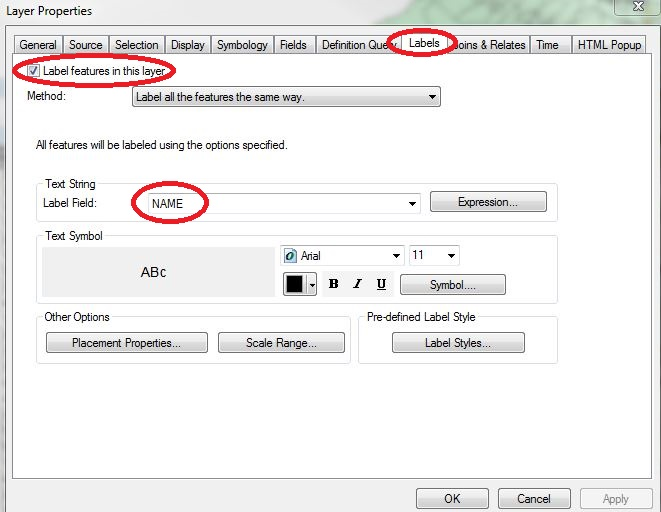 
4.  Click "OK" and your map should now display New Jersey county names
5.  Click the 'Select Features' button; click 'Select by Rectangle'

    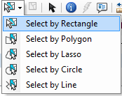 
6.  Using the cursor draw a rectangle around the County you think has the best name.
7.  Examine the highlighted records in the table (NJ\_tracts\_NAD)
8.  **How many records did you highlight?** \_\_\_\_\_\_
9.  To clear all of the selected records click the Clear Selected Features toolbar button (next to Select Features button) 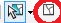.
10. To remove the labels, go back to the layer properties and uncheck "Label".

### Selecting records from an attribute table

A second way to select geographic features is directly from the attribute table. From a table, you can interactively select records with the mouse pointer, or you could select those records that meet some criteria (SQL query). Once you've selected records in the table, you'll see those features highlighted on your map.

Select the census tracts within county FIPS `001`:

1.  On the NJ\_tracts\_NAD attribute table select the `CNTY_FIPS` field, right mouse click and select 'Sort Ascending'
2.  Using the mouse pointer select the records (tracts) that have a County FIPS of `001`. You can hold shift key to select multiple records.
3.  Examine your map. Note that the features you selected are highlighted on your map.
4.  **How many records (census tracts) have the County FIPS of 001?** \_\_\_\_\_\_
5.  Clear the selection.

Getting Statistics for Selected Records
---------------------------------------

When exploring a table, you can immediately get statistics describing the numeric values in the columns. When you use the statistics tool you'll see how many values the column has, as well as the sum, minimum, mean, maximum, and standard deviation of those values. A histogram is also provided showing how the column's values are distributed.

Get statistics from the NJ\_tracts\_NAD attribute table:

1.  Right-click the heading of the field `Pop2005` on the NJ\_tracts\_NAD attribute table (population data 2005) and select "Statistics..."
2.  On the Statistics dialog box, you'll see information about the values in the field whose heading you clicked.

    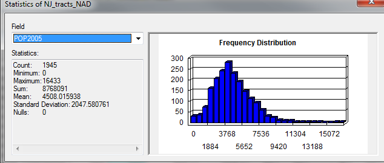 
3.  **What's the total population of New Jersey?** \_\_\_\_\_\_
4.  Click the Close button when you are finished exploring statistics.

Selecting Records with an Attribute Query
-----------------------------------------

The Query Attributes task helps users select or view certain data on the map based on that data's attributes. The Query Attributes task creates a single query on one map layer. However, the query can have compound criteria. For example, you can define a query on a cities layer that selects cities with a population greater than a value entered by the user and with a name that begins with a value entered by the user. It works the same way as a relational database like Microsoft Access.

> **Structured Query Language (SQL)** is a set of defined expressions and syntax used to query and manipulate data in relational database management systems (RDBMS).
>
> The American National Standards Institute (ANSI) defines a standard for SQL. Most RDBMSs use that standard and have extended it, making SQL syntax across different RDBMSs slightly different from one another.
>
> Query expressions are used in ArcGIS to select a subset of features and table records. Query expressions in ArcGIS adhere to standard SQL expressions.

Find all census tracts with a population less than or equal to 1,500:

1.  Open the NJ\_tracts\_NAD attribute table.
2.  Click the Table Options dropdown button  in the upper left, and choose 'Select by Attributes…'
3.  In the Select by Attributes dialog, note that the beginning of a standard SQL query appears above the lower text box: `SELECT * FROM NJ_tracts_NAD WHERE`. The `WHERE` keyword indicates that a criteria is about to specified. The database engine will use this criteria to **filter** the records, that is, to select only those records which satisfy the criteria.
4.  We will use a criteria to find only those tracts with a population less than or equal to 1,500. We can enter this criteria in two ways:
    1.  Double-click `Pop2005` in the upper listbox. Notice it appears in the lower textbox. Then Select the `<=` operator ("less than or equals"). Finally, type `1500` directly into the lower text box. ***Do not use commas in numeric values. I.e., do not type*** `1,500`.
    2.  Alternatively, you can enter the complete formula directly into the lower listbox: `"Pop2005" <= 1500`.

5.  Press Apply.
6.  81 records should have been selected
7.  **What's the Total Population for these selected records?**

> **Quoting in SQL**
>
> Standard SQL uses single and double quotes in very specific way. Double quotes are always used to indicate an **identifier**, such as a table name or column name. Notice that in the formula above, the field name is quoted using double quotes: `"Pop2005"`. What if you were trying to find a county with a particular name, such as Bergen county? In that case, you would have to quote the county name using single quotes. The criteria would look like `"NAME" = 'Bergen'`. Single quotes are always used to set off **strings** (that is, text values). If you left out the single quotes, ArcGIS would be unable to execute the query.
>
> Keep in mind that some IDs look like numbers but are actually stored as text. ZIP codes, Social Security Numbers, and the FIPS column in the NJ\_counties layer, are actually **strings**, and must be single quoted when using them in SQL statements.

Creating a New Map Layer from a Selection of Features
-----------------------------------------------------

Frequently a GIS analyst will want to work with a subset of a larger data set. If you were working on a project in one county, doing an analysis over the entire data set would be unnecessary, and for certain operations could be considerably slower. We are going to create a new selection of only those Census tracts in Somerset county (County FIPS `035`) and export it to a new shapefile.

You will have occasion to create new data files over and over again this term, and you must pay attention to where you are storing this data **every single time**. We are going to create a new data file using the Export Data menu, but you will create new data in many other situations, including many of the spatial analysis tools we will be using later this term. There are two ways that this can go horrifically wrong. ArcGIS tries very hard to get you to save your data:

1.  in the "Geodatabase" format; and
2.  in a default location on your local hard drive.

Additionally, it usually gives you stupid default layer names, like the thoroughly unhelpful "Export\_Output".

Therefore, if you don't pay attention when you do this step, you will end up with a layer name that is unintelligible in a format that you don't want in a location that you won't be able to find. Do not do this.

1.  Now that you know how Select by Attribues works, select all tracts in Somerset county with the criteria `"CNTY_FIPS" = '035'`. 62 records should be selected.
2.  Right-click the NJ\_tracts\_NAD layer. In the popup menu choose Data → Export Data….
3.  Change the "Save as type:" dropdown to Shapefile. The "Look in:" dropdown should change from "Default.gdb" to "Home - Document/ArcGIS". You still don't want to save your data to this location.
4.  In the "Look in:" dropdown, select one of your folder connections, and then navigate to the folder with your other New Jersey data ("census").
5.  Name your file FIPS035. Whether or not you leave `.shp` at the end doesn't matter. You have already specified the shapefile format, and ArcMap will automatically create the correct filename extensions.

    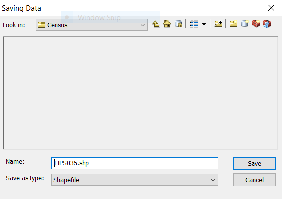 
6.  Click Save. You're actually not done yet, as this just pushes your settings to the Export Data dialog box. Click OK.
7.  A dialog box will appear asking whether you want to add your new layer to the current map. Click Yes. The layer will now appear in TOC.

Designing and Exporting a Map
=============================

In this section we will see how to create a map layout and export the map.

Working in Layout View
----------------------

We have been working in a view called "Data View", which is most useful for data exploration and analysis. When producing maps for export, we need to switch to "Layout View". In this view, you will see a representation of a page, and the map (or maps) will appear on that page. By default, the page will be a standard 8½ by 11 inch page in portrait view. In Layout View you can also add other elements, such as titles, textboxes, and legends. It is possible to place elements "off" the page (in an area known as the "pasteboard" in desktop publishing lingo). Anything not on the page will not be included on the map when you export the image, so it can be a useful place to store items during the design process when you are trying out different ideas.

1.  If it is not already open, reopen Lab1v2.mxd.
2.  Uncheck the tracts layer in the TOC. Make sure that the counties, rail, and cities layers are on the map and set to visible (checked). Make sure that the rail and cities layers are on top of the counties layer. Your canvas should looke something like this (your colors may be different):

    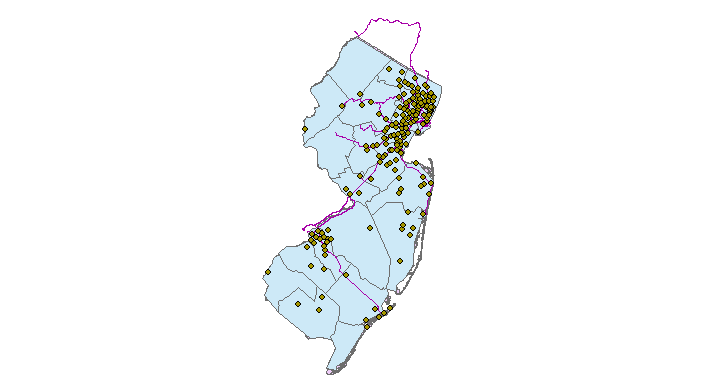 
3.  Switch to Layout View in one of the following ways:
    1.  Click the Layout View button in the lower-left of the map canvas:

    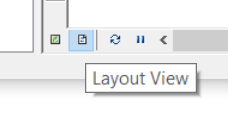 
    1.  Select View → Layout View from the menu.

4.  Notice that the Layout toolbar now appears. This toolbar has pan and zoom tools, similar to the ones you have used before, but these will zoom in to the *page*. Notice that each of these icons has a page behind it (e.g. magnifier on a page) to distinguish it from the pan and zoom tools on the Tools toolbar. Experiment with these tools to move around the page. When you are done, hit Zoom Whole Page (the fourth button on the Layout toolbar).

    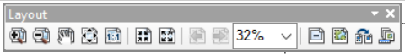 
5.  The pan and zoom buttons on the Tools toolbar can be used to resize the map image on the page. Use the Zoom In button 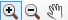 to make sure that New Jersey fills most of the data frame. Note that if you zoom in too far, parts of New Jersey will be "outside" the data frame, and will not appear on the page.
6.  Use the Insert menu to add the following elements:
    1.  Title---Should default to top center, can be repositioned.
    2.  Legend---A dialog will appear offering many options for customizing the legend. Just keep hitting Next until the legend appears on your map.
    3.  North Arrow.
    4.  Scale Bar.
    5.  Text---When the textbox first appears, it will probably be very small in the center of the page, so you may not see it at first. Zoom in to the layout (*not the map, make sure you use the right zoom button!*) if necessary. Edit the textbox to say "Map Designer: \[Fill in your name\]". Zoom to the full layout.

7.  Reposition the map elements to fill the whitespace. Try not to have any elements overlaying New Jersey. Your final layout may look something like this, but do *NOT* try to make it look exactly the same. Just make sure it has all of the requested elements:

    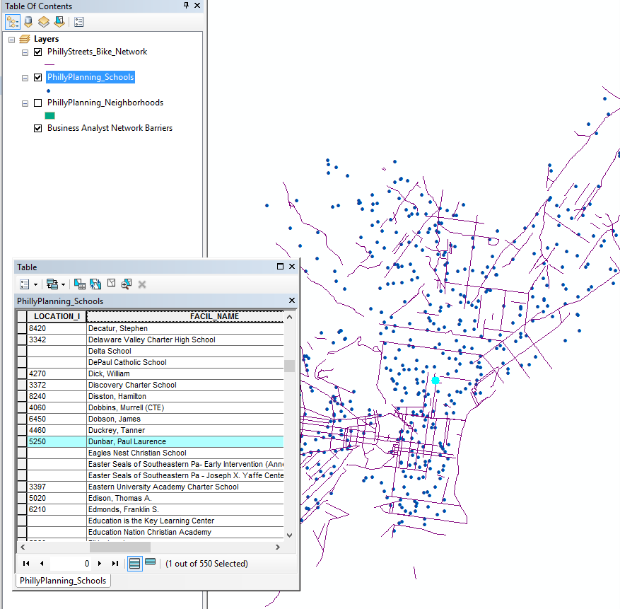 

Exporting a Map Image
---------------------

When you are satisfied with the map, you will export it using two different image formats, PNG and SVG. You will then visually compare these formats.

1.  Go to File → Export Map….
2.  Set the Save as type to "PNG (\*.png)".
3.  Navigate to your lab1 folder. *As always, be clear about **where** you are saving your files.*
4.  Hit Save.
5.  Open the Export Map dialog again.
6.  Set the Save as type to "SVG (\*.svg)".
7.  Confirm that you are still in the lab1 folder.
8.  Hit Save.
9.  Open Google Chrome (or any image viewer or web browser that you have installed on your computer).
10. Press `Ctrl` + `O` for "File Open". Open Lab1v2.png (or whatever you named your PNG export).
11. Use the `Ctrl` + `+` keys and `Ctrl` + `-` keys to zoom in and out on the image. What do you notice about the image quality as you zoom in?
12. Open Lab1v2.svg (or whatever you named your SVG export).
13. Use the `Ctrl` + `+` keys and `Ctrl` + `-` keys to zoom in and out on the image. What do you notice about the image quality as you zoom in? **What difference to you observe in the image quality between the PNG and SVG file formats? What difference do you observe in the file sizes?** \_\_\_\_\_\_
14. Completely close ArcMap.

ASSIGNMENT
==========

Submit your PNG image of New Jersey that you produced in the final section, as well as answers to the following questions, which you should have answered as your worked your way through the lab exercise:

1.  **What happens when you put the counties as the top layer?**
2.  **What file extensions are part of the NJ\_counties shapefile?**
3.  **What field names show up when you click on one of the counties?**
4.  **How many miles long (north-south) is New Jersey?**
5.  **How many miles wide (east-west) is New Jersey?**
6.  **How many census tracts are there in New Jersey?**
7.  **What does FIPS refer to?**
8.  **How many records did you highlight?**
9.  **How many records (census tracts) have the County FIPS of 001?**
10. **What's the total population of New Jersey?**
11. **What's the Total Population for these selected records?**
12. **What difference to you observe in the image quality between the PNG and SVG file formats? What difference do you observe in the file sizes?**

