**Learning Objective**

To introduce ArcGIS and its basic data management, display, and analysis components. To learn how to work with map layers, query attribute tables and geographic features, create maps, and design and execute a simple GIS analysis.  As a demonstration, you will map and analyze data from Philadelphia, Pennsylvania.

First, complete the tutorial by following the steps below.  Then, using the skills you've learned in the tutorial, complete the assignment given following the tutorial.

# TUTORIAL

## Acquiring the Data

1. Create a **workspace**, which is a technical way of referring to a project folder, the folder where you store your data files, including both inputs and outputs. Thus, when you see a reference to 'your workspace' here, you can think of it as "your Lab1 data folder". Using the term "workspace" is more concise, and when you become a more advanced GIS user, setting the workspace becomes an important part of automating complex processes.  If you have a flash drive, create a new workspace folder named 'Lab1'.  If you do not have a flash drive create a new folder in the Documents folder. (On the Temple lab computers, Documents is located at C:\\data\\Documents.) For future labs, create new workspace folders – Lab2, Lab3, etc.
2. Here we will acquire the following spatial data layers for the city of Philadelphia: schools, bike routes, and neighborhoods.  We will download data from **PASDA** (The Pennsylvania Geospatial Clearinghouse), which is an example of a **geoportal**, a website that collects geospatial data from many different sources organized around a particular theme or region of interest. Unsurprisingly, PASDA, hosts data related to Pennsylvania, and is maintained by Pennsylvania State University. PASDA hosts data provided by local governments, federal and state agencies, nonprofits, and academic institutions.
3. Go to [http://www.pasda.psu.edu](http://www.pasda.psu.edu).  Under SEARCH BY KEYWORD(S) enter 'Philadelphia' and press submit.
4. Find 2016 Philadelphia Planning - Schools, click on the link, press Download, which will download a file.
5. In addition to schools, find and download the following: 
    * 2016 Philadelphia Streets - Bike Network
    * 2016 Philadelphia Planning - Neighborhoods
6. You should have downloaded 3 files:
    * PhillyPlanning_Schools.zip
    * PhillyPlanning_Neighborhoods.zip
    * PhillyStreets_Bike_Network.zip
7. Notice all 3 files are .zip files, which is a single file that is composed of one or more individual files that have been compressed to a smaller storage size for convenience.  The lab computers will automatically save the zip files to the Downloads folder. Copy or move these files to your Lab1 workspace folder.
8. Unzip the archive. The lab computers have 7-Zip installed on them. In File Explorer, right-click the file and choose **7-Zip → Extract Here or 7-Zip → Extract to "folder_name"**.
9. Unzip each of the .zip files using the 7-zip application (or another appropriate application) and extract the files to your workspace folder.

## Opening ArcCatalog and Exploring Data

1. Open ArcCatalog.  You can navigate to ArcCatalog through the Start button at the lower left of the screen, then go to CAD and GIS, then ArcGIS.
2. Press the 'Connect to Folder' button. {height="0.167in"}
3. Navigate to the location of your Lab1 workspace folder and then click OK. **Note:** After you have connected to a data folder you will be able to connect directly to this folder in the future without having to repeat this step.
4. The workspace folder should now appear in ArCatalog in the catalog tree on the left.
5. In the catalog tree, navigate to your workspace folder and drill down in each folder so that you can see each spatial data layer you've downloaded, something like this:\
    {height="1.0in"}\ 
6. Each of these spatial data layers is a **shapefile**, which is a particular GIS file format.  There are other such formats, but shapefiles are very common. You'll notice different symbols for each type of layer.  Neighborhoods is a **polygon** layer, schools is a **point** layer, and bike network file is a **line** layer.
7. Click once on the neighborhoods layers and click on the Preview tab at the top of the view window on the right side of ArcCatalog so that the layer appears like this:\
    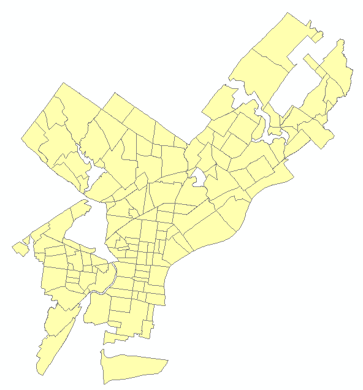{height="3.0in"}\ 
8. At the bottom of the view window, next to Preview: change the drop down menu from Geography to Table.  Now you see the attribute table for this layer.  Each row represents one polygon, or neighborhood, in the map.  The number of row, i.e. neighborhoods, appears at the bottom (148).
9. Scroll to the right to see the different columns (called 'fields').  Find the column with the heading 'Name'.  These are the names of the different neighborhoods.
10. Explore the map and attribute data for the schools and bike network data.

## Opening ArcMap and Adding Map Layers

1. Open ArcMap.  You can do this by clicking on the ArcMap button in ArcCatalog {height="0.167in"} or by opening ArcMap on its own from the CAD and GIS/ArcGIS folder.
2. The New Document dialog will appear. Click OK to begin with a blank map. **Note:** When you are starting with a new map, it doesn't really matter whether you close this dialog by clicking OK, Cancel, or the **X** at the upper right.
3. Click the Add Data Button. {height="0.167in"}
4. In the Add Data browser window click the 'Connect to Folder' button, navigate to your workspace folder, and press OK. 
5. Navigate into your workspace folder and add the neighborhoods, schools, and bike network data layers to ArcMap.
6. After adding the files, it should look something like this (the colors may be different):\
    {height="3.0in"}\ 

> **Table of Contents (TOC)**
>
> The left panel of panel in ArcMap is called the "Table of Contents". The TOC lists all the map layers found in the map window and shows what the geographic features in each map layer represent (points, lines, polygons, images, tables). The table of contents helps you manage the display order of map layers and symbols used to represent layers, as well as set the display and other properties (e.g. colors, line thickness) for each map layer. It is also the place where you can easily see the drive paths where your files are physically located on the computer (e.g., C:\\temp\\mygisfiles). **It is very important to remember where your files are located when you are working on a GIS project. In a GIS environment you will be doing a lot of data processing which requires the creation of new files, which must be saved. If you don't know where you saved a file, your instructor is not going to know either.**

## Working in the Table of Contents

At the top of the TOC is a toolbar that controls how the layers are listed, and what you can do to them. You can hover over the buttons to see tooltips for their function:

* List By Drawing Order
* List By Source
* List By Visibility
* List By Selection
* Options

In a new map, the List By Drawing Order button should be selected:

\ 

1. Select the List By Drawing Order button if it is not already selected (if, for example, you have done the steps out of order, or someone used this computer previously).
2. Try changing the order of the map layers.  Click, hold, and drag the neighborhoods layer to the top. Notice that now that is 'on top' it visually obscures the other layers (schools and bike network) below it.  Drag and drop the schools and bike network layers to the top again.
3. Select the List By Source button.
4. Note the path, i.e. the drive and folder hierarchy, within which each layer is stored. 
5. You can also turn layers on and off (i.e. make them visible or not) by simply checking or unchecking the box next to the layer name in the Table of Contents.

> **What are ArcMap documents? (.mxd files)**
>
> ArcMap documents (which have the .mxd extension) allow desktop users to save and share their GIS project with other desktop users or reopen a project at a future time. After an ArcMap document is created and its various map properties are defined (map colors, projection), all of the properties of the GIS map are saved as part of the map document. Remember that the map document file (.mxd) only saves ArcMap document properties and the location of the map layers that are being used and does not save the geospatial data (that is, the data in the  shapefiles or other geospatial data format). The ArcMap document will only reference the location where the data files are saved. If you move your data files to a different drive path or folder and then open your project, you will have to locate the files again.

## Saving a Map Document

1. Click File, Save.
2. Navigate to your workspace and save the project as Lab1.mxd.
3. Click Save.
4. Close the ArcMap software completely.

## Opening your ArcMap Document (.mxd file)

As with Microsoft Word or other Windows applications, if you have an existing map document, you can open it directly from the desktop. You do not have to have ArcMap already open.

1. In File Explorer, navigate to your map document file (Lab1.mxd).
2. Double-click the file to launch ArcMap and open your existing document.

Again, as with other Windows applications, you can open an existing map document from the File menu. The File menu will also list recently opened documents.

Do *NOT* attempt to open a shapefile by double-clicking in File Explorer. You cannot open shapefiles directly. You must read a shapefile using GIS software such as ArcMap.

## Remove Map Layers from Map Document

1. Right-click Neighborhoods from the popup menu, and click Remove.
2. Close ArcMap completely. Do not save your changes.
3. Close ArcCatalog completely.

> **Organizing GIS data**
>
> One of the most challenging parts of learning GIS is organizing your files and understanding where they are stored. You will find out in the next few weeks that when you perform spatial operations and/or geoprocess your data ArcGIS often creates new files. You need to stay organized (check you paths and know where the data are being stored). The faster you get this concept, the quicker you will learn the more important GIS concepts.
>
> There are many different spatial data formats. Vector data (points, lines and polygons) are commonly stored in **shapefiles**. A shapefile is a simple, nontopological format (topology will be explained later this term) for storing the geometric location and attribute information of geographic features. Geographic features in a shapefile can be represented by points, lines, or polygons.
>
> The shapefile format defines the geometry and attributes of geographically referenced features in three or more files with specific file extensions that should be stored in the same folder. Each file must have the same base name in order for ArcGIS to recognize them as part of the same spatial layer, for example, schools.shp, schools.shx, and schools.dbf.
>
> The following are common shapefile extensions. The first three (.shp, .shx, .dbf) are **required** by the shapefile standard:
>
> * .shp—The main file that stores the feature geometry; required.
> * .shx—The index file that stores the index of the feature > geometry; required.
> * .dbf—The dBASE table that stores the attribute information of features; required.
> * .prj—The file that stores the coordinate system information. **All** spatial data use **some** CRS (coordinate reference system), but shapefiles are sometimes distributed without the PRJ file. How to deal with that will be demonstrated in a future exercise.
> * .sbn and .sbx—The files that store the spatial index of the features.
> * .xml—**Metadata** ("data about data") for ArcGIS—stores information about the shapefile, such as the source of the data, accuracy, publication date, time period, etc.

## Viewing Shapefiles between Folders

This section aims to show you that shapefiles are composed of many files that you must transport all together in one group to another location. Additionally, it is important to note where all of the files are stored for each project that you work on.

1. Open File Explorer and navigate to your workspace folder and examine the schools shapefile. There should be 8 files with the base name PhillyPlanning_Schools. These files must be kept together to be maintained.  *THE LOSS OF ANY ONE OF THESE 8 FILES CAN BREAK THE SHAPEFILE.*
2. Open ArcCatalog and navigate to your workspace so you can view the schools shapefile.  Note that it appears as a single file in ArcCatalog, even though it is actually composed of 8 individual files.
3. In ArcCatalog you can rename, copy, and move shapefiles, just as you can in File Explorer, and it will automatically maintain the integrity of all files that compose the shapefile.  It is recommended to use ArcCatalog to rename, copy, and move GIS data files (though it is still possible to use File Explorer for this purpose).
4. Close ArcCatalog.

## Repairing Broken Data Links

ArcMap and ArcCatalog should be closed when you begin this section. Your Lab1 workspace folder should have a map document named Lab1.mxd which is linked to data in that folder. We are going to break that link and learn how to repair it.

We are going to break the link by moving the map document. It could also be broken by moving the data to a new folder, or, if the data were not in the same folder as the map document, by renaming the data folder. If you don't have relative paths set (see next section), it can also be broken just by plugging your flash drive into a new computer and having it mount on a different drive letter. All of these are very common occurrences, so it is very likely that you will encounter broken data links when working with GIS.

1. In File Explorer, move Lab1.mxd to the parent folder of Lab1. For example, if Lab1 is in a folder named GIS_Class, move Lab1.mxd to GIS_Class.
2. Double-click Lab1.mxd to open ArcMap. Notice that the map canvas is empty, and all of the layers have a red exclamation mark next to them. This indicates that a layer is defined in the map document, but the source data is not at the expected location. Any layer properties, such as the color of polygon features, are preserved, even if ArcMap can't find the polygons to display!\
    {height="1.0in"}\ 
3. Right-click on any of the layers in the TOC. From the popup menu select Data → Repair Data Source….
4. Navigate to the correct shapefile for the layer you clicked on. Select it and hit the Add button.
5. Notice that ArcMap has repaired the link for not just that layer, but for all the other layers as well. The Repair Data Source feature will check whether other map document layers come from the same data source. In this case, since all of the shapefiles are in the same folder, all of the data links were repaired.
6. Close ArcMap **but do not save your changes**.
7. Move Lab1.mxd back into the Lab1 folder.

There is another way to repair a broken link, which involves going into the Layer Properties and changing the path in the Source tab. This would have to be done once for each layer, and is usually less convenient. More information is available at "[Repairing broken data links](http://desktop.arcgis.com/en/arcmap/latest/map/working-with-layers/repairing-broken-data-links.htm)".

## Using Relative Paths

A file location can be stored using an **absolute** or a **relative** path. In the real world, an absolute path would be a location specified in some address system, like "1801 N. Broad Street". A relative path would be a location specified in relation to your current location, like "walk two blocks, turn left, walk three blocks, and go into the third building on the right".

When you add geographic layers and tables to ArcMap and save the project (.mxd), the software does ***NOT*** store the data. It stores the *paths* to the data. When you use absolute paths, the data must be at the exact same location in the filesystem. If you work on a lab computer and store your map document and data in C:\\temp\\mystuff, but go home and copy the data to C:\\other_folder\\mystuff, ArcMap will not find the data, even though it is right there. If you work on a flash drive that is mounted as drive letter E:\\, but then go work on another computer (or even return to the same computer) that happens to mount the flash drive as drive letter F:\\, ArcMap will not find the data. In order to make sure that you keep your map document connected to your data, you must:

a. Use relative paths for the map document.
b. Copy your map document (MXD) and data as a unit. This will be easiest if you keep the data in the same folder as or an immediate subfolder (perhaps named "data") of the map document.

Relative or absolute paths is a property of the map document, so you may choose to have some that use relative paths and some that use absolute paths.

Check the path settings as follows:

1. Reopen your Lab1.mxd map document.
2. Click File → Map Document Properties.
3. Check "Store relative pathnames to data sources" (if it is not checked) and Press OK.\
    {height="3.0in"}\ 

Usually, working with relative paths is preferable, and *the Temple CLA computers should be set to use relative paths by default*. If you uncheck the box (i.e., tell ArcMap to use absolute paths), it will only apply to that document.

* If you install ArcGIS at home, the default will be to use absolute paths. See [Setting ArcMap options](http://desktop.arcgis.com/en/arcmap/latest/map/working-with-arcmap/setting-arcmap-options.htm) in the ArcGIS Desktop online help for information on how to make relative paths the default for all new map documents.
* Temple computers outside of CLA (e.g., at the TECH Center) may use absolute paths.
* See [Paths explained: Absolute, relative, UNC, and URL](http://desktop.arcgis.com/en/arcmap/latest/tools/supplement/pathnames-explained-absolute-relative-unc-and-url.htm) for more information on this topic.

## Changing the Symbology of Map Layers

In ArcGIS it is very easy to change the colors and symbols of map layers. Let's try changing the color and symbols of the map layers in your Lab1 map document

### Change Color

1. Turn off the bike network and schools layers so only neighborhoods is showing.
2. Double click the neighborhoods layer in the TOC. (You can also right-click on the layer and select Properties from the popup menu.)
3. Click on the Symbology tab.\
    {height="1.0in"}\ 
4. Click the colored polygon symbol.
5. Select a new 'fill' color and select a color from the color palette.
6. Select 'outline' color and select a new color.
7. Make sure to choose a fill and outline color that makes it easy to see the individual neighborhoods.
8. Click OK to see the new color settings.

### Change Point Glyph (Symbol) and Color

1. Turn off all the layers except for the schools layer.
2. Double click the schools layer.
3. Click point symbol. 
4. Scroll down and change the glyph.
5. Change the fill color.
6. Make sure to choose a glyph and fill color that makes it easy to see the individual schools.
7. Click OK.

## Using the Tools Toolbar to Navigate and Get Information

\ 

ArcMap has many toolbars, which can be toggled on and off in the Customize menu. A default installation will start with the following two toolbars visible:

* **Standard**—This has file management features and actions common to almost all Windows software, including opening and saving files, cut-copy-paste, and undo-redo. We have already used to add spatial data to our map document.
* **Tools**—This has a number of tools commonly and specifically used for working with geospatial data. We will explore it now.

Hover the mouse over each of the different buttons to see their name and description.

### Zoom and Pan

Using the 'zoom in' or 'zoom out' tool you can navigate to and from close-up views. The pan tool shifts the display in any direction without changing the scale of the map

1. Try the zoom tools
2. Try the pan tool

### Full Extent, Previous Extent, and Next Extent

The map extent tools allow you to navigate through map extents. A map extent defines the geographic boundaries for displaying map layers within a data frame.

**Try the different map extent tools.**

### Identify Features

The identify tool allows you to quickly get attribute information about a geographic feature. Let's try to get info about the neighborhoods.

1. Turn off all the layers except the neighborhoods.
2. Select the 'Identify' tool {height="0.167in"} and click on one of the neighborhoods. The Identify window will appear.  This shows you the attribute values from the attribute table for that neighborhood, such as its name.
3. If you are not getting info about the neighborhoods then you will need to change the "Identify from" layer in the dropdown at the top of the window.
4. Try using this tool on the other map layers.
5. Note that when features are close together (e.g. a bike network nearby a school), the Identify tool may select several nearby features. Zoom in until you can select a single feature.

### Measure Distances and Areas

How big is Philadelphia?

1. Click the Measure tool {height="0.167in"} on the Tools toolbar to open the Measure dialog box.
2. When the measure menu opens, click on the units dropdown menu (its down arrow), select distance, and then miles.
3. Click on the northeastern tip of Philadelphia and then drag the ruler drag ruler tool to the southwestern tip and double click to take the measurement.
4. Close the Measure tool.

## Working with Attribute Tables

Along with feature classes (points, lines, and polygons) and image datasets (referred to more generally as raster datasets), tables represent one of the three key dataset types in GIS. Tables are used to store descriptive attributes about geographic features (e.g., census data for counties or census tracts, disease counts by health district).

### Opening the Attribute Table

1. Turn off all layers except for schools.
2. Right-click the schools layer in the TOC and select 'Open Attribute Table' from the popup menu.\
    {height="1.5in"}\ 

The table containing the records for schools should open.  This is same table you viewed earlier in ArcCatalog.

\ 

1. The attribute fields names appear at the top. Scroll across the table to view them all.  Some important fields are:
    * `FACIL_NAME` which contains the name of the school
    * `ENROLLMENT` which contains the number of students
    * `GRADE_LEVE` which contains the grade level of the school
    * `TYPE_SPECI` which indicates whether the school is run by the District (Philadelphia School District), or is a private, charter, or Archdiocese (Catholic parish) school.
2. Scroll down the table to view the records. Note the total number of records (rows) in the layer appears at the bottom (550 schools), along with a count of how many are currently selected, which at the moment should be 0).
3. Open the attribute table for the bike network layer.  Note the important fields:
    * `STREETNAME` which indicates the name of the street
    * `TYPE` which indicates the type of bike lane (buffered, conventional, sharrow, conventional with sharrow).
4. Open the attribute table for the neighborhood layer.  Note the important fields:
    * `NAME` indicating the name of the neighborhood.
5. Close all the attribute tables.

### Select by Attribute (Attribute Query)

An attribute query helps users select or view certain data on the map based on that data's attributes.  It works the same way as a relational database like Microsoft Access.

> **Structured Query Language (SQL)** is a set of defined expressions and syntax used to query and manipulate data in relational database management systems (RDBMS).
>
> The American National Standards Institute (ANSI) defines a standard for SQL. Most RDBMSs use that standard and have extended it, making SQL syntax across different RDBMSs slightly different from one another.
>
> Query expressions are used in ArcGIS to select a subset of features and table records. Query expressions in ArcGIS adhere to standard SQL expressions.

One way to select geographic features is directly from the attribute table. From a table, you can manually select records with the mouse pointer, or you could select those records that meet some criteria (SQL query). Once you've selected records in the table, you'll see those features selected (highlighted) on your map.

Manual Selection:

1. Open the schools attribute table.  Right click on the `FACIL_NAME` field and select 'Sort Ascending'.  This puts the schools in alphabetical order by name.
2. Scroll down the table until you find the Dunbar, Paul Laurence school.
3. Click on the row on the far left of the table to manually select that row (see circle in the picture below).  Note the Dunbar school will be highlighted to show its selection – in both the attribute table and in the map (it is adjacent to Temple University Main Campus).   Note that at bottom of the table it should indicate 1 out of 550 schools are selected.\
    {height="3.0in"}\ 
4. Clear the selection by clicking the Clear Selection button {height="0.167in"} on the attribute table or in ArcMap.

Attribute Query:

1. In the attribute table go the Table Options button at the top left and choose Select by Attributes.\
    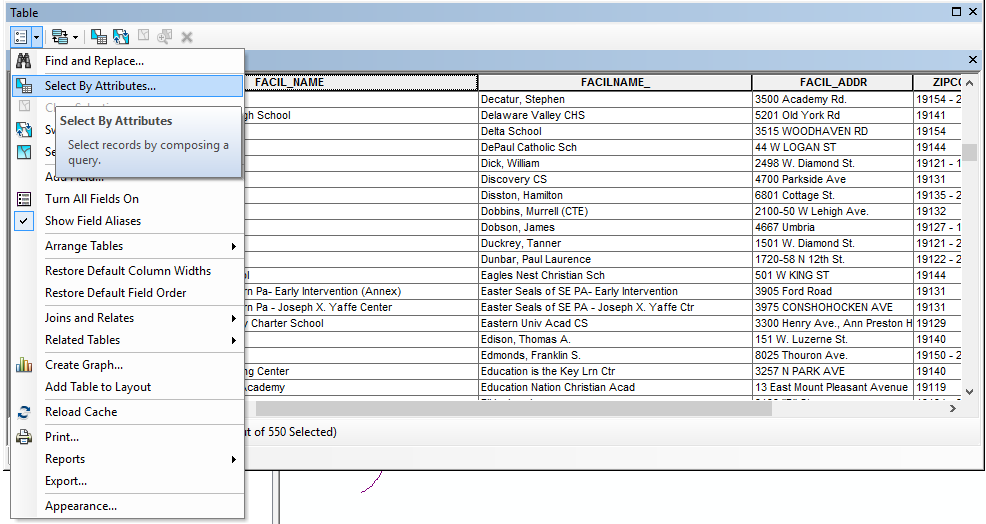\ 
2. A dialog box will pop up that allows to make a query statement.  We will create a query that states which schools will be selected based on some criteria, in this example, the school with the name Dunbar, Paul Laurence.
3. In the Select by Attributes dialog, note that the beginning of a standard SQL query appears above the lower text box: `SELECT * FROM PhillyPlanning_Schools WHERE`. The `WHERE` keyword indicates that a criteria is about to specified. The database engine will use this criteria to **filter** the records, that is, to select only those records which satisfy the criteria.
4. In the top box, double click `"FACIL_NAME"`.  It should appear in the text box below.
5. Click the equals (=) button, then click the Get Unique Values button.  Scroll down in the list of school names and double click `'Dunbar, Paul Laurence'`.  Note that the column name appears in double quotes. Text values, such as the school name, appear in single quotes. You should form a query appearing in the text box at the bottom of the dialog box:\
    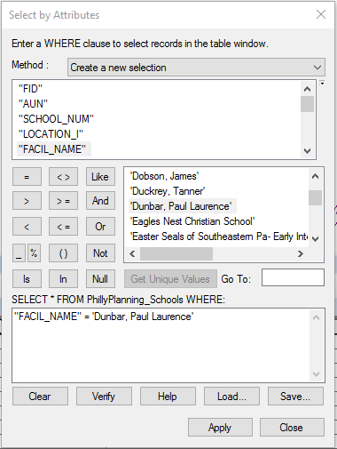{height="3.0in"}\ 
6. Click Apply.  The same school should be selected in the table and on the map.
7. Close the Select by Attributes box and clear your selection.
8. As another example, let's select schools with enrollments over 500 students.  Open Select by Attributes and delete the last query statement.
9. Create a query statement by double clicking the `ENROLLMENT` field at the top, then the greater than (>) button then type in `500`.  Note that 500 is a numeric value, and does not appear in quotes. Press Apply.
10. The selection should show that 212 out of 550 schools have enrollments over 500.
11. You can also create a compound query.  Build a new query in the Select By Attributes dialog box query window that reads `"TYPE_SPECI" = 'District' AND "ENROLLMENT" > 600`.  This will select only schools run by the Philadelphia School District (as opposed to charter, private, or Archdiocese schools) with enrollments greater than 600 students.  There should be 77 schools selected.
12. Close the Select by Attributes box, clear your selection, and close the attribute table.

### Getting Statistics for Selected Records

When exploring a table, you can immediately get statistics describing the numeric values in the columns. When you use the statistics tool you'll see how many values the column has, as well as the sum, minimum, mean, maximum, and standard deviation of those values. A histogram is also provided showing how the column's values are distributed.

As an example, we will get statistics from the schools attribute table:

1. Clear all your selections so no schools are selected.  Open the schools attribute table.
2. Right-click the heading of the field Enrollment and select "Statistics…"
3. On the Statistics dialog box, you'll see information about the values in the field whose heading you clicked.\
    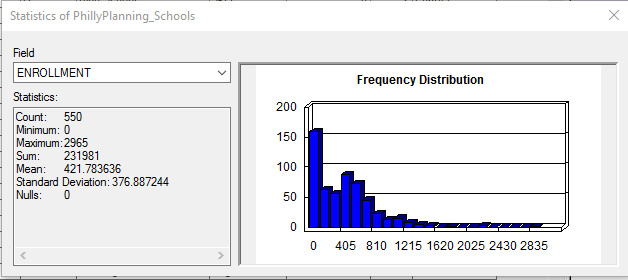{height="2.0in"}\ 
4. Note the statistics, e.g. minimum, maximum, mean, etc.  The sum is the sum of the row values in the Enrollment field for all the schools, i.e. the total number of students in all schools – 231,981 students.
5. Close the statistics box.  Using Select by Attributes, select only the private schools.   There should be 173 schools selected.
6. Reopen the statistics for the Enrollment field.  Note the Statistics tool operates only on selected rows (if any are selected).  You can see the sum for enrollment for private schools is 15,860 – this is the total number of students in private schools.

## Graphical Selection

You can also select features interactively on the map.

The Tools toolbar in ArcMap contains a tool for graphically selecting features. The 'Select Features' tool works using a single graphic that you interactively digitize (draw) as part of the selection process.

1. Click the Select Features button 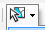{height="0.167in"}, then click 'Select by Rectangle'\
    {height="1.0in"}\ 
2. Using the cursor draw a rectangle around a set of schools, say, the schools in West Philadelphia.\
    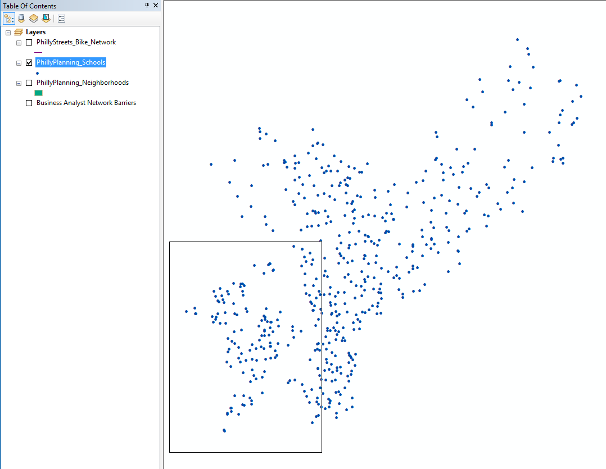{height="3.0in"}\ 
3. Examine the selected records on the map and in the schools attribute table.
4. You can also perform a graphical selection using a circle or other shapes.  Experiment with different graphical selection options.
5. When you are finished, clear your selection.

## Select by Location (Spatial Selection)

You can also select features based on their spatial relationship to another feature, such as the distance between features or whether one feature contains another feature.  As an example we will select schools located within 500 feet of the bike network.

1. Turn on the schools and bike network layers (neighborhoods should be off).
2. From the menu at the top, choose Selection, then Select by Location.\
    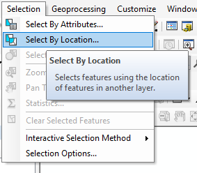{height="2.0in"}\ 
3. In the Select By Location dialog box choose
    * Selection method: Select features from 
    * Check the box next to PhillyPlanning_Schools (since you want to select schools)
    * Source Layer: PhillyStreets_Bike_Network
    * Spatial selection method for target layer feature(s): are within a distance of the source layer feature
    * Apply a search distance: 250 Feet\
        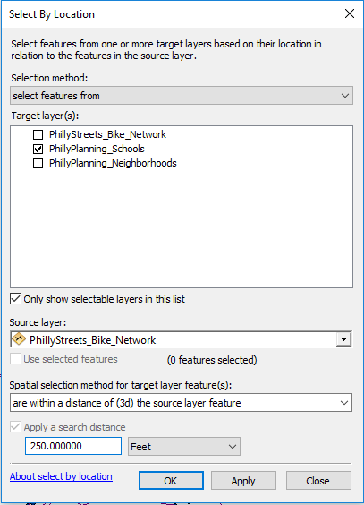{height="3.0in"}\ 
4. Press OK.
5. You should see 140 of the 550 schools selected.  Open the attribute table for the schools layer to see how many schools are selected.
6. Clear your selection so no schools are selected.

## Using Selected Features in Another Selection Operation

You can also select features from a set of features which are already selected, or alternatively, select a set of features from a set of selected source features.  We'll use two examples for illustration.

First, we will select features from a set of features which are already selected – charter schools (first selection) and enrollments over 1,000 students (second selection).

1. Turn on only the schools and neighborhoods layers (turn off the bike network layer).  Put the neighborhoods layer on the bottom of the drawing list so you can see both schools and neighborhoods layers clearly.
2. Using Select by Attributes, select only the charter schools.  There should be 94 selected.
3. Open the Select by Attribute dialog box again, but this time for Method: choose select from current selection.  Then, of those selected schools, select those with enrollments greater than 1,000.  There should be 15 schools selected, which are both charter schools and with enrollments greater than 1,000 students.
   
    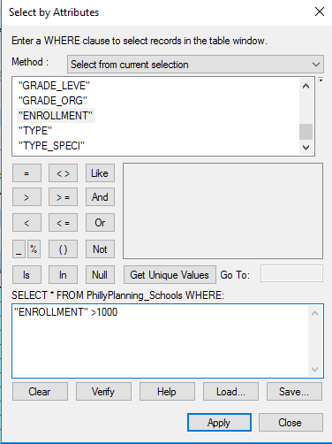{height="3.0in"}\ 
    
Now, we will select a set of features from a set of selected source features – the neighborhoods that contain the selected schools.

1. Close the schools attribute table, but keep the 15 charter schools selected.\
    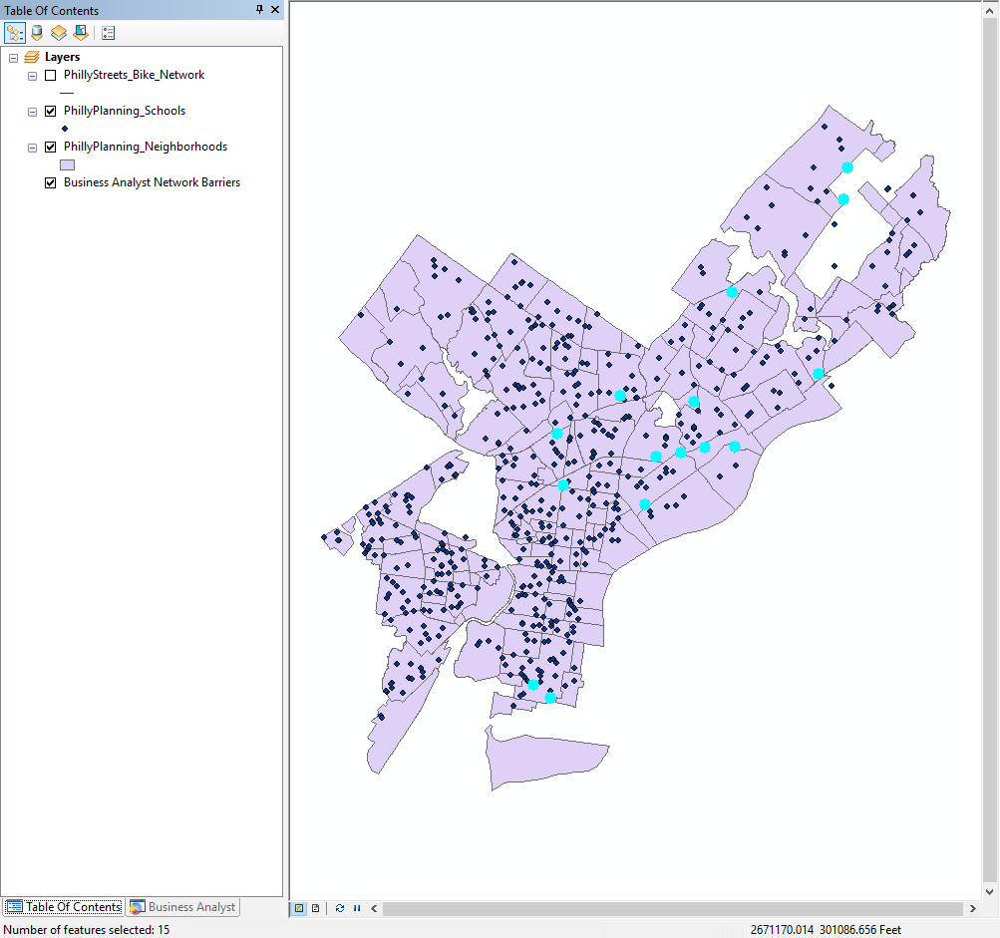{height="3.0in"}\ 
2. Open Select By Location.
    * For Selection method: choose select features from.
    * For Target layer(s) check the box for the neighborhoods layer and uncheck all other boxes.
    * For Source layer: choose the schools layer.  Then check the Use selected features box.
    * Under Spatial selection method for target layer feature(s): choose contain the source layer feature.  This spatial relationship operator allows you to select based on spatial containment – whether on feature contains another feature – i.e. if a neighborhood contains a currently selected school.  (Make sure the Apply a search distance box is NOT checked)
    * Press OK.\
        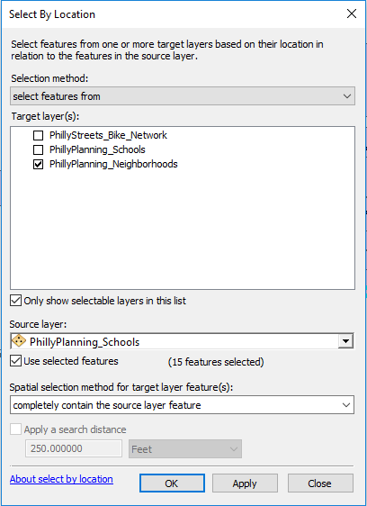{height="3.0in"}\ 

There should be 10 out of 48 neighborhoods selected.

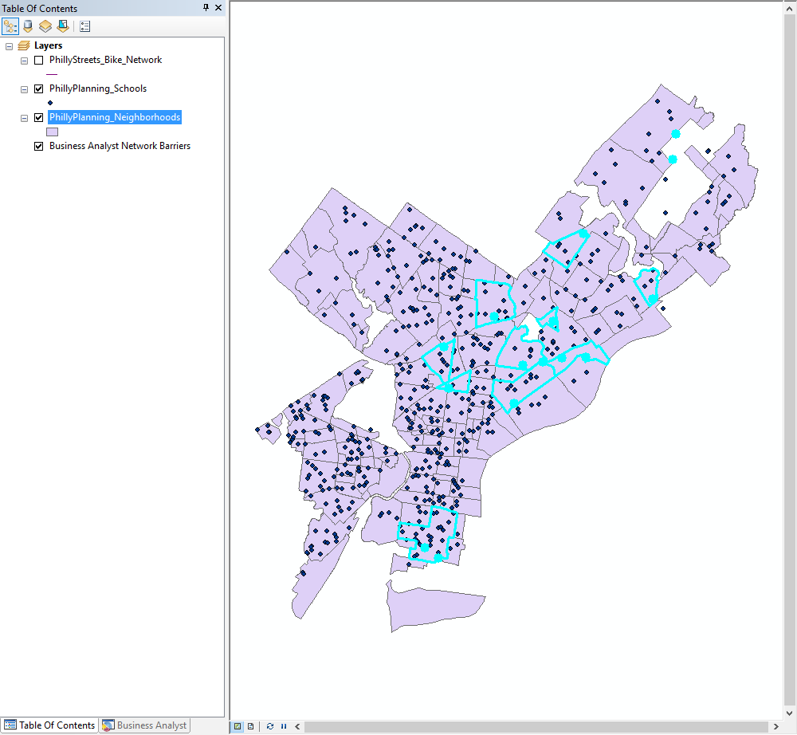{height="3.0in"}\ 

## Creating a New Map Layer from a Selection of Features

Frequently, you will want to save your selected subset of features as a separate, standalone data file.  For instance, you may want to select a set of schools based some enrollment criteria, and save this smaller number of schools as its own data file, not simply as a selection within the original schools data file.  Generally, as you proceed through a GIS analysis, it is helpful to regularly save your selected features in separate data file. 

You will have occasion to create new data files over and over again this term, and you must pay attention to where you are storing this data **every single time**. ArcGIS tries very hard to get you to save your data:

a. in the "Geodatabase" format; and
b. in a default location on your local hard drive.

Additionally, it usually gives you unhelpful default file names, like "Export_Output".

Therefore, if you don't pay attention when you do this step, you will end up with a file name that is unintelligible, in a format that you don't want, in a location that you won't be able to find. Do not do this.

As an example of how to save a selected set of data to its own file, we will export the 10 selected neighborhoods from the last step in the tutorial.

1. Make sure the neighborhoods layer is on and you have 10 neighborhoods selected.
2. In the TOC, right-click on the neighborhoods layer, then choose Data → Export Data.
3. Under Export: choose Selected features.
4. Under Output feature class: click on the yellow folder icon and navigate to your Lab1 workspace folder.
5. Under Save as type: choose Shapefile.
6. Under Name: enter my_neighborhoods (or, whatever you want to name this file – whether or not you leave .shp at the end doesn't matter).\
    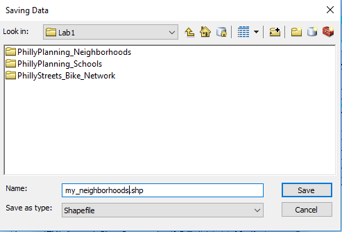{height="2.0in"}\ 
7. Click Save. You're actually not done yet, as this just pushes your settings to the Export Data dialog box. Click OK.
8. A dialog box will appear asking whether you want to add your new layer to the current map. Click Yes. The layer will now appear in TOC.
9. Clear your selection so no schools or neighborhoods are selected.
10. Turn off the neighborhoods layer.  You should be able to see the my_neighborhoods layer contains only those 10 formerly selected neighborhoods.

## Designing and Exporting a Map

In this section we will see how to create a map layout and export the map.

### Working in Layout View

We have been working in a view called "Data View", which is most useful for data exploration and analysis. When producing maps for export, we need to switch to "Layout View". In this view, you will see a representation of a page, and the map (or maps) will appear on that page. By default, the page will be a standard 8½ by 11 inch page in portrait view. In Layout View you can also add other elements, such as titles, textboxes, and legends. It is possible to place elements "off" the page (in an area known as the "pasteboard" in desktop publishing lingo). Anything not on the page will not be included on the map when you export the image, so it can be a useful place to store items during the design process when you are trying out different ideas.

1. Turn off the bike network layer and turn on all the other layers.  Put them in the following drawing order:
    * Schools (top)
    * My_neighborhoods
    * Neighborhoods (bottom)
2. Make sure you are viewing the full extent of your data (press the full extent button to be sure).  Your canvas should look something like this (your colors may be different):\
    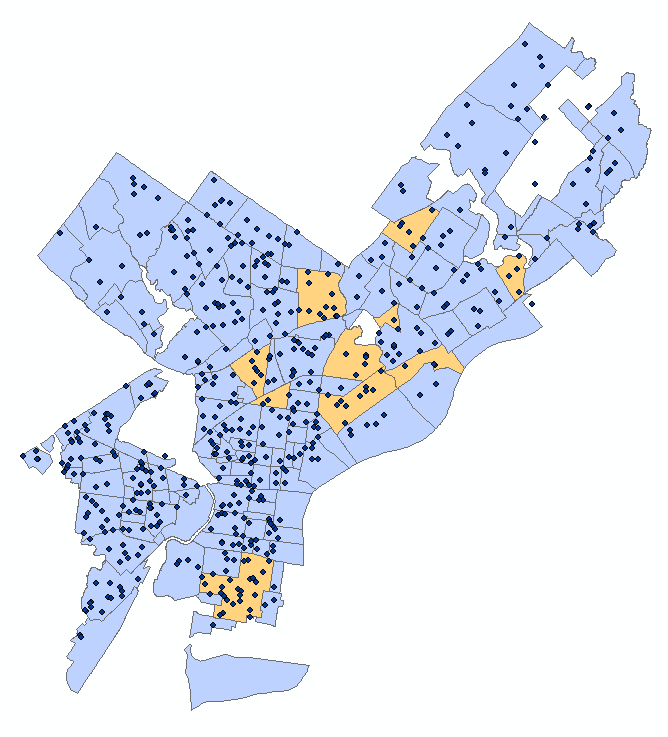{height="3.0in"}\ 
3. Switch to Layout View in one of the following ways:
    * Click the Layout View button in the lower-left of the map canvas:\
        {height="0.5in"}\ 
    * Select View → Layout View from the menu.
    * Note that you can toggle back and forth between the layout and data view windows.
4. Notice that the Layout toolbar now appears. This toolbar has pan and zoom tools, similar to the ones you have used before, but these will zoom into the page (not the map). Notice that each of these icons has a page behind it (e.g. magnifier on a page) to distinguish it from the pan and zoom tools on the Tools toolbar. Experiment with these tools to move around the page. When you are done, hit Zoom Whole Page (the fourth button on the Layout toolbar).\
    \ 
5. The pan and zoom buttons {height="0.167in"} on the Tools toolbar can be used to resize the map image on the page. Use the Zoom In button {height="0.167in"} to make sure that Philadelphia fills most of the data frame. Note that if you zoom in too far, parts of Philadelphia will be "outside" the data frame, and will not appear on the page.
6. Use the Insert menu to add the following elements:
    a. Title—Should default to top center, can be repositioned.
    b. Legend—A dialog will appear offering many options for customizing the legend. Just keep hitting Next until the legend appears on your map.
    c. North Arrow.
    d. Scale Bar.
7. Reposition the map elements to fill the white space. Try not to have any elements overlaying the Philadelphia neighborhoods. Your final layout may look something like this, but do *NOT* try to make it look exactly the same. Just make sure it has all of the requested elements:\
    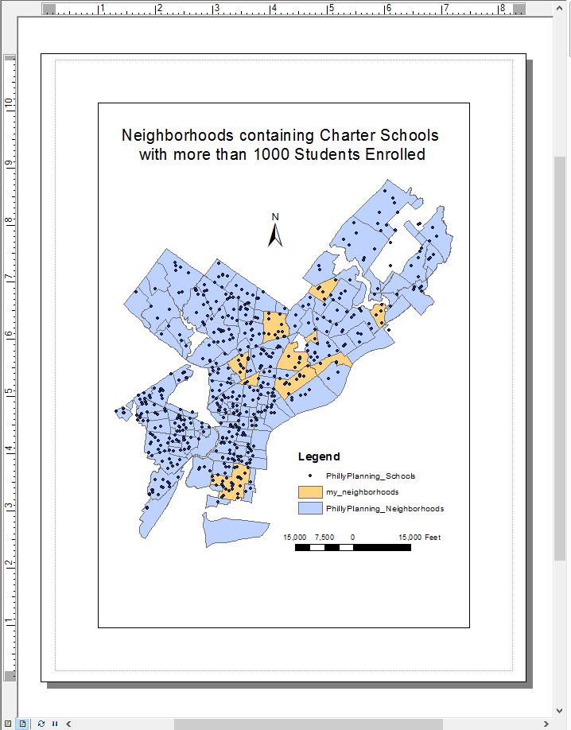{height="4.0in"}\ 

Once you have completed your map, save your .mxd document.

## Exporting a Map Image

A finished map product can be exported into an image file that can be inserted into a MS Word document for your lab reports, or into web pages or other documents.

Here, as an example we will export the map using two different image formats, PNG and JPEG. 

1. Go to File → Export Map….
2. Set the Save as type to "PNG (*.png)".
3. Navigate to your lab1 folder. As always, be clear about where you are saving your files.
4. Press Save.
5. Open the Export Map dialog again.
6. Set the Save as type to "JPEG (*.jpg)".
7. Confirm that you are still in the lab1 folder.
8. Press Save.

# ASSIGNMENT

## Objective

Consider that the Philadelphia School District is interested in encouraging its students to bike to school.  The district wants to know what neighborhoods contain its largest schools that are well-connected to the bike network.  To address this, answer the following question: 

What neighborhoods contain Philadelphia School District schools that both enroll more than 1,200 students and are also within 0.1 mile of the bike network?

## Deliverables

**Turn in a report in the format described in the syllabus.**

Be sure to include the following information:

1. A list of the Philadelphia School District schools that both enroll more than 1,200 students and are within 0.1 mile of the bike network (*hint…there are 5 schools that meet these two criteria*).
2. The total enrollment of those 5 schools,
3. A list of the neighborhoods that contain those 5 schools (*hint…there are 4 neighborhoods*).
4. A map showing the 5 schools and the 4 neighborhoods that meet the criteria, overlain on a map of all the neighborhoods and schools. 

The **Introduction** section should state the research objective and the relevant criteria for selecting the neighborhoods and schools.

The **Data and Methods** section should state the data sets used in the analysis, from where those data were acquired, and the GIS operations employed.

The **Results** section should state the results (i.e. the neighborhoods that meet the criteria, as well as the four pieces of information listed directly above).  The final map should be cited in the text here (e.g. Figure 1).

The **Discussion** section should state an interpretation of the results (i.e. do these neighborhoods tend to concentrate in certain regions of Philadelphia, how can this information be used to improve bike network access for students, etc.), limitations of the analysis, and how the analysis could be improved or expanded.

The **Tables and Figures** section should contain the map of the selected schools and neighborhoods noted above, with a caption.  The map should be cited in the text.

## Getting Started

All the data and operations you need to complete this assignment are described in the tutorial above.

There are many ways to complete this analysis.  A simple way is to parse the analytical objective into a smaller set of operations that proceeds in steps:

1. Select the schools that are Philadelphia School District schools and that enroll more than 1,200 students (use a Select by Attributes operation).
2. Of those selected schools, select those that are also within 0.1 miles of a bike network (use a Select by Location operation).
3. Export the 5 selected schools to its own shapefile.
4. Select the neighborhoods that contain those 5 selected schools (use a Select by Location operation)
5. Export the 4 selected neighborhoods to its own shapefile.
6. Create a map in the layout view that overlays the 5 selected schools and 4 selected neighborhoods on top of the schools and neighborhoods for all of Philadelphia, using color settings that distinguish the schools and neighborhoods that meet the selection criteria.

