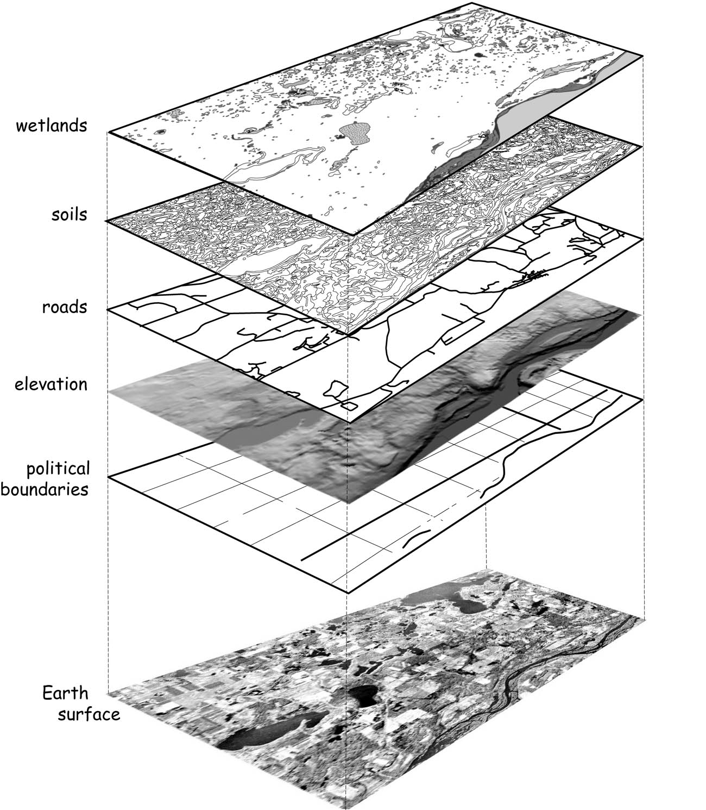
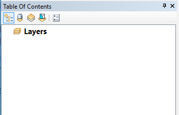
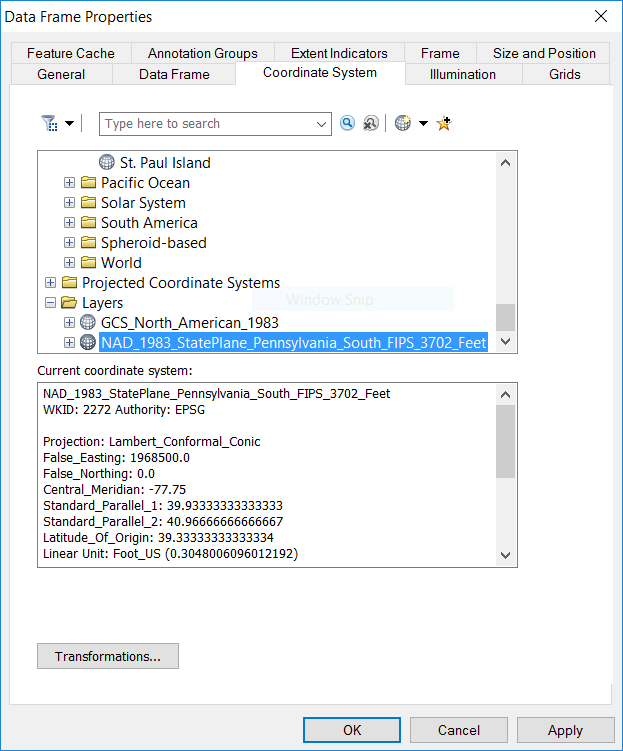
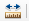
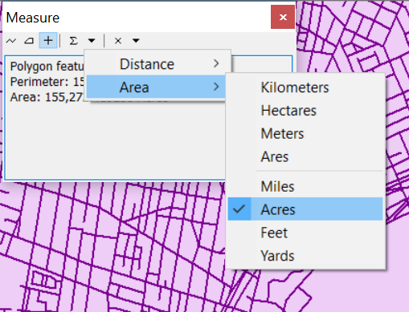
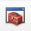
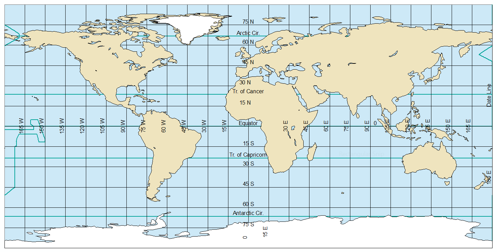

**Purpose:** To introduce concepts in map projection, and common operations in working with coordinate reference systems. To learn how to make more complex map layouts for reference cartography.

At the end of this exercise you will be able to:

1.  Download from online online repositories of geographic data
2.  Identify a spatial layer's coordinate system
3.  Change the display projection of a data frame
4.  Reproject spatial data
5.  Fix missing spatial reference information
6.  Create a layout with multiple maps

Finding Geospatial Data Online
==============================

In the first exercise, you were provided the data you needed to complete the assignment. Sometimes GIS practitioners create their own data (something you will get experience with later this semester), but often we turn to online sources for ready-to-go data. We will download data from two websites which exemplify the kinds of online data available:

-   [**Natural Earth**](http://www.naturalearthdata.com/) is an example of a single-purpose website. It provides global data, both physical (rivers, land masses) and cultural (poltical boundaries, populated places) specifically for cartography at medium to small scale.
-   [**PASDA** (The Pennsylvania Geospatial Clearinghouse)](http://www.pasda.psu.edu/) is an example of a **geoportal**, a website that collects geospatial data from many different sources organized around a particular theme or region of interest. Unsurprisngly, PASDA, hosts data related to Pennsylvania, and is maintained by Pennsylvania State University. PASDA hosts data provided by local governments, federal and state agencies, nonprofits, and academic institutions.

Because geospatial data can be quite large, downloads are typically provided in ZIP files. These files must be unzipped before use (they cannot be read directly by ArcMap, though some other GIS software can read data stored in a ZIP archive). Therefore, over and over again in this exercise, and throughout the term, and for any future GIS job you have or project you undertake, you will have to repeat the following steps:

1.  Download the ZIP archive.
    -   Move the ZIP archive to a folder that you will remember and have access to. The lab computers will automatically save the ZIP to the Downloads folder. You will not have access to that folder if you change computers, and even if you are working on your own computer, dumping all of your data into the Downloads folder is a poor choice. I recommend creating a Data folder (or GIS\_Data folder) on your flash drive, external hard drive, or personal laptop, which you use to organize and store *all* of your downloaded data.

2.  Unzip the archive. The lab computers have [7-Zip](http://www.7-zip.org/) installed on them. In File Explorer, right-click the file and choose **7-Zip → Extract Here** or **7-Zip → Extract to "*folder\_name*"**.
3.  If desired, organize the extracted files. You could store all the files in a single folder, or create subfolders by theme, region, or source. There is no right way to do this. But the wrong way is to not have a plan, and then be unable to find your data when you need it.

Keeping these steps in mind, download the following data from [PASDA](http://www.pasda.psu.edu/):

-   The Delaware River Watershed Municipalities 2016 data contributed by Natural Lands Trust
-   The Philadelphia Street Centerlines 2016 data contributed by the City of Philadelphia

In each case, no instructions are given here so that you can get familiar with searching a geoportal for data.

For the Natural Earth data, start at the [Natural Earth Downloads page](http://www.naturalearthdata.com/downloads/). Browse the different categories of data. Think about the different uses for large, medium, and small scale data. Look through the different files available in the cultural, physical, and raster themes. After exploring the different data available, go to the download page for small scale physical layers. At the top of the page, select the link to "Download all 110m physical themes".

Remember to unzip all of the downloaded data from both PASDA and Natural Earth, and organize the files into folders with names that you will understand so that you will be able to find the data later in this exercise and in the future.

Understanding Coordinate Reference Systems
==========================================

Making Use of On the Fly Reprojection
-------------------------------------

Working with geographic data is often conceptualized as a "layer cake", with geographic data tables being treated as layers that are stacked on top of each other.

 

In ArcMap, spatial layers are added to a data frame. As we will see, multiple data frames can be added to a single map canvas. When you start ArcMap with a blank canvas, the Table of Contents will show a single data frame named "Layers". This name can confuse new users, so keep in mind that this is a **data frame** which *contains* **layers**. The data frame name can be changed to something more descriptive by the user, and you will probably want to do so if you add multiple data frames.

 

Initially, a data frame has no **CRS**, or coordinate \[reference\] system, associated with it. You can confirm this by checking the data frame properties. Double-click on the data frame name ("Layers") in the TOC. Select the Coordinate System tab (if it is not already selected). You should see that the Current coordinate system is listed as "No coordinate system."

Now add the DRWI\_Municipalities2016 data. Check the data frame properties. Note that the data frame now has coordinate system information. Specifically, it is using NAD83, a geographic coordinate system based on the North American Datum 1983. This is another way of saying that the data is being shown using latitude and longitude, the spherical coordinate system used for geographic locations, as if it were a planar (flat) CRS. Close the properties box. Hover the cursor near the center of the map. The coordinate values displayed in the lower right of the ArcMap window should be near -75 and 40 decimal degrees. Whenever you see these lat-long values, you are in the region near Philly.

Now add the Philadelphia roads data. Right-click on the roads layer and select Zoom To Layer from the popup menu. You should be zoomed in to the Philly area. Does the shape of Philly look strange? If you can't tell, or if you are not familiar with Philly, zoom into part of the street grid, and notice that the streets don't meet at right angles. This is a consequence of viewing data using geographic coordinates without projection.

Open the layer properties for the roads layer by double-clicking on the name in the TOC. Click on the Source tab (if it is not already selected). Note that in addition to displaying the data type ("Shapefile Feature Class"), file location, geometry type, the dialog also shows the CRS the layer is stored in, which in this case is "Projected Coordinate System: NAD\_1983\_StatePlane\_Pennsylvania\_South\_FIPS\_3702\_Feet". This shows us that the layer is stored in State Plane Pennsylvania South, a CRS designed for high-accuracy, large-scale mapping appropriate for local and state planning agencies. Most US states require land records and public infrastructure (such as roads and bridges) to be stored and published using the appropriate State Plane CRS. If you are mapping the Philly area, SP Pennsylvania South will usually be your best choice. However, if you are mapping a larger region, distances and shapes will begin to distort rapidly as you move away from Southern Pennsylvania. The State Plane coordinate system is explained further in Bolstad, 5e, pp. xx.

If SP Pennsylvania South is an appropriate CRS for Philly area data, why does the road grid look skewed? The reason is that the data frame is still set to NAD83 (lat-long), and ArcMap is using "on the fly" reprojection to show the road network in NAD83. If you want to view the data in SP Pennsylvania South, you can change the data frame CRS. Open the data frame properties and go to the Coordinate System tab. Notice the top pane has four folders: Favorites, Geographic Coordinate Systems, Projected Coordinate Systems, and Layers. Expand the Layers folder. This will display the CRSes used by all loaded layers (in this case two). Select "NAD\_1983\_StatePlane\_Pennsylvania\_South\_FIPS\_3702\_Feet" from the list and hit OK.

 

The roads network and Philly borders should now look "right". This is because SP Pennsylvania South is a **conformal** projection, which means that it preserves local angles (often casually we say it "preserves shapes"). Conformal projections are ideal for route-finding, which is why Google Maps uses "Web Mercator", a conformal projection.

Understanding Areal Distortion
------------------------------

All projections introduce distortions to **distance, direction, area,** and/or **shape (local angles)**. To understand how projections distort area (just one of these four properties), you are going to measure the approximate area of Philadelphia in different projections. If you have followed the steps above, the Layers data frame should be in the SP Pennsylvania South CRS. If it is not, please follow the steps above to change the CRS of the data frame.

1.  Zoom in to Philadelphia and uncheck the roads layer in the TOC.
2.  Click the Measure button  in the Standard toolbar. Your cursor should turn into a carpenter's square, and the Measure panel should appear over your map.
3.  In the Measure panel, click the plus sign (+), the third toolbar button.
4.  Click the fifth toolbar button, the dropdown arrow, and set the measurement units to Acres.

     
5.  Click on Philadelphia with the cursor. The Measure panel should now display the perimeter and area of Philadelphia. **Write down the area of Philadelphia in acres, rounded to the nearest whole number.**
6.  Now change the data frame coordinate system and repeat the measurement. Each time, make a note of the CRS and the area of Philadelphia in acres, rounded to the nearest whole number. In the end, you should make measurements in the following four CRSes, all of which are in appropriate subfolders of the Projected Coordinate Systems folder. Try to find them yourself, but in each case if you can't find them in the folders, type some keywords into the search box at the top of the Coordinate Systems tab.
    -   SP Pennsylvania South---You already did this in the previous step. You can treat this as the most accurate value for the true area of Philadelphia.
    -   NAD 1983 UTM Zone 18N
    -   US National Atlas Equal Area (Hint: This is a Continental projection)
    -   WGS 1984 World Mercator

**To turn in:** Submit your measurements of the area of Philadelphia in Acres for each of the four CRSes. Write a few sentences describing the purpose and use of each CRS. Assuming that SP Pennsylvania South measurement represents the true value, explain why each other measurement is close or far from this value. You may refer to the textbook or to Google searches, but make sure that your submission is entirely your own words.

Reprojecting Geospatial Data
----------------------------

Relying on on the fly reprojection is fine for display purposes. But it can lead to inaccuracies or anomalies when editing or performing spatial analysis. (Read "[About editing data in a different projection (projecting on the fly)](http://desktop.arcgis.com/en/arcmap/latest/manage-data/editing-fundamentals/about-editing-data-in-a-different-projection-projecting-on-the-fly-.htm)"). Therefore, it is usually a good idea to make sure that your data are in the same CRS.

There are two ways to do this.

### Using Export Data to Reproject a Loaded Layer

1.  Right-click on DRWI\_Municipalities2016 in the TOC and choose Data → Export Data….
2.  Set the radio button to **Use the same coordinate system as:** *the data frame*. Remember, the data frame is now using the State Plane Pennsylvania South CRS, which it copied from the street centerline layer.
3.  Name the output feature class DRWI\_Municipalities2016\_SpPennSouthFt.shp.
4.  Hit OK.
5.  Say yes to add the new layer to the map. Remove the old DRWI\_Municipalities2016 layer.

### Using the Project Tool in ArcToolbox

Often we want to reproject geospatial data without loading it first. This is easiest to do using the Project tool in ArcToolbox. (That's *pro*-**JECT**, not **PRO**-*ject*.)

1.  Click the ArcToolbox button . The ArcToolbox panel will appear. You can dock this panel by dragging the title bar and dropping it on one of the blue arrows that appears while you are dragging. Many users like to dock it to the right.
2.  Open the Project tool, which can be found under Data Management Tools → Projections and Transformations. Double-click to open it.
3.  Look at the Project dialog. The settings that have a green dot on the left are required parameters. Note that at the bottom of the dialog box is a button to `Show Help >>`. All ArcToolbox tools have this. Click to have a help pane appear on the right. As you select items in the dialog, the help pane will display information about that parameter.
4.  Set the following parameters:
    -   **Input Dataset or Feature Class**: Note that the dropdown displays currently loaded vector layers. However, we are going to project the DRWI\_Municipalities2016 layer, which you removed from the map in the previous section. Click the folder icon to the right, and navigate to DRWI\_Municipalities2016.shp and select it.
    -   **Output Dataset or Feature Class**: Save the output as a shapefile named DRWI\_Municipalities2016\_UTM18N.shp. Pay attention to where you save it, as discussed earlier in the exercise.
    -   **Output Coordinate System**: Use NAD 1983 UTM Zone 18N.

5.  Hit OK. The reprojected layer should get added to the map automatically.

Handling Missing Coordinate Reference Systems
---------------------------------------------

Occasionally you will be supplied with data that lacks a CRS. This is common with tabular data, which might have an X and Y column, but not specify what they mean. Frequently it is easy to identify latitude and longitude data by eye, and XY data with latitude and longitude is very likely to have been gathered by GPS, and therefore to be in the WGS 1984 datum. If you don't know the CRS you have to go back to the source to see if you can find it. If not, you have to try one that might be reasonable for the region or scale, and see if it lines up with the rest of your data. This takes a lot of trial and error and is something you will learn over a years of practice.

It used to be somewhat common for shapefiles to get passed around without the PRJ file that stores the coordinate system metadata. Less commonly, but still possible, you might get a shapefile (or other spatial data) that just has the wrong CRS associated with it (probably because the person responsible for it didn't take this course).

If this happens, you need to use the Define Projection tool to set the CRS of the data. This does **NOT** change the coordinates. It just tells the GIS software to interpret the coordinates as measurements in a particular CRS.

In order to see what this process looks like, we're going to trick ArcGIS into thinking the CRS is missing:

1.  In File Explorer, navigate to the folder with the DRWI\_Municipalities2016 shapefile. Click on DRWI\_Municipalities2016.prj. Edit the file name by single-clicking, or hitting the `F2` key. Enter a tilde (~) at the front of the filename. Now that the basename is different, ArcGIS will no longer see it as related to the other files in the shapefile group.
2.  Change your data frame CRS back to SP Pennsylvania South.
3.  Remove the streets layer.
4.  Add DRWI\_Municipalities2016.shp to the map.
5.  A dialog box appears indicating that you are trying to load data with an Unknown Spatial Reference. Hit OK.
6.  Make sure that the DRWI\_Municipalities2016 layer is on top in the drawing order. (Reorder in the TOC, if necessary). Do you see the layer? Or do you see the version in UTM 18N or SP Pennsylvania South? Change the colors to distinguish them, if necessary.
7.  In order to find new layer, right-click on DRWI\_Municipalities2016 and select Zoom to Layer.

There are several clues that something has gone horribly wrong. The first thing you might notice is that the overall shape of the region looks distorted again, similar to when we first loaded it prior to reprojection. The second clue is that the coordinates in the lower right are near -84 longitude, 39 latitude, which you know to be wrong for this region. The third clue is that zoom level in the toolbar shows approximately 1:10 (that is, one screen inch equals ten real world inches). This is obviously wrong. Previously this region was being displayed at a scale of approximately 1:4,000,000.

What is going on? The coordinates of this layer are stored in lat-long (so the values are in the range of ±180 longitude and ±90 latitude), but ArcGIS is displaying it in the SP Pennsylvania South CRS, which measures coordinates in feet from an origin Southwest of the Southwesternmost point in Pennsylvania. In this CRS, these coordinates are so low that they appear near the origin, millions of feet (and hundreds of miles) Southwest of where they should be.

Click the Full Extent zoom button. You will see the municipalities with the right CRS all the way in the Eastern part of the map, and a lot of blank space in the middle and West. The layer with the missing CRS is all the way in the Southwest (lower left) corner, too small to see because the units of decimal degrees (1 decimal degree ≈ 70 miles near the equator) are being interpreted as feet, so the features are being drawn more than 350,000 times too small.

How can we fix this?

1.  Remove DRWI\_Municipalities2016 from the TOC.
2.  Open ArcToolbox and find the Define Projection tool. (Hint: It's in the same toolbox as the Project tool that you used previously.)
3.  Set the following parameters:
    -   **Input Dataset or Feature Class**: Select DRWI\_Municipalities2016.shp.
    -   **Coordinate System**: Do you remember what CRS this data is stored in? If you don't, look earlier in the lab instructions at the very first time that you added this data. I tell you the right CRS there.

4.  Hit OK. The data will get added to the map, and you will see that the layer aligns with your other municipalities layer(s).

Look in File Explorer again. You will see that there is a new file named DRWI\_Municipalities2016.prj. Open it and open the old file that you renamed with a tilde as ~DRWI\_Municipalities2016.prj. *You will see that the contents of these files are exactly the same.* All that the Define Projection tool does is create a PRJ file with the necessary info. In fact, expert GIS users often skip the toolbox and just copy the correct PRJ file, if they have it, to the right folder, and rename it to match the shapefile basename.

**Remember, the Define Projection tool should only be used when the CRS is unknown or incorrect. One of the most common mistakes that new users make is to take a shapefile with a known CRS and use the Define Projection tool to *set a coordinate system* when, actually, their intention is to use the Project tool to *convert the coordinates*. It *is* important that you know how the Define Projection tool works. But now that you have done so, forget that it exists. Do not use it again unless specifically directed to do so by your instructor.**

Comparing Global Projections in a Multi-Frame Map
=================================================

We are going to compare the distortion and appearance of four different global projections by creating four data frames in a single maps. Each data frame is going to show the same data: landforms, water bodies, reference lines, etc. We will add all of the data and style it as we wish, then copy the data frame. Each copied data frame will show exactly the same features, but we will change the display CRSes so that we can compare them.

The map will display the following reference lines:

-   Major geographic reference lines, including the equator, Tropics of Cancer and Capricorn, Arctic and Antarctic Circle, and International Date Line.
-   A **graticule**, which is a grid showing lines of latitude and longitude. We will use a 15 degree graticule.

Styling the World Map
---------------------

First, let's add and style the data:

1.  Open ArcMap (or, if it is already open, save your work and create a new map document).
2.  Add the following layers to ArcMap, and reorder them as indicated:
    1.  (Topmost layer) `ne_110m_lakes`
    2.  `ne_110m_glaciated_areas`
    3.  `ne_110m_land`
    4.  `ne_110m_graticules_15`
    5.  `ne_110m_geographic_lines`
    6.  `ne_110m_wgs84_bounding_box`

3.  Set the following symbology:
    1.  Use a white fill and thin black border for the glaciated areas.
    2.  Use a light-colored fill (tan, beige, gray, etc.) and thin black border for the land layer.
    3.  Use a thin (0.2 point) black line for the graticule.
    4.  Use a medium (1 point) line for the geographical lines. Use black or a dark color.
    5.  Use a blue fill and thin black border for the lakes and the bounding box.

4.  Set labels for the line layers:
    1.  Label the graticule with the `display` field.
    2.  Label the geographic lines with the `abbrev` field.

When you are done with these steps (add data, set symbology, set labels), your map canvas should look something like this:

 

Creating a Multi-Frame Layout
-----------------------------

Sometimes we want a **neatline**, or box around our map. For this particular layout, those lines will be distracting, so in the instructions below, we will get rid of them.

1.  Switch to Layout View.
2.  Go to File→Page and Print Setup...
3.  Change the page orientation to Landscape. **Note:** There are two places to do this, but as long as the box "Use Printer Paper settings" is checked, which by default it should be, only the top one will be available. That's the one that you want to set.
4.  Hit OK.
5.  Resize the data frame (use the handles at the edges and corners) and reposition it so that it fills about a quarter of the page, leaving some room for a title, credits, etc.
6.  Open the Data Frame Properties, and select the Frame tab.
7.  Select the Border dropdown and set it to "<None>". Hit OK.
8.  Copy the data frame and paste it three times. There are several ways to do this, but the easiest is to hit `Ctrl`+`C` with the data frame selected, then hit `Ctrl`+`V` three times.
9.  Position the four data frames so that they form a 2x2 grid.
10. Change the display CRS of each data frame into four different global projected CRSes:
    -   Robinson (world)
    -   Good Homolosine (Land)
    -   Mercator (world)
    -   Any projection of your choice in the Projected Coordinate Systems→World folder. In order to try out different options, position the Data Frame Properties dialog so that you can see the map, select a new CRS, and hit Apply (rather than OK, which applies the projection, but also dismisses the dialog).

Map Elements
------------

You need to think carefully about what map elements to include, and whether an element applies to a specific map or to the entire document:

1.  **Title:** The page should have a title, but each map should have a subtitle indicating the CRS used.
2.  **Source:** All of the maps use the same data (from Natural Earth), so you should include one source line.
3.  **Author:** Credit yourself (once) as the cartographer.
4.  **North Arrow:** North arrows only make sense when North is in a consistent direction, which is the case for the World Mercator map, but not for the Robinson or Goode Homolosine map. For this layout, North arrows would just add clutter, so I recommend omitting them entirely.
5.  **Scale:** A scale bar or scale statement is often used. Again, for this layout, this would add clutter. On the other hand, as part of the goal is to show the impact of different projections, understanding scale may be important. Think about whether you want to include scale bars, and how you can place them so that they are useful to your presentation.

Think through these items, and include items 1, 2, and 3. Use your judgment regarding 4 and 5.

Finishing Touches
-----------------

The world represented in different projections will fill the available space differently. Experiment with resizing and repositioning the data frame, and using the zoom, to create a visually balanced layout. Try to fill the white space, while still leaving some breathing room among the four maps.

Certain projections will occupy more of the data frame. For example, cylindrical projections will display as big rectangles, while many other projections like the Robinson will be an oval, leaving white space around the edges. Try to *not* have the heavy visual elements all to one side.

When you place additional map elements, like title, credits, scale bars, you may need to reposition or resize the four projected maps. You may need to change the default font size or positioning of the title and other text elements. You may need to reposition scale bars or North arrows, if you chose to include any. White space should be distributed around the map, and filled with map elements where possible.

**To turn in:** Make sure your map includes the indicated elements, including your name. Export your map to PDF. Describe the four map projections you used, particularly with regard to which of the four map properties they preserve. What purpose does each projection serve? What limitations does each have? Refer to the ArcMap [List of supported map projections](http://desktop.arcgis.com/en/arcmap/latest/map/projections/list-of-supported-map-projections.htm) for information, but make sure that your submission is entirely your own words.

DELIVERABLES
============

Submit the map with four global projections as a PDF.

Submit a document with the following answers or discussion, repeated from earlier in the exercise:

1.  What were the measurements of the area of Philadelphia in Acres for each of the following four CRSes:
    -   SP Pennsylvania South
    -   NAD 1983 UTM Zone 18N
    -   US National Atlas Equal Area
    -   WGS 1984 World Mercator Write a few sentences describing the purpose and use of each CRS. Assuming that SP Pennsylvania South measurement represents the true value, explain why each other measurement is close or far from this value. You may refer to the textbook or to Google searches, but make sure that your submission is entirely your own words.

2.  Describe the four map projections you used, particularly with regard to which of the four map properties they preserve. What purpose does each projection serve? What limitations does each have? Refer to the ArcMap [List of supported map projections](http://desktop.arcgis.com/en/arcmap/latest/map/projections/list-of-supported-map-projections.htm) for information, but make sure that your submission is entirely your own words.

