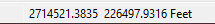
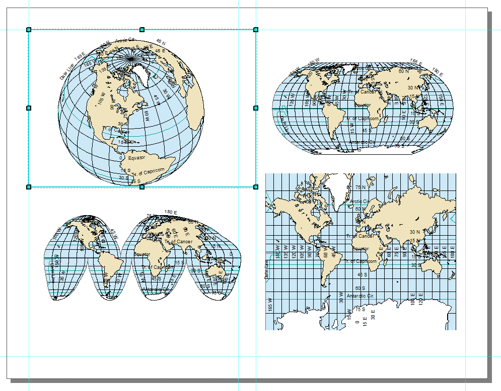

**Learning Objective**

To introduce concepts in map projection, and common operations in working with coordinate reference systems (CRSs). To learn how to make more complex map layouts for reference cartography. As a demonstration, you will investigate properties of CRSs for large scale data in for Philadelphia, Pennsylvania, as well as global data.

First, complete the tutorial by following the steps below.  Then, using the skills you’ve learned in the tutorial, complete the assignment given following the tutorial.

# TUTORIAL

## Acquiring the Data

We will download GIS data from two websites:

* [**Natural Earth**](http://www.naturalearthdata.com/) is an example of a single-purpose website. It provides global data, both physical (rivers, land masses) and cultural (political boundaries, populated places) specifically for cartography at medium to small scale.
* [**PASDA** (The Pennsylvania Geospatial Clearinghouse)](http://www.pasda.psu.edu/), as we saw in the previous lab exercise, is a **geoportal**.

Search for and download the following data from [PASDA (http://www.pasda.psu.edu/)](http://www.pasda.psu.edu/):

* The Delaware River Watershed Municipalities 2016 data contributed by Natural Lands Trust: A municipality is a general purpose local government. A municipality may be a city, town, borough, village, or something else, with different states having slightly different terminology.
* The Philadelphia Streets Centerline 2016 data contributed by the City of Philadelphia.

For the Natural Earth data, start at the [Natural Earth Features page](http://www.naturalearthdata.com/features/) (http://www.naturalearthdata.com/features/). Browse the different categories of data. Think about the different uses for large, medium, and small scale data. Look through the different files available in the cultural, physical, and raster themes. After exploring the different data available, download the following small scale (110m) physical layers:

* Land
* Lakes (also called Lakes + Reservoirs)
* Glaciated areas
* Geographic Lines
* 15-degree graticule
* Bounding box (under Graticules)

Create a Lab 2 workspace folder.  Move all the zip files to your workspace folder.  Unzip all of the zip files.

## Exploring Coordinate Reference Systems (CRSs) in ArcCatalog

1. Open ArcCatalog and navigate to your workspace.  Preview the map and table for Philadelphia street centerlines data.
2. Zoom in and explore the streets data – you can see the individual street segments.
3. In the catalog tree on the left side of ArcCatalog, right click on the street centerline shapefile and go to Properties.
4. In the Shapefile Properties box click on the XY Coordinate System tab.  This contains information on the projection and coordinate system for this data file.  Note the top line under Current coordinate system:\
    `NAD_1983_StatePlane_Pennsylvania_South_FIPS_3702_Feet`\
    This is a code indicating the data file is in the Pennsylvania State Plane South CRS. Other information below indicates the specific parameters for this CRS, i.e. the specific projection used (Lambert Conformal Conic), the datum used (North American 1983), and so on.
5. Because the software has encoded the CRS information we say the projection and coordinate system are ‘defined’.
6. Close the Shapefile Properties box.
7. Set the Preview: to Geography and look to the bottom right corner of the view window.  It should show the coordinate position of the mouse in feet.  This is the coordinate position in Pennsylvania State Plan.  As you move the mouse, the coordinate position will change.\
    \ 
8. Now view the municipalities data file in ArcCatalog.  Note this data set covers a much larger area than only Philadelphia, which is only one of 824 municipalities in the data file.
9. Open the Properties box and view the XY Coordinate System.  Note this data set is in GCS_North_American_1983 –  a different coordinate system from the Philadelphia street centerline data.  GCS stands for Geographic Coordinate System, also known as decimal degrees or latitude/longitude – a spherical coordinate system.
10. Close the Shapefile Properties box and set the Preview: to Geography.  Note the coordinate position of the mouse at the bottom right of the view window is in decimal degrees.

## Understanding How the CRS is Encoded in the .prj File

1. Open Windows File Explorer and navigate to your Lab2 workspace folder and into the folder containing the DRWI_Municipalities2016 files that compose the shapefile.
2. Right click on the DRWI_Municipalities2016.prj file select Edit with Notepad++. (The .prj file can be viewed with *any* text editor. Notepad++ is installed on CLA computers, but if you are working elsewhere, you can open the file with Notepad, WordPad, etc.) Note the file is simply a text file that contains the CRS information:\
`GEOGCS["GCS_North_American_1983", DATUM["D_North_American_1983", SPHEROID["GRS_1980",6378137.0,298.257222101]], PRIMEM["Greenwich",0.0], UNIT["Degree",0.0174532925199433]]`
3. Close Notepad++.  To illustrate how defining a projection works, delete the DRWI_Municipalities2016.prj.
4. Return to ArcCatalog.  Refresh ArcCatalog by right clicking on the Lab2 folder and going to Refresh.
5. Open the properties for the municipalities data and view the XY Coordinate System.  Notice that the Current coordinate system now indicates <unknown>.  This is because there is no .prj file to indicate the CRS.  The projection and coordinate system are ‘undefined’.  Close the Properties box.
6. Note that the municipalities data are still in the GCS_North_American_1983 CRS – the software is simply unaware of that information because there is no .prj file.

## Handling Undefined Coordinate Reference Systems

Occasionally you will be supplied with data that lacks a CRS, as is the case currently with the DRWI_Municipalities2016 data, since we deleted the .prj file. This is common with tabular data, which might have an X and Y column, but not specify what they mean. Frequently it is easy to identify latitude and longitude data by eye, and XY data with latitude and longitude is very likely to have been gathered by GPS, and therefore to be in the WGS 1984 datum. If you don’t know the CRS you have to go back to the source to see if you can find it. If not, you have to try one that might be reasonable for the region or scale, and see if it lines up with the rest of your data. This takes a lot of trial and error and is something you will learn over a years of practice.

It used to be somewhat common for shapefiles to get passed around without the PRJ file that stores the coordinate system metadata. Less commonly, but still possible, you might get a shapefile (or other spatial data) that just has the wrong CRS associated with it (probably because the person responsible for it didn’t take this course).

To illustrate the problem with GIS data for which the CRS is undefined we will visualize the street centerline data (which is defined in Pennsylvania State Plane South CRS) and the municipalities data (which is in decimal degrees, but currently undefined) together in ArcMap.

1. Open ArcMap and add the street centerline data.  Then add the municipalities data.
2. You should see an error message:\
    {height="2in"}\
    The message indicates that the CRS for the municipalities data set is undefined. Press OK.
3. At this point, the software has included both data sets in the view window.  But they are in completely different CRSs, and because the municipalities data CRS is undefined, the software cannot ‘register’ the layers so that they overlay properly in the view window.
4. To visually demonstrate this, right click on the municipalities layer and go to Zoom to Layer.  You will see it appear.  Do the same for the street centerlines data.  You will also see it appear.  So, both layers are available in the view window.
5. Now click the Full Extent button that zooms so that you can see all data sets in the view window simultaneously.  Both data sets are displayed, but the municipalities is basically invisible, as the software is displaying it in the Pennsylvania State Plane CRS even though it is encoded in units of decimal degrees.
6. In the next step, we will fix this by re-creating the prj file for the municipalities data.
7. Close ArcMap.

## Defining the CRS when the CRS is Undefined

1. If a GIS data file has an undefined CRS, it must be defined.  To illustrate this principle, we will define the CRS for the currently undefined municipalities data, which will recreate the .prj file.  To do this we will use the Project (pronounced ‘pro-**JECT**’) function.
2. Open ArcToolbox by clicking on the button {height="0.167in"} with the red toolbox on it. 
3. Navigate to Data Management Tools/Projections and Transformations and double click on the Define Projection tool.
4. In the Project dialog box:
    * Under Input Dataset or Feature Class navigate to and enter the DRWI_Municipalities2016 data set.
    * Under Coordinate System, click on the button to the right.  In the Spatial Reference Properties dialog box, navigate to Geographic Coordinate Systems/North America and click NAD 1983.  Press OK.  The text box should now read GCS_North_American_1983.
5. Press OK.
6. When the Define Projection function is finished close ArcToolbox.  Open the Properties for the municipalities data file.  It should indicate the CRS is now defined as GCS_North_American_1983.  Close the box.

## Making Use of "On the Fly" Reprojection

Working with geographic data is often conceptualized as a "layer cake", with geographic data tables being treated as layers that are stacked on top of each other.

{height="3in"}\ 

In ArcMap, spatial layers are added to a data frame. As we will see, multiple data frames can be added to a single map canvas. 

1. Open ArcMap.

When you start ArcMap with a blank canvas, the Table of Contents will show a single data frame named "Layers". This name can confuse new users, so keep in mind that this is a **data frame** which *contains* **layers**. The data frame name can be changed to something more descriptive by the user, and you will probably want to do so if you add multiple data frames.

{height="0.667in"}\ 

Initially, a data frame has no **CRS**, or coordinate [reference] system, associated with it. You can confirm this by checking the data frame properties. 

2. Double-click on the data frame name ("Layers") in the TOC. 
3. Select the Coordinate System tab (if it is not already selected). You should see that the Current coordinate system is listed as "No coordinate system."

The first time you add data, ArcMap will update the data frame to match the CRS of that data.

4. Add the DRWI_Municipalities2016 data. 
5. Check the data frame properties. Note that the data frame now has coordinate system information. Specifically, it is using GCS_North_American_1983 (abbreviated in the upper pane as "NAD83"), a geographic coordinate system based on the North American Datum 1983. This is another way of saying that the data is being shown using latitude and longitude (decimal degrees), the spherical coordinate system used for geographic locations, as if it were a planar CRS.
6. Close the properties box. 
7. Hover the cursor near the center of the map. The coordinate values displayed in the lower right of the ArcMap window should be near -75 and 40 decimal degrees. Whenever you see these lat-long values, you are in the region near Philly.
8. Now add the Philadelphia streets centerlines.  Notice the street centerline and municipalities are ‘registered’, i.e. they graphically overlay correctly. **Even though they are in different CRSs, since they are both defined correctly, ArcMap can register them ‘on the fly’ by ‘reprojecting’ the street centerlines data into the decimal degrees CRS of the municipalities data.**
9. Right-click on the streets layer and select Zoom To Layer from the popup menu. 

You should be zoomed in to the Philadelphia area. Does the shape of Philadelphia look strange? If you can't tell, or if you are not familiar with Philadelphia, zoom into part of the street grid, and notice that the streets don't meet at right angles (whereas in reality they do). This is a consequence of viewing data using geographic coordinates without projection.

10. Open the layer properties for the streets layer by double-clicking on the name in the TOC. 
11. Click on the Source tab (if it is not already selected). Note that in addition to displaying the data type ("Shapefile Feature Class"), file location, geometry type, the dialog also shows the CRS the layer is stored in, which in this case is "Projected Coordinate System:	NAD_1983_StatePlane_Pennsylvania_South_FIPS_3702_Feet". 

This shows us that the layer is stored in Pennsylvania State Plane South, a CRS designed for high-accuracy, large-scale mapping appropriate for local and state planning agencies. Many US state agencies require land records and public infrastructure (such as roads and bridges) to be stored and published using the appropriate State Plane CRS. If you are mapping the Philadelphia area, Pennsylvania State Plane South will usually be your best choice. However, if you are mapping a larger region, distances and shapes will begin to distort rapidly as you move away from southern Pennsylvania.

If Pennsylvania State Plane South is an appropriate CRS for Philadelphia area data, why does the road grid look skewed? The reason is that the data frame is still set to GCS NAD83 (lat-long), and ArcMap is using "on the fly" reprojection to show the road network in GCS NAD83. If you want to view the data in SP Pennsylvania South, you can change the data frame CRS. 

12. Open the data frame properties and go to the Coordinate System tab. Notice the top pane has four folders: Favorites, Geographic Coordinate Systems, Projected Coordinate Systems, and Layers. 
13. Expand the Layers folder. This will display the CRSes used by all loaded layers (in this case two). 
14. Select "NAD_1983_StatePlane_Pennsylvania_South_FIPS_3702_Feet" from the list and hit OK. 

{height="3in"}\ 

The streets network and Philly borders should now look "right". This is because SP Pennsylvania South is a **conformal** projection, which means that it preserves local angles (often casually we say it "preserves shapes"). Conformal projections are ideal for route-finding, which is why Google Maps uses "Web Mercator", a conformal projection.

Note that changing the data frame properties CRS does not change the CRS of the data themselves – only how they are displayed.

## Understanding Areal Distortion

All projections introduce distortions to **distance, direction, area,** and/or **shape (local angles)**. To understand how projections distort area (just one of these four properties), you are going to measure the approximate area of Philadelphia in different projections. If you have followed the steps above, the Layers data frame should be in the SP Pennsylvania South CRS. If it is not, please follow the steps above to change the CRS of the data frame.

1. Zoom in to Philadelphia and uncheck the streets layer in the TOC.
2. Click the Measure button {height="0.167in"} in the Standard toolbar. Your cursor should turn into a carpenter's square, and the Measure panel should appear over your map.
3. In the Measure panel, click the plus sign (+), the third toolbar button.
4. Click the fifth toolbar button, the dropdown arrow, and set the measurement units to Acres.\
    {height="2in"}\ 
5. Click on Philadelphia with the cursor. The Measure panel should now display the perimeter and area of Philadelphia – 91,347.93167 acres.  Close the measure tool.
6. Now let’s repeat the measurement in a different coordinate system for comparison.  Change the Layer Data Frame Properties to the NAD 1983 UTM Zone 18N CRS.  You can search for this particularly CRS by entering it into the search box in the Data Frame Properties/Coordinate System box and navigating to the CRS.
7. Once you’ve changed the data fame CRS, measure the area of Philadelphia again in acres.  The area should now read 91,277.485886 acres.  The point here is that changing the CRS can change measurements of area, as well as distance and directions between locations.

Close ArcMap.

## Converting from One CRS to Another

Relying on "on the fly" reprojection is fine for display purposes. But it can lead to inaccuracies or anomalies when editing or performing spatial analysis. (Read "[About editing data in a different projection (projecting on the fly)](http://desktop.arcgis.com/en/arcmap/latest/manage-data/editing-fundamentals/about-editing-data-in-a-different-projection-projecting-on-the-fly-.htm)"). Therefore, it is usually a good idea to make sure that your data are in the same CRS ***before*** adding data to ArcMap for analysis.

There are two ways to do this.

Here we will ‘reproject’ the municipalities data set to the UTM CRS.

Go to ArcCatalog and navigate to your workspace folder.

1. Click the ArcToolbox button {height="0.167in"} and navigate to Data Management Tools/Projections and Transformations. Double-click the Project tool.
2. Look at the Project dialog. The settings that have a green dot on the left are required parameters. Note that at the bottom of the dialog box is a button to `Show Help >>`. All ArcToolbox tools have this. Click to have a help pane appear on the right. As you select items in the dialog, the help pane will display information about that parameter.
3. Set the following parameters:
    * **Input Dataset or Feature Class**: Click the folder icon to the right, and navigate to DRWI_Municipalities2016.shp and select it.
    * **Output Dataset or Feature Class**: Navigate to your workspace folder where DRWI_Municipalities2016 resides. Save the output as a shapefile named DRWI_Municipalities2016_UTM18N.shp.
    * **Output Coordinate System**: Press the button to the right of the text box and search for UTM.  Navigate to Projected Coordinate Systems/UTM/NAD 1983 and click NAD 1983 UTM Zone 18N.  Press OK.
5. Press OK.

**It is very important that you understand the difference between the Define Projection tool and the Project tool.  Note that the Define Projection tool should only be used when the CRS is undefined. One of the most common mistakes that new users make is to take a GIS data set with a defined CRS and use the Define Projection tool to *set a coordinate system* when, actually, their intention is to use the Project tool to *convert to a different CRS*.  This results in a situation where the software ‘thinks’ the data are in one CRS when actually they are in a different CRS.  Generally, when acquiring GIS data you should first see if the CRS is defined in ArcCatalog (i.e. does it have a prj file defining the CRS?).  If not, then use the Define Projection tool to define the CRS.  Once the CRS is defined, the Project tool can be used to convert the data set to a different CRS.**

## Comparing Global Projections in a Multi-Frame Map

In this portion of the tutorial, we will work with the other global environmental data you downloaded.

We are going to compare the distortion and appearance of four different global projections by creating four data frames in a single map. Each data frame is going to show the same data: landforms, water bodies, reference lines, etc. We will add all of the data and style it as we wish, then copy the data frame. Each copied data frame will show exactly the same features, but we will change the CRS for each data frame so that we can compare the different CRSs.

The map will display the following reference lines:

* Major geographic reference lines, including the equator, Tropics of Cancer and Capricorn, Arctic and Antarctic Circle, and International Date Line.
* A **graticule**, which is a grid showing lines of latitude and longitude. We will use a 15 degree graticule.

### Styling the World Map

First, let's add and style the data:

1. Open ArcMap (or, if it is already open, save your work and create a new map document).
2. Add the following layers to ArcMap, and reorder them as indicated:
	1. `ne_110m_lakes` (Topmost layer) 
	2. `ne_110m_glaciated_areas`
	3. `ne_110m_land`
	4. `ne_110m_graticules_15`
	5. `ne_110m_geographic_lines`
	6. `ne_110m_wgs84_bounding_box` (Bottom-most layer)
3. Set the following symbology:
	1. Use a white fill and thin black border for the glaciated areas.
	2. Use a light-colored fill (tan, beige, gray, etc.) and thin black border for the land layer.
	3. Use a thin (0.2 point) black line for the graticule.
	4. Use a medium (1 point) line for the geographical lines. Use black or a dark color.
	5. Use a blue fill and thin black border for the lakes and the bounding box.
4. Set labels for the line layers:
	1. Label the graticule with the `display` field.
	2. Label the geographic lines with the `abbrev` field.

When you are done with these steps (add data, set symbology, set labels), your map canvas should look something like this:

\ 

### Creating a Multi-Frame Layout

Sometimes we want a **neatline**, or box around our map. For this particular layout, those lines will be distracting, so in the instructions below, we will get rid of them.

1. Switch to Layout View.
2. Go to File→Page and Print Setup...
3. Change the page orientation to Landscape. **Note:** There are two places to do this, but as long as the box "Use Printer Paper settings" is checked, which by default it should be, only the top one will be available. That's the one that you want to set.
4. Hit OK.
5. Resize the data frame (use the handles at the edges and corners) and reposition it so that it fills about a quarter of the page, leaving room for three more maps of the same size. Also leave some room at the top and bottom of the page for a title, credits, etc.
6. Open the Data Frame Properties, and select the Frame tab.
7. Select the Border dropdown and set it to no border ("\<None\>" in the list). Hit OK.
8. Copy the data frame and paste it three times. There are several ways to do this, but the easiest is to hit `Ctrl`+`C` with the data frame selected, then hit `Ctrl`+`V` three times.
9. Position the four data frames so that they form a 2x2 grid.
    
    {height="2.5in"}\ 

10. Change the display CRS of each data frame into four different global projected CRSes:
    * Robinson (world)
    * Goode Homolosine (Land)
    * Mercator (world)
    * Any projection of your choice in the Projected Coordinate Systems→World folder. In order to try out different options, position the Data Frame Properties dialog so that it does not block the map, select a new CRS, and hit Apply (rather than OK, which applies the projection, but also dismisses the dialog).

In the TOC, rename each of the data frames to match the projection used (e.g. "Robinson"). To help identify which is which (since they have identical layers), note that whichever data frame is "active" will be bold in the TOC, and the frame on the page will have a blue border. You can activate a data frame by selecting it in the page layout, or by right-clicking on the name in the TOC and selecting Activate from the popup menu. Edit the data frame by selecting the name in the TOC, then hit `F2` on your keyboard.

When you are done, your map may look something like this. You do not have to put the specific projections in the same position, and one of the projections will be of your own choice. Make sure that the map in each data frame is scaled so that it is not "cut off" at the edge of the data frame. Note, however, that it is not possible to display the North or South pole in the World Mercator projection, so you must pick a reasonable cutoff for this one.

\ 

### Map Elements

You need to think carefully about what map elements to include, and whether an element applies to a specific map or to the entire document:

1. **Title:** The page should have a title, but each map should have a subtitle indicating the CRS used.
2. **Source:** All of the maps use the same data (from Natural Earth), so you should include one source line.
3. **Author:** Credit yourself as the cartographer.
4. **North Arrow:** North arrows only make sense when North is in a consistent direction, which is the case for the World Mercator map, but not for the Robinson or Goode Homolosine map. For this layout, North arrows would just add clutter, so I recommend omitting them entirely.
5. **Scale:** A scale bar or scale statement is often used. Again, for this layout, this would add clutter. On the other hand, as part of the goal is to show the impact of different projections, understanding scale may be important. Think about whether you want to include scale bars, and how you can place them so that they are useful to your presentation.

Think through these items, and include items 1, 2, and 3. Use your judgment regarding items 4 and 5.

### Finishing Touches

The world represented in different projections will fill the available space differently. Experiment with resizing and repositioning the data frame, and using the zoom, to create a visually balanced layout. Try  to fill the white space, while still leaving some breathing room among the four maps.

Certain projections will occupy more of the data frame. For example, cylindrical projections will display as big rectangles, while many other projections like the Robinson will be an oval, leaving white space around the edges. Try to *not* have the heavy visual elements all to one side.

When you place additional map elements, like title, credits, scale bars, you may need to reposition or resize the four projected maps. You may need to change the default font size or positioning of the title and other text elements. You may need to reposition scale bars or North arrows, if you chose to include any. White space should be distributed around the map, and filled with map elements where possible.

# ASSIGNMENT

## Objective

Discuss and compare the four different world maps, each using a different CRS, in terms of the purpose and applications of each projection, the cartographic properties each preserves or distorts, and the limitations of each.

## Deliverables

**Turn in a report in the format described in the syllabus.**

Be sure to include the map with four global projections.

The **Introduction** section should state the research objective.

The **Data and Methods** section should state the data sets used, from where those data were acquired, and the GIS operations employed.

The **Results** section should state the results – a brief description of each of four global projections.  The map should be cited in the text here (e.g. Figure 1).

The **Discussion** section should discuss the purpose and applications of each projection, the cartographic properties each preserves or distorts, and the limitations of each.  Refer to the ArcMap [List of supported map projections](http://desktop.arcgis.com/en/arcmap/latest/map/projections/list-of-supported-map-projections.htm) for information, or investigate using other available sources, but make sure that your submission is entirely your own words.

The **Tables and Figures** section should contain the map with the four global projections, with a caption.  The map should be cited in the text.

