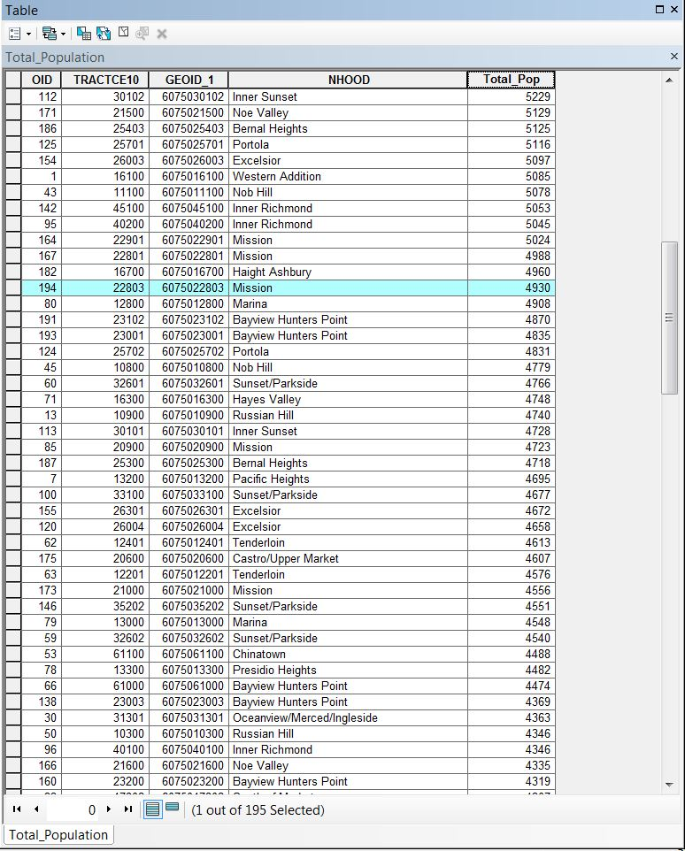
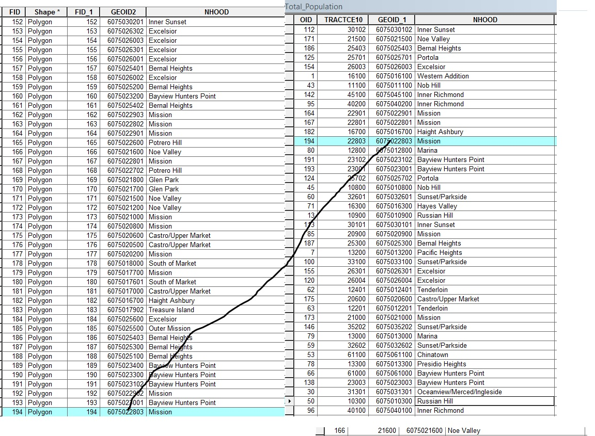
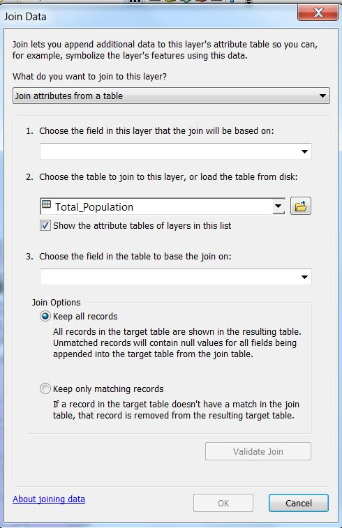
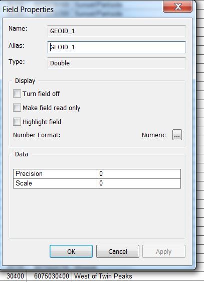
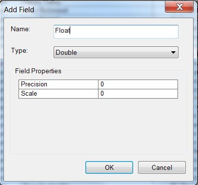
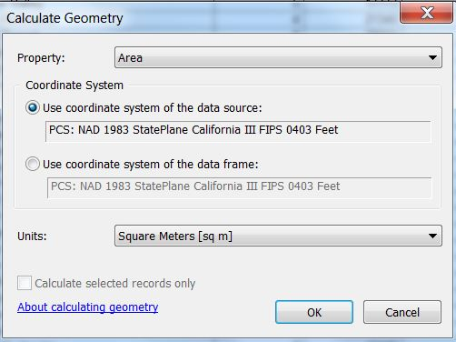

**Purpose:** The purpose of this lab is to become familiar with the relational database model.  It allows us to join tables based on attributes, a valuable way to integrate new data into a GIS. This is a skill that you will use frequently in your GIS practice. Students will also learn how to calculate the population density of enumeration units. To calculate area students will learn how to use the tool - calculate geometry. The field calculator will also be covered. In this example we will explore population density in San Francisco neighborhoods. 

## Acquiring Data and Understanding Relational Databases

The data for neighborhoods in San Francisco originally comes from https://datasf.org/opendata/.  The data has been manipulated for the purpose of this lab. 

As we transition from GIS novices to GIS experts we will become intimate with data tables. This is what you see when you open an attribute table. We will manipulate them in a way that helps us analyze the specific spatial problems we want to solve. Tables are based on the relational database model. Please ask your professor about relational data tables or feel free to conduct your own research. Arc GIS makes sure we stay in what is called normal form. This way we cannot break the connection between a record and its attributes.

\ 

Add 'SF_NEIGHBORHOODS' And 'TOTAL_POPULATION' from the S Drive to ARC Map and examine them. One is an attribute table (Total_Population) and the other is a shapefile (SF_NEIGHBORHOODS). Notice how the table has a grid next to it and SF_Neighborhoods appears like previous shapefiles.

\ 

If you right click your mouse on both files you will see that you have different options. Understanding the difference between these types of files is very important.

# Understanding how data are organized in the relational database model

1. Right click on Total_Population
2. Select Open 
    a. Draw your attention to the column Total_Pop. Each one of the entries in the column is an attribute of a different Census Tract in San Francisco. Notice that each Census Tract is attached to a neighborhood. 
3. Scroll down to the bottom of the table, until you've reach the last or 195th entry. You can see how many rows or enumerations units are on the table. I am getting this number because I am looking towards the bottom center of the table window.  You should see that 0 out of 195 cases are selected. 

\ 

Notice that the last entry in the table has the `NHOOD` attribute Mission and the TRACTCE10 22803

Right click on Total Population (the column/field). You should see options such as Field Calculator and Summarize. We will use those later. You will also see Calculate Geometry grayed out. We will use that tool later to calculate the area of each enumeration unit. We cannot calculate area because we don't have the geographical information to do so in a table. To calculate area we will need to two things. 

First we must have a `.shp` file. Second, we will need a coordinate system. 

For now right click Total_Pop and select 'Sort Descending'. Now use 'Select by Attribute' on the `TRACTCE10` column and select `22803`. 

\ 

Notice how the location of the row has changed, but most importantly – what is attached to it – its attributes - are intact. They haven't changed position. This is important and what fundamentally allows us to complete our next step – joining our attribute table.

**Problem: In order to calculate population density I need both total population and the ability to calculate area. Presently they are in different files. The table and the .shp file. We need both in the .shp file to calculate population density.**

**Solution: Join the table to the shapefile.**

Essentially you are taking the information from the table Total_Population and adding it to SF_NEIGHBORHOODS. The rules of relational databases require that we match record to record from table to .shp file in order to join. Again, the goal is transfer the information from the table to the .shp file. 

We will accomplish this task by using the 'joins and relates' dialogue on the SF_NEIGHBORHOODS .shp file. 

First, we should go over some rules of joining.

\ 

At this stage we will not bog you down in the cumbersome and often complicated nature of 1 to many and many to 1 joins. In this class we will work with 1 to 1 or basic joins. I will also attempt to keep it simple here as joining and how it works in ARC is best demonstrated through a drawn illustration. I would encourage you to ask your instructor about how the joining process works. An illustration can illuminate.

If you right click on SF_Neighborhoods you will see an option called Joins and Relates.

Click on **Joins** 

The following menus should come up: 

\ 

Before we fill in our parameters we should know the following information about joins: 

1. When you are joining a table to a .shp file always enter the join dialogue by right clicking on the shape file in this case SF_NEIGHBORHOODS
2. Numbers 1 and 3 in the joins dialogue must be similar 
    a. They should refer to the same geographic unit (Census Tract, Neighborhood etc)
    b. They should uniquely identify each enumeration unit 
        i. This unique identification is often a combinations of numbers and letters
        ii. A unique identification introduces a system of data organization in which a value can only refer to one case. If there is any possibility that there are 2 of the same entries in the column it is not the one you are looking for.
        iii. There can be several unique identifier columns in a table 
        iv. OID or FID is NEVER a unique identification column. This is the order which ARC enters each entry. This is often random and does not refer to the unique geographic case or enumeration unit you are interested in.
    c. These unique identification columns must exist both in the .shp file and the table. You are essentially playing an elaborate matching game.
3. The columns that you choose to join must have the same type 
    a. Right click on GEOID_1 (in Total_Population) and select properties 

\ 

    b. Under Alias you will see the category type – it says double
    c. You will have to ensure that the column in Total_Population you are going to join to SF_Neighborhoods has the same type. 
    d. Types signal to ARC what type of values you will be feeding or giving it. You are telling it what to expect. If you give it something that it doesn't expect it will get angry.
        i. Double is the type for GEOID_1. This is good if you are creating a value that has many decimal places. Previously double wasn't used often because it took up a lot of room. Now it really doesn't matter unless you are dealing with a very large data set.
        ii.	Short Integer Type. Use this for short numbers like age, which has 2 or 3 places.
        iii. Click on Total_Pop. This column is a long integer. It has 4 places. 
        iv.	Click on NHOOD. This is a string. This is a different type because it holds letters. You cannot join a string type to a number type. This is a common problem when folks are trying to join similar columns and fail. 
        v. Float is longer than long integer but shorter than double.
        vi.	There is also a date option that we will not be using in this lab. 
        vii. A lot of this is computer programming. If you would like to do more research on this look up SQL data types.

# Time to Join

1. Right click on 'SF_Neighborhoods'
2. Then 'Joins' and 'Joins and Relates' 
    a. Once we get to the familiar Join menu, for number 1 choose the field GEOID2
    b. Make sure you choose the Total Populations table for number 2 
    c. For number 3 Choose GEOID_1
3. Click 'Keep Only Matching Records' – it won't matter here but I find it makes the data cleaner to select this option. This option prevents you from getting null values if some cases don't join.
4. Press OK. You might be asked if you want to index the join. Choose yes. On larger data sets the index helps you located individual cases.

\ 

Open up the attribute table in SF_Neighborhoods. You should see that the information from the table is now joined to your shapefile. If it isn't you probably entered the information in the join dialogue wrong. If something is wrong right click on total population and then joins and relates – click 'remove join' and choose 'Total Population' and the table.

I must emphasize that you once you have a bad join you cannot make that correct it without starting from scratch. If you don't get what you want please remove all joins.

\ 

1. Make the join permanent (some wacky things can happen in ARC if you don't save it as a new shapefile.
2. Right click on SF_neighborhoods and click on export data. Save as a new shapefile and call it 'Neighborhood_Pop'.

# Why this Join Worked 

If you were joining without my help you would:

1. Scan the table and shape file to look for a matching unique identification column. That means they have to be on both tables or else the join can't happen. (I'm looking at Total Population) `NHOOD` can't work because there are multiple entries. Neighborhoods contain several Census Tracts. Joining here will confuse ARC. OID will be false because like I said earlier this is the random order in which ARC enters your cases. The important thing is that records stay with their attributes and ARC does this without fail. Total Pop Is not in the other table. This is why we are joining in the first place. `GEOID_1` is the correct column. 
2. Check the type of GEOID_1 by right clicking on it and highlighting properties. It should say that its type is a double. This is important because you are going to have to find a column that looks very similar, with the same amount of characters and the same type as on the column for the .shp file. 
3. This is confusing, but unfortunately this happens a lot, especially with Census data. There appears to be many columns that fit the bill. This is important. THE NAME OF THE COLUMNS DON'T HAVE TO MATCH – what is important is that the uniquely identify each case, they have the same number of characters and they have the same type. 
4. GEOID looks like it could work but the type is string we don't want that one
5. You'll see that GEOID2 has a similar number of characters, uniquely identifies each record, and has the same type. This is the column we will join to.

# Summarizing and Joining

Now that you have joined for the first time I am going to let you practice again. Bring in 'SF_Dissolved' into ARC MAP. This file is a dissolved version of SF_Neighborhoods. Now instead of Census Tracts we only have neighborhoods. You will learn how to dissolve later in the semester.

Please note that all of the .shp files are in the proper coordinate system (In this case California State Plane)

**Our Problem: We need to Join Total_Population to SF_Dissolved but the unique identification column we used earlier doesn't exist on the table. Also, there are many fewer neighborhoods than Census Tracts.** 

**Solution: Summarize Total_Population.**

In order to follow our rules of joining and add population data for each neighborhood to SF_Dissolved we have to summarize total_population. Please ask your instructor to illustrate this concept for you on the dry erase board. Essentially ARC is summarizing common values in a specific field for us. In this case instead of having many entries for the neighborhood Pacific Heights (for example) we will have only one. 

Summarize will count how many times each neighborhood appeared in the column. We can also add together the population counts for each Census Tract and include them in our neighborhood summary table.

This is how it works: 

1. Open 'Total_Population' with a right click and 'Open Attribute Table'
2. Right Click on `NHOOD`. This is the column we want to summarize because we want to join it to SF_Dissolved which has the column neighborhood. This will be the unique identification column in this case.
3. Click 'Summarize' 
    a. Our field to summarize is already NHOOD. Great
4. For number 2 uncollapse `Total_Pop` (Click on the plus sign) 
    a. You will have a number of options. When ARC condenses or summarizes all the rows or entries that have the same neighborhood name – for example – Pacific Heights, it is asking us what we want to do with the attributes connected to these cases. It cannot express all of the Total_Pop counts for all of the Census Tracts in Pacific Heights – there is only room for one number now.

If there are 7 Census Tracts to a neighborhood, those  tracts will disappear and merge into one neighborhood row. We are only interested in saving or keeping total population information. We want the total population per neighborhood. So we are going to add together the individual populations of each Census Tract. These numbers will be tallied based on what neighborhood they are located in.
1. Check the sum box under Total_Pop. Save it to a place that makes sense and call it 'Neighborhood_Pop'.
2. Add it to the map and click on the attribute table 

\ 

\ 

Notice that the summary table has one entry for each neighborhood. Notice there are only 41 entries. 

Notice there is a Count_NHOOD column that tells how many times each neighborhood was on the original table. This column is automatically included in summary and will be useful to use when you map homicides per police district in the lab/assignment. 

For example – there were 11 Census Tracts in Bayview Hunters Point on the previous table (Total_Population). The last column (Sum_Total_Pop) contains the sum of populations of individual Census Tracts. The Census Tracts on Total_Population that had the NHOOD value Bayview Hunters Point.

Now we can join it to SF_Dissolved using `NHOOD` as the join field because the characters are similar, the column is a unique identifier and the type is the same.

1. Right click on SF_Dissolved – joins and relates – joins
    a. For number 1 choose `NHOOD` 
    b. For number 2 choose `Neighborhood Pop`
    c. For number 3 choose `NHOOD`
2. Choose ok 
3. Select 'Keep only matching'

\ 

\ 

4. Right click on your joined file in `SF_DISSOLVED`
5. Export your data and save the shape file as `SF_DISSOLVED_POP` 

# Population Density 

To calculate population density (the amount of people per square unit – a relative measure of how relatively concentrated a population is given an enumeration unit) we need to find the area of each neighborhood. In this case we will choose meters. 

# Add Field

To calculate area we need to create a new field:

1. Open the attribute table for SF_DISSOLVED_POP
2. Click on options in the upper left hand corner of the table and select 'Add Field'.
3. Name the field `Area` and make it a double type

\ 

Your attribute table should show your new column - the last entry on the right side. 

# Calculate Geometry

1. Right click on your new column area and select 'calculate geometry' 
    a. ARC asks you if you would like to make changes outside of an edit session - please do so
        i. Note that you will use the coordinate system you already have in place. Note that a coordinate system can determine area calculations and if you are not using a reasonable one (based on many factors – talk to your Professor about it) it can greatly distort your results. If you have no coordinate systems you cannot calculate area. Choose square kilometers as your unit of measurement. 
2. Press ok and your area column should be populated. 

\ 

\ 

# Field Calculator

1. Add a new field and make it double and call it density 
2. Right click on the new column density and choose 'field calculator' 
4. Click on the name in the field that corresponds to your population column 
5. To the right there will be some operator buttons - choose the division symbol (a forward slash)
6. Choose the field under fields with the area information. 
7. Divide the population by the area 
8. Press ok 

\ 

\ 

You now have the population density for each neighborhood in San Francisco. 

Try creating a map of population density using the skills you learned last week in thematic mapping. 

You don't have to submit anything here, but it's good to refresh your mapping skills. You will need them in the lab/assignment.
 

# Assignment, Objectives, and Deliverables

## Part I
You have been hired as a GIS crime analyst for the city of Chicago. Your boss is upset about how Presidential candidates judge your whole city based on the murder rate (But for real there was just a drive by in front of my friend's apartment in Chicago). You want to find out where the geographic concentration of murders is so your boss can distribute police resources appropriately. She wants you to create a map that shows the density of murders in each police district per square mile.

Your final answer should be a choropleth map that shows density of murders per square mile in each district.

## Part II

Your boss is also interested in the relationship between crime and Airbnb listings. The total numbe of reviews are a proxy for activity in the Airbnb market. Please create the following tables and maps so we can appropriately consider this question. 

She would like: 

a)	A table that summarizes the average Airbnb price for each neighborhood in Chicago. (Column Price)

And

b)	A map that shows the density of total Airbnb reviews per police district. (The name of the column is 'Number of') The density should be per square mile.

## Getting Started

Each point file contains districts. You will have to join each table to the shape file Police_Districts_Chicago.

Start by summarizing your data.

Remember that the crimes data table contains crimes other than homicides. You will want to isolate homicides before you continue. 

Remember that summarize counts for you. Use this knowledge to your advantage.

In summarize you have a choice of what type of mathematical operation you perform on your data. We used sum in the tutorial – what other operator might you use?

In your report, be sure to include the following information (see the syllabus for lab report guidelines and formatting):

**Introduction:**

State the research question.

**Data and Methods:**

The data comes from 'Inside Airbnb' a watch dog for Airbnb. Please visit the website. It's pretty interesting if you have ever used Airbnb. They have collected data for cities all around the world. 

The crime data comes from the city of Chicago. Please email [bradley.gardener@temple.edu](mailto:bradley.gardener@temple.edu) if you want to look at the entire crime data set. Many cities Open Data websites have similar data. 

The structure of this lab is very similar to the tutorial. You will be summarizing data and joining it. You will be calculating density in both cases - per square mile - using the tools add field, calculate geometry, and field calculator. You will map population density using the techniques of choropleth mapping from previous labs. Please use a classification scheme that makes sense given what you have already learned.

**Results:** 

You should include the following:

1.	A map of murders per police district area (square miles) in Chicago. 
2.	A map of the total number of Airbnb reviews per police district area (square miles) in Chicago.
3.	A table that shows the average Airbnb price of each neighborhood in Chicago.

**Discussion:** 

In your final analysis, look at both of the maps you created and answer the following questions: 

1. Is there a geographic relationship between the density of Airbnb reviews and the density of homicides?
2. What neighborhoods have the highest Airbnb prices? Why do you think this is? Do some Internet investigations. Look at Yelp. What types of restaurants are in these neighborhoods? Why is sample size important here? 
3. What other crimes would you like to map? Where do you think their spatial distributions would look like?
4. What other crime data do you think it would be important to map?
5. What crimes would be difficult to map?

**Tables and Figures:**

Insert all tables and figures (including maps) at the end of the report, each on a separate page, with a label (e.g. Figure 1).  Be sure to cite each table and figure included in the body of the report text.

