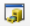
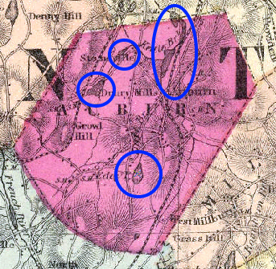

**Learning Objective**

To introduce the basics of georeferencing and digitizing in ArcGIS.  As a demonstration, you will georeference historical maps and compare the data to more recent spatial data for areas in Massachusetts and Utah.

First, complete the tutorial by following the steps below.  Then, using the skills you’ve learned in the tutorial, complete the assignment given following the tutorial.

# TUTORIAL

## Acquiring the Data

The data for this tutorial includes an historical map image provided to you:

* [Worcester_towns.jpg](https://github.com/temple-geography/fundamentals-of-gis/raw/master/data/Worcester_towns.jpg) is a JPEG image of an 1871 map of towns in Worcester County, Massachusetts, downloaded from DavidRumsey.com. [Click for more information about this image.](https://www.davidrumsey.com/luna/servlet/detail/RUMSEY~8~1~26368~1100042:Worcester-County-?sort=Pub_List_No_InitialSort%2CPub_Date%2CPub_List_No%2CSeries_No&qvq=q:towns%2Bin%2Bmassachusetts;sort:Pub_List_No_InitialSort%2CPub_Date%2CPub_List_No%2CSeries_No;lc:RUMSEY~8~1&mi=29&trs=294)

In addition, you are to download two GIS layers from MassGIS, Massachusetts’ spatial data repository. The two Massuchusetts GIS layers we are interested in – towns and ponds – are in ZIP archives (linked below) which contain other layers. Download and unzip the archives, but keep in mind that we won’t be using all of the data downloaded, and make sure to add the correct layer when directed to.

* `TOWNS_POLY.shp`: A shapefile of the town boundaries in Massachusetts. It is included in the [Community Boundaries (Towns)](http://www.mass.gov/anf/research-and-tech/it-serv-and-support/application-serv/office-of-geographic-information-massgis/datalayers/towns.html) bundle.
* `MAJPONDS_POLY.shp`: A shapefile of major ponds in Massachusetts. It is included in the [Major Ponds and Major Streams](http://www.mass.gov/anf/research-and-tech/it-serv-and-support/application-serv/office-of-geographic-information-massgis/datalayers/majhd.html) bundle.

Move all files to your workspace folder and unzip any zip files.

## Georeferencing

Georeferencing is the process of aligning data with real-world coordinates. In this tutorial we will geoference an historical map of towns in Massachusetts to a modern GIS layer of town boundaries, and we will digitize the lakes in the Town of Auburn and compare them to a current shapefile of lakes. This process will take a few steps.

1. In File Explorer, navigate to the Worcester_towns.jpg and open it in an image viewer or web browser.  Note the image shows a map of towns in Massachusetts in 1871. Close the image.
2. In ArcCatalog, view the image and explore the `TOWNS_POLY` and `MAJPONDS_POLY` layers.
3. Open ArcMap. Add `TOWNS_POLY.shp` to the map canvas.
4. Set the polygon fill to hollow (or set the Fill Color to No Color), so that you can see the town borders, but also see the historical map (which we are about to add).
5. Add the 1871 towns map (Worcester_towns.jpg) to ArcMap. 
    a. Use Add Data as if this were a shapefile or other GIS layer. Even though this is just an image file, not a GIS data layer, the file will show up in the Add Data dialog box as a suitable data source.
    b. You will get the by now familiar Unknown Spatial Reference warning. This is OK! This is the problem that you are about to fix! Hit OK to dismiss the dialog.
    c.  ***The image will not appear in the map initially.*** Since it is not a spatial layer, ArcGIS does not know how to display it. Nonetheless, `Worcester_towns.jpg` will be listed in the TOC, so you will know that it is there, and be able to change Layer properties in the next step. Even though you can't see an image, keep following the instructions. You won't be able to see the image until you turn on the Georeferencing toolbar and begin that process.
6. Open the Layer Properties for the Worcester towns layer and select the Display tab.
7. Change the Resample during display setting to Cubic Convolution. This will improve the quality of the display. Press OK.

The data are now available in your map document and you are ready to begin Georeferencing.

1. Go to the Customize→Toolbars menu. A long list of toolbars will appear. (You can also show the list of toolbars to display or hide by right-clicking anywhere in the toolbar area, i.e. on an visible toolbar or in the gray space next to a visible toolbar.) Turn on (select in the menu) the Georeferencing toolbar. The Georeferencing toolbar will appear floating over your map canvas. You can drag this to a position that you like, including docking it to the top (among the other toolbars), bottom, or sides of the ArcMap window.
2. As we have only one image, Worcester\_towns.jpg, in this map document, it should already appear in the dropdown of the layer to be georeferenced. If for some reason it is not, select the layer name in the dropdown.
3. From the Georeferencing menu that appears in the toolbar, select Fit to Display. The JPEG image will now appear in the visible part of the map canvas, along with the rest of the layers you added.

You are now ready to begin placing ground control points (GCPs). The GCPs link coordinates from the map (already referenced) with the image of the historical map.

1. In the Georeferencing toolbar, click the Add Control Points button {height="0.167in"}.
2. Place the first GCP:
    a. Look at the modern towns layer and the map to identify (by shape, or possibly by name) a town that is the same in both data sources.
    b. Click on a corner of the town in the JPEG image. ***NOTE:** You **must** click on the image **first***.
    c. Click on the matching corner of the town in the `TOWNS_POLY` layer. The image will immediately reposition itself so that that point in the two data sources are aligned. The scale (size of the towns) will (probably) still be off.
    d. Repeat the process for another (perhaps the opposite) corner of the same town. The image will now be rescaled to approximately the same size as the modern towns layer. It won't be perfect, but even with only two GCPs, it should now be visibly obvious that the two data sources are slightly different versions of the same real-world entities.
3. Place additional GCPs.  As you place additional points, the image will align more and more closely to the modern data. Be sure to add pairs of GCPs to different parts of image – do not bunch your GCPs in just one area of the image.
4. In addition to visually assessing the fit, you should also evaluate the fit using the residuals and **root mean square (RMS) error**. Click the View Link Table button {height="0.167in"} on the Georeferencing toolbar. The residual tells you how much discrepancy lies between the reference data (modern towns layer) and the JPEG image. Values close to 0 indicate that you are doing a good job. If the RMSE reaches 0, you have perfect fit. You can delete control points that have a very large residual, and you may find that the fit will be improved by deleting these points.
5. Continue placing additional GCPs. Ideally, your control points will be well-distributed across the map. We can't know the number of required GCPs in advance. The process is iterative. As you place additional points, you will evaluate the fit, erase the ones with a poor fit, add new points to improve the fit, etc. **NOTE:** The next section of the lab will focus on digitizing features in the town of Auburn, so please prioritize the fit in Auburn.
6. When you are satisfied with your GCPs, you will want to save the JPEG as a new image. 
    a. Select Rectify from the Georeferencing menu.
    b. Change the resample type to Bilinear Interpolation.
    c. Select the folder (Output Location) where you would like to save the image. **NOTE:** The Select Workspace dialog is somewhat confusing. Do *not* try to enter a filename. Just select your workspace folder (e.g. the Lab5 folder) and hit Add.
    d. Change the image Name (if you are not happy with the default name).
    e. The Format should be TIFF. (If it is some other type, change it to TIFF.)
    f. TIFF images can be very large. Change the Compression Type to JPEG. Compression Quality can stay at the default value (which should be 75).
    g. Hit Save.

## Digitizing

For historical research, the researcher/analyst will often need to **digitize** features by referring to an historical map. Now that you have finished geoferencing the towns map, you can begin digitizing features drawn on the map. We are going to digitize the lakes in the town of Auburn and compare the historical locations of these lakes to the current water bodies taken from a modern GIS layer.

A video of this digitizing tutorial is available at <https://drive.google.com/file/d/0B_rk0_Y4N6QzWFFDclRUcnE3TkU/view> and a brief description of the steps follow. You might find it useful to review the steps below and watch the video before beginning the tutorial.

1. Add the georeferenced TIFF (the result of the previous section) to the map document.
2. Zoom in to the town of Auburn (you can identify Auburn in the TOWNS_POLY attribute table).
3. Open the ArcCatalog pane in ArcMap using the Catalog button {height="0.167"} and navigate the catalog tree to get to your workspace folder. 
4. Right-click in your folder and select New→Shapefile.
5. Create the settings for your shapefile as follows:
    a. Name: `Lakes_auburn`
    b. Feature type: polygon
    c. Spatial reference: Select the Edit button {height="0.167in"}, then Import, and in the following window, select the `TOWNS_POLY` shapefile. The new (empty) shapefile) will now have the same spatial reference information as the `TOWNS_POLY` shapefile. Any features that you create will use coordinates from that coordinate reference system.
6. Click OK and the new shapefile will be created in the selected folder and added to the TOC. (If it does not get added to the map automatically, you can use the Add Data button as usual.)
7. Display the Editor toolbar.
8. In the Editor toolbar, select Editor→Start Editing.
9. Select your newly created 'Lakes_auburn' shapefile to begin editing.
    a. You will see a new pane appear on the right. Your new shapefile should appear. 
10. Select the shapefile, and look at the bottom of the pane. A number of Construction tools will appear. Select the Polygon tool.
11. Begin tracing the outline of one of the lakes in the town of Auburn. The lakes are darker shaded polygons, for example those found within the areas circled below. Each click will add a **vertex** to the polygon. Draw the polygon with a series of closely spaced clicks. Where the boundary is curved, you will have to add more vertices to follow the curve. Where the boundary is straight, the vertices can be more spread out.\
    \ 
12. When you have finished one polygon, double-click to complete the sketch. The polygon will be outlined in teal, indicating that the shape is complete.
13. Return to the Editor toolbar and select Editor→Save Edits so that you do not lose any work.
14. Digitize all of the lakes in the town of Auburn. When you are finished, save your edits once again and chose Editor→Stop Editing.
15. Add the `MAJPONDS_POLY.shp` layer to compare the locations of lakes in 2017 and 1871.

# ASSIGNMENT

## Objective

Recently, there were a number of articles about the shrinking Great Salt Lake in Utah <https://earthobservatory.nasa.gov/IOTD/view.php?id=88929>.

Your objective is to investigate how much the Great Salt Lake in Utah has changed in size since 1889. You will start with an image file of a historical map of Utah, which is provided to you:

* [Utah_1889.jpg](https://github.com/temple-geography/fundamentals-of-gis/raw/master/data/Utah_1889.jpg) is a JPEG image of an historical 1889 map of Utah [originally downloaded from DavidRumsey.com](https://www.davidrumsey.com/luna/servlet/detail/RUMSEY~8~1~37442~1210316:Utah-?showTipAdvancedSearch=false&showShareIIIFLink=true&showTip=false&helpUrl=https%3A%2F%2Fdoc.lunaimaging.com%2Fdisplay%2FV73D%2FLUNA%2BViewer%23LUNAViewer-LUNAViewer&title=Search+Results%3A+List_No+equal+to+%272094.058%27&fullTextSearchChecked=&dateRangeSearchChecked=&advancedSearchUrl=https%3A%2F%2Fdoc.lunaimaging.com%2Fdisplay%2FV73D%2FSearching%23Searching-Searching&thumbnailViewUrlKey=link.view.search.url).

For this assignment you are to georeference the image, digitize the perimeter of the Great Salt Lake, and compare the digitized historical lake boundary to more recent representations of the lake boundary as captured in satellite imagery within Google Earth.

## Deliverables

**Turn in a report in the format described in the syllabus.**

Be sure to include the following information:

1. A map of the digitized 1889 Great Salt Lake polygon you digitized overlain on the historical 1889 image of Utah. 
2. A map/image of the digitized Great Salt Lake polygon overlain on the modern satellite imagery of the lake in Google Earth.

The **Introduction** section should state the research objective and the relevant criteria for selecting the neighborhoods and schools.

The **Data and Methods** section should state the data sets used in the analysis, from where those data were acquired, and the GIS operations employed.  Be sure to address your methods for georeferencing and digitizing, and to justify why you chose specific mapping options.

The **Results** section should state the results (i.e. your assessment of the change in size of the lake over time).  Include the RMSE derived from the image georefrencing and an evaluation of the digitizing quality.  The map should be cited in the text here (e.g. Figure 1).

The **Discussion** section should state an interpretation of the results (i.e. how and, briefly, why, has the size of the Great Salt Lake changed over this time period), limitations of the analysis, and how the analysis could be improved or expanded.

The **Tables and Figures** section should contain the map, with a caption.  The map should be cited in the text.

## Getting Started

1. Georeference Utah_1889. Use the National Geographic World Map as your basemap to georeference this map. This can be added by choosing Add Basemap from the dropdown function of the Add Data button, or the File→Add Data menu. In the Add Basemap dialog box, try the National Geographic World Map.
    * **If you are behind a corporate firewall:** On Temple campus, or another campus or organizational network that requires proxy authentication, you may be blocked from adding a basemap, which ArcMap downloads from the internet. If this is the case, you can authenticate as follows:
        1. Close ArcMap.
        2. Open a web browser, such as Google Chrome or Firefox. If you have already authenticated in an open browser window, close the browser and reopen it.
        3. Go to <https://livingatlas.arcgis.com/>.
        4. When the proxy server asks you to authenticate, enter your network credentials. **NOTE:** This is not the same as signing into the website, which is not necessary. This is authenticating against your corporate proxy server. If you do not get an authentication dialog, this may not be the reason why Add Basemap is not working!
2. Digitize the perimeter of Great Salt Lake as a polygon.
3. Save the polygon shapefile as a Layer file and then convert to KML file for viewing in Google Earth. This will allow you to visually compare the historic extent of the Great Salt Lake to its current extent. A layer in ArcGIS references a spatial data set and includes a set of rules for how it should be displayed. (Think how a layer in ArcGIS is both a pointer to a data source and rules about how to display it.) To create the KML file:
    a. Change the symbology of the shapefile to a hollow fill with a 2 point border.
    b. Right-click the layer in the TOC and select Save as Layer File. Save it to your working folder.
    c. Use the Layer to KML tool to create a new KMZ file (a zipped .KML file). This tool is found in ArcToolbox under Conversion Tools→To KML→Layer to KML. The input file will be the Layer File that you just saved.
4. Once the KML layer is exported, double-click it in Windows File Explorer. This will launch Google Earth and view the file. Once you are in Google Earth you can access imagery since 1970 by clicking on the button that looks like a clock with an arrow pointing counterclockwise.
5. You can export the image as a jpg, with the lake polygon you added overlain, by going to File→Save→Save Image.

