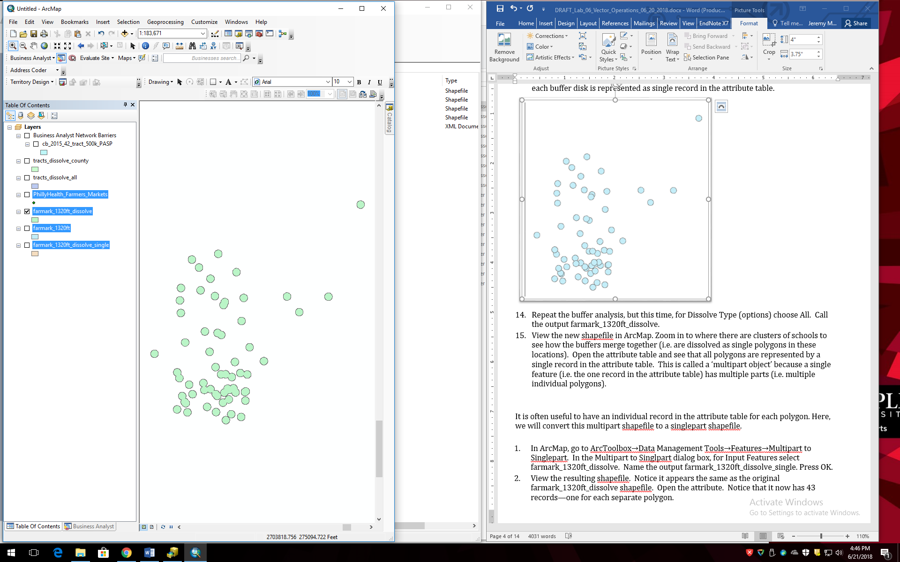
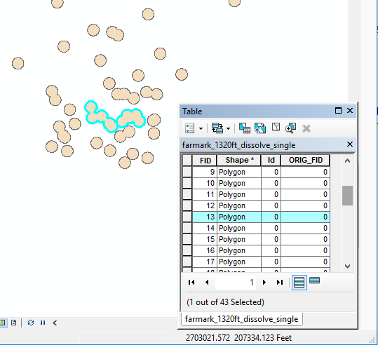
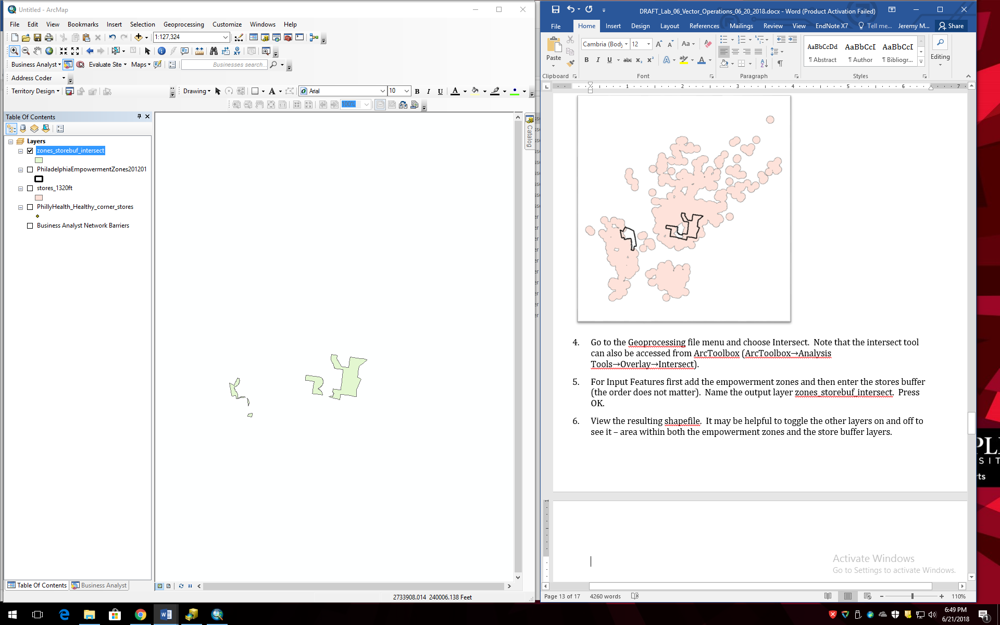
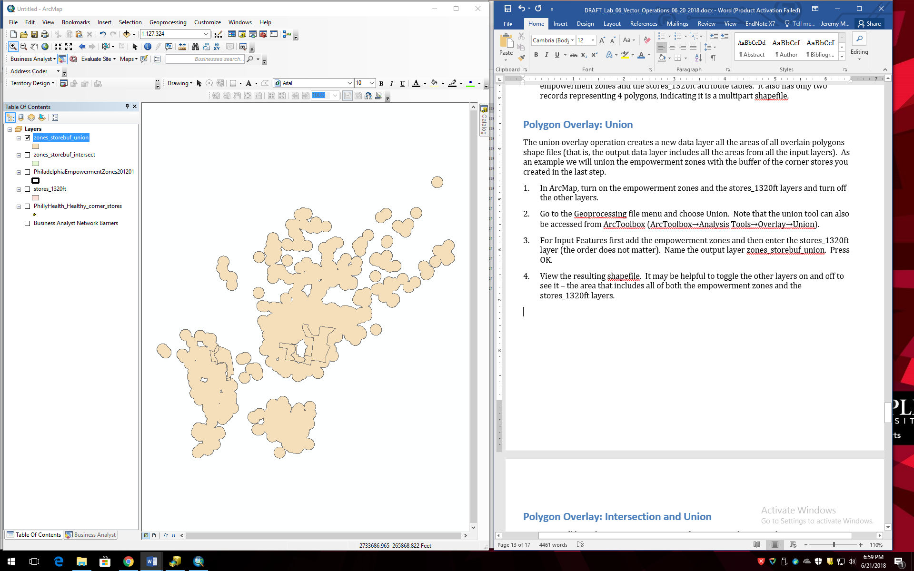
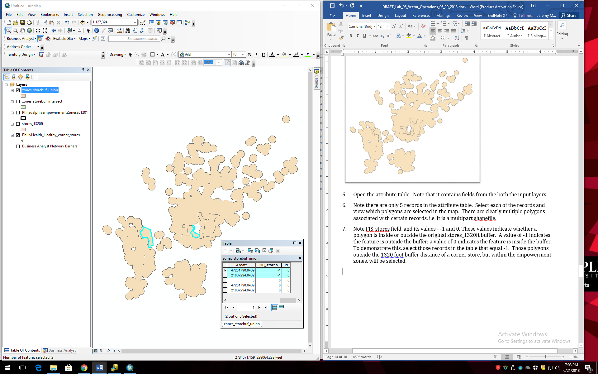

**Learning Objective**

To introduce vector operations, including buffer, dissolve, and overlay
operations.

Vector operations refers to a variety of tools that operate on vector
data. While far from exhaustive, this lab tutorial walks through a set
of extremely commonly used operations. Each section of the tutorial is
essentially a standalone mini-tutorial that introduces how a specific
operation works, using data from Philadelphia, Pennsylvania. You will
notice that each of these operations has a variety of settings and
capabilities beyond what you are instructed to do. You are encouraged to
explore the various functionalities of these tools. In the assignment,
you will be asked to work with several of these tools in sequence,
performing a classic **site suitability analysis**, through which these
tools identify optimal locations based on a set of spatial criteria.

First, complete the tutorial by following the steps below. Then, using
the skills you’ve learned in the tutorial, complete the assignment given
following the tutorial.

## TUTORIAL

## Acquiring the Data

We will work with data for Philadelphia (and one data set for
Pennsylvania) made publicly available by PASDA, the Pennsylvania
Geospatial Clearinghouse ([PASDA](http://www.pasda.psu.edu)). From
PASDA, use the search function to find and download the following files
layers:

  - SEPTA High Speed Stations (2012)  
    These are the **subway stations**.
  - SEPTA Regional Rail Stations (2016)  
    These are the **regional rail stations**.
  - SEPTA Routes Spring (2016)  
    These are the **bus routes**.
  - Philadelphia Health – Healthy Corner Stores (2016)  
    These are **corner stores** participating in the Food Trust’s
    Healthy Corner Store Initiative –
    <http://thefoodtrust.org/what-we-do/corner-store>.
  - Philadelphia Health – Farmers Markets (2016)  
    These are **farmers markets**.
  - Philadelphia Empowerment Zones (2012)  
    These are **empowerment zones** – areas targeted by the City of
    Philadelphia for investment –
    <http://www.phila.gov/commerce/neighborhoods/Pages/EmpowermentZones.aspx>.
  - 2015 Cartographic Boundary File, State-County-Census Tract for
    Pennsylvania, 1:500,000 (2015)  
    These are Pennsylvania **census tracts** – US Census Bureau
    enumeration units.

Some of these files will be used for the tutorial portion of the lab.
Others will be used for the assignment.

Move all files to your workspace folder and unzip any zip files.

## Explore and Integrate the Data into a Common CRS

Open ArcCatalog and explore each of the downloaded data sets, including
the maps and tables.

Pay particular attention to the CRS of each data set. Note that most are
in Pennsylvania State Plan South, which is the CRS used by the City of
Philadelphia for its GIS data. The exceptions are the regional rail
stations, the bus routes, and the census tracts. Using the Project tool
in ArcCatalog, convert these data sets to Pennsylvania State Plane. Use
these converted data sets in the remainder of the tutorial and
assignment.

## Adjust the Environment Settings

Now, we will set up the Environment in ArcMap. This will specify a
workspace folder for all of the data files generated when running
different operations and make it easier to save output files.

1.  Open ArcMap, select the Geoprocessing file menu, and choose
    Environments.
2.  Under Workspace, set the Current and Scratch Workspaces to your
    workspace folder (See example below; your path will differ.) You do
    not need to modify any of the other fields. Click OK. Each time you
    run an operation, the output will be saved to your workspace. Be
    sure to set up your Environment in ArcMap and/or ArcCatalog each
    time you begin working.

 

## Retrieve Line Length and Polygon Area Measurements

Here, you will learn how to use ArcMap to calculate line length and
polygon area and encode these values in an attribute table.

We will start by adding a new field and populating the field with new
length values in feet.

1.  Add the bus routes layer to ArcMap (be sure to add the new data set
    you created that is in Pennsylvania State Plane CRS).
2.  Open the attribute table. Explore the data by selecting some
    different routes so you understand that each record in the table
    represents one bus route.
3.  Add a new field to the table. Name the new field `Lengthft`. Make it
    a double data type, and press OK.
4.  Right click on the header for the new field (where it says
    `Lengthft`) and go to Calculate Geometry.
5.  Click Yes to confirm you want to edit this field. In the Calculate
    Geometry dialog box make sure Property is set to `Length` and the
    Units is set to `Feet US [ft]`. Click OK. You should see the new
    length values appear in the field. This is the length of each bus
    route in feet.

It is also possible to calculate the area of polygons.

1.  Turn off the bus routes layer, and add the empowerment zones
    shapefile to ArcMap.
2.  Open the empowerment zones attribute table.
3.  Add a new field called `Areaft`. Calculate the area of each
    empowerment zone for this new field by following the analogous
    procedures as above, but instead of length choose to calculate the
    area in square feet.
4.  Remove all data layers from ArcMap.

## Buffer

Here, you will learn how to use ArcMap to perform a buffer operation. We
will buffer points here but it is also possible to buffer lines and
polygons in the same way.

1.  Add the farmers markets shapefile to ArcMap.
2.  Go to the Geoprocessing menu and select Buffer. (The Buffer tool can
    also be accessed from ArcToolbox by going to Analysis
    Tools→Proximity→Buffer.)
3.  In the Buffer dialog box, for the Input Features choose the farmers
    markets. Name the output shapefile `farmark_1320ft` and make sure it
    saves to your workspace. For the Distance box, under Linear Unit,
    enter 1320 feet. Leave the rest of the options as the defaults.
    Press OK.
4.  View the new shapefile in ArcMap. Zoom in to where there are
    clusters of farmers markets to see how the buffer polygons overlap.
    Open the attribute table and see that each buffer disk is
    represented as a single record in the attribute table.

 

5.  Repeat the buffer analysis, but this time, for Dissolve Type
    (options) choose All. Call the output farmark\_1320ft\_dissolve.
6.  View the new shapefile in ArcMap. Zoom in to a cluster of farmers
    markets to see how the buffers merge together (i.e. are dissolved as
    single polygons in these locations). Open the attribute table and
    see that *all* polygons are represented by a single record in the
    attribute table. This is called a ‘multipart object’ (in this
    specific case a ‘multipolygon’) because a single feature (i.e. the
    one record in the attribute table) has multiple parts (i.e. multiple
    individual polygons).

 

It is often useful to have an individual record in the attribute table
for each polygon. Here, we will convert this multipart layer to a
singlepart layer using a Multipart to Singlepart operation.

1.  In ArcMap, go to ArcToolbox→Data Management Tools→Features→Multipart
    to Singlepart. In the Multipart to Singlpart dialog box, for Input
    Features select farmark\_1320ft\_dissolve. Name the output
    farmark\_1320ft\_dissolve\_single. Press OK.

2.  View the resulting shapefile. Notice it appears graphically the same
    as the original farmark\_1320ft\_dissolve shapefile. Open the
    attribute. Notice that it now has 43 records—one for each separate
    polygon.

3.  Explore this new shapefile by selecting certain records in the
    attribute table to see which polygon is associated with a single
    record.
    
     

4.  Remove all data layers from ArcMap.

## Map Dissolve

Here, you will learn how to use ArcMap to generalize a data layer by
dissolving the boundaries of adjacent polygons.

1.  Add the census tracts shapefile (be sure to add the one in
    Pennsylvania State Plane CRS).

2.  First we will dissolve all the tract boundaries to yield the
    boundary of the state. Go to the Geoprocessing file menu and select
    Dissolve. (The Dissolve tool can also be accessed from ArcToolbox
    (ArcToolbox→Data Management Tools→Generalization→Dissolve).

3.  For Input Features select the census tracts shapefile. Name the
    output file `PA_bnd`. Press OK.

4.  View the resulting shapefile. Note that the new shapefile is simply
    a boundary of Pennsylvania – the operation has dissolved all the
    boundaries between the tracts, resulting in an outline of the entire
    set of features (i.e. the entire state of Pennsylvania). You’ll
    notice that the resulting feature has one record in the attribute
    table.
    
     

Now we will compare what you have just done to what happens when you
dissolve by an attribute.

5.  Open the attribute table of the original census tracts shapefile and
    find the field `COUNTYFP10`. This field is a 3-digit identifier for
    each individual county (e.g. `091` for Montgomery County) in the
    state. You’ll notice that the GEOID code full name for all the
    tracts in Philadelphia begins `42101` (`42` for Pennsylvania; `101`
    for Philadelphia County). Of course, many individual tracts share
    the same value for this field. It is thus possible to perform a map
    dissolve operation on the PA tracts shapefile, using the
    `COUNTYFP10` field as the dissolve field.

6.  Perform another dissolve operation on the original census tracts
    shapefile, but this time under Dissolve\_Field(s) (optional) check
    the COUNTYFP box. This will dissolve the boundaries among adjacent
    tracts that share the same county identification. Name the output
    shapefile counties. Press OK.

7.  View the resulting shapefile in ArcMap. You’ll see that the tracts
    have been dissolved by the county identifier, resulting in a
    shapefile of county outlines.
    
     

8.  Remove all data layers from ArcMap.

## Point in Polygon Overlay

Here, you will learn how to use ArcMap to create a **spatial join**
based on a point in polygon overlay. Point in polygon is a type of
spatial relationship used to find points that are geographically
contained by a polygon. Other types of spatial relationships are
possible. A spatial join is used when you want to attach data in one
vector layer to another layer based on a spatial relationship. Very
commonly the attributes from a polygon data layer are attached to the
points in a point layer. It is possible to do spatial joins with other
vector data types, for example to attach county names (from a polygon
layer) to road segments (in a line layer), or attach a voting precinct
(from a polygon layer) to residential buildings (in a polygon layer).

Here, as an example, we will join data from the polygon counties layer
onto the regional rail station points.

1.  Add the regional rail stations and the counties shapefiles (which
    you just created) to ArcMap. Review each of their attribute tables
    and note the fields that are included in each.

2.  Right click the regional rail stations shapefile and choose Joins
    and Relates→Join.

3.  In the new window, in the top drop down menu ‘What do you want to
    join to this layer’ choose `Join data from another based on spatial
    location`.
    
    > Note: As is so often the case, there’s an additional way to
    > implement spatial join functions in ArcGIS generally, the “Spatial
    > Join” tool. In Toolbox, click on Analysis Tools→Overlay→Spatial
    > Join. You will see that compared to the route we are taking (Joins
    > and Relates→Join), the more comprehensive Spatial Join tool offers
    > quite a few additional options. It is worth exploring more fully
    > if you are interested in getting a deeper understanding of point-
    > and line-in-polygon operations.

4.  Under Choose the layer to join to this layer, or load spatial data
    from disk: select the counties layer. You are also given a choice of
    how to associate each polygon with a given point. Here, choose “it
    falls inside”.

5.  Name the new shapefile rail\_stations\_w\_counties

6.  Press OK

7.  View the new shapefile. Note that spatially it is identical to the
    original regional rail stations shapefile. Open the new shapefile’s
    attribute table. You will observe that the attributes from the
    counties file are now appended to the attributes of the original
    regional rail stations shapefile, based on the county within which
    each station resides.

You can also join points to polygons. The problem, however, is that many
points can fall within a single polygon. Since we cannot store multiple
values of a single attribute for a single polygon (a violation of first
normal form), the software provides a few options for transforming
multiple point values to a single value for each polygon.

1.  Right click on the counties shapefile and choose Joins and
    Relates→Join. In the new window, the top drop down menu should
    read “Join data from another based on spatial location”.

2.  Choose the regional rail stations shapefile as the layer to join to
    the counties layer.

3.  Note that it now reads “You are joining: Points to Polygons”. You
    are given a choice for how to summarize the point data. Option one
    counts the number of points within each polygon and then offers some
    statistical functions based on combining the attributes of multiple
    points that fall within each polygon. Option two simply takes the
    point nearest the polygon, or if many points fall within a single
    polygon, it takes the first point that the algorithm comes to.

4.  Here, choose the first option (you don’t have to choose any
    statistical summary option).

5.  Name the output file counties\_w\_railstations.

6.  View the new shapefile and open its attribute table. You should see
    a new field called Count that contains the number of regional rail
    station points that fall within each county polygon. Most counties
    have none, of course, since these are counties for all of
    Pennsylvania, but there should be many regional rail stations in
    Philadelphia county and the surrounding counties.

7.  Remove all the layers from ArcMap.

## Polygon Overlay: Clip

A Clip operation is akin to a “cookie cutter” operation whereby one
layer (points, lines, or polygons) is clipped to the boundaries of
another polygon data layer. As an example, we will clip the bus routes
lines to the empowerment zones polygons.

1.  Add the empowerment zones and bus routes shapefiles to ArcMap.
    
     

2.  Go to the Geoprocessing file menu and select Clip. Note that the
    clip tool can also be accessed from ArcToolbox (ArcToolbox→Analysis
    Tools→Extract→Clip).

3.  In the Clip dialog box, for Input Features select the bus routes
    layer. For clip Features select the empowerment zones layer. Name
    the output shapefile bus\_routes\_clip. Press OK.

4.  View the new shapefile, which should include only the bus routes
    within the empowerment zones polygons. It may be helpful to turn off
    the original bus routes layer.
    
     

5.  Open the attribute tables for the original bus routes layer and the
    new clipped bus routes layer. Note that they have the identical set
    of fields.

## Polygon Overlay: Erase

An Erase operation is akin to a “pencil eraser” operation whereby one
polygon layer use to erase (or eliminate) the features of another point,
line, or polygon layer which fall within its boundaries. As an example,
we will erase the bus routes lines that fall within the empowerment
zones polygons (i.e. the complement of the previous clip operation).

1.  Turn on only the empowerment zones and the original bus routes
    layers (or add them to ArcMap if you have removed them).

2.  Go to the Geoprocessing file menu and select Search for Tools. In
    the text box type in erase and choose Erase (Analysis). Note that
    the erase tool can also be accessed from ArcToolbox
    (ArcToolbox→Analysis Tools→Overlay→Erase).

3.  In the Erase dialog box, for Input Features select the bus routes
    layer. For Erase Features select the empower zones layer. Name the
    output shapefile bus\_routes\_erase. Press OK.

4.  View the new shapefile, which should include only the bus routes
    which are NOT within the empowerment zones polygons. It may be
    helpful to turn off the original bus routes layer and make the
    empowerment zones hollow.
    
     

5.  Remove all data layers from ArcMap.

## Polygon Overlay: Intersect

The intersect overlay operation creates a new data layer from the areas
that overlap when you overlay multiple polygons shape files (that is,
the output data layer only includes areas that are spatially coincident
to all the input layers). As an example we will intersect the
empowerment zones with a buffer of the corner stores which we perform
here.

1.  Add the empowerment zones layer and the corner stores layers to
    ArcMap.

2.  Perform a buffer operation on the corner stores using a buffer
    distance of 1320 feet and using the dissolve all option. Name the
    new shapefile stores\_1320ft.

3.  Turn off the corner stores layer. Change the symbology of the
    empowerment zones so it is hollow. Then order the layers so that the
    empowerment zones is on top. You can see the area of intersection –
    the area where the stores\_1320ft and the empowerment zones are
    spatially coincident, or overlap each other.
    
     

4.  Go to the Geoprocessing file menu and choose Intersect. Note that
    the intersect tool can also be accessed from ArcToolbox
    (ArcToolbox→Analysis Tools→Overlay→Intersect).

5.  For Input Features first add the empowerment zones and then enter
    the stores\_1320ft layer (the order of entry does not matter). Name
    the output layer zones\_storebuf\_intersect. Press OK.

6.  View the resulting shapefile. It may be helpful to toggle the other
    layers on and off to see it – the area within both the empowerment
    zones and the store buffer layers.  

7.  Open the attribute table for the new shapefile. Note that it has
    fields from both the empowerment zones and the stores\_1320ft
    attribute tables. It also has only two records, though there are
    more than two polygons, indicating it is a multipart layer.

## Polygon Overlay: Union

The union overlay operation creates a new data layer representing the
combination of all the areas from all the input layers. As an example we
will union the empowerment zones with the buffer of the corner stores
you created in the last step.

1.  In ArcMap, turn on the empowerment zones and the stores\_1320ft
    layers and turn off the other layers.

2.  Go to the Geoprocessing file menu and choose Union. Note that the
    union tool can also be accessed from ArcToolbox (ArcToolbox→Analysis
    Tools→Overlay→Union).

3.  For Input Features first add the empowerment zones and then enter
    the stores\_1320ft layer (the order does not matter). Name the
    output layer zones\_storebuf\_union. Press OK.

4.  View the resulting shapefile. It may be helpful to toggle the other
    layers on and off to see it – the area that includes all of both the
    empowerment zones and the stores\_1320ft layers.
    
     

5.  Open the attribute table. Note that it contains fields from the both
    the input layers.

6.  Note there are only 5 records in the attribute table. Select each of
    the records and view which polygons are selected in the map. There
    are clearly multiple polygons associated with certain records,
    i.e. it is a multipart shapefile.

7.  Note the FIS\_stores field, and its values - -1 and 0. These values
    indicate whether a polygon is inside or outside the original
    stores\_1320ft buffer. A value of -1 indicates the feature is
    outside the buffer; a value of 0 indicates the feature is inside the
    buffer. To demonstrate this, select those records in the table that
    equal -1. Those polygons outside the 1320 foot buffer distance of a
    corner store, but within the empowerment zones, will be selected.
    
     

It often helpful to convert the result of a union operation from
multipart to a singlepart shapefile. Here, we will convert the
zones\_storebuf\_union shapefile.

1.  Clear your selection, if you have any features still selected.
2.  In ArcMap, in Geoprocessing-\>Search for Tools, search for and
    execute the Multipart to Singlepart tool. Perform the multipart to
    singlepart operation on the zones\_storebuf\_union shapefile.
3.  View the resulting shapefile. It should now have 29 records in the
    attribute table – one for each separate polygon.

# ASSIGNMENT

## Objective

Consider the city government is choosing a location to encourage the
development of a new store selling healthy foods. The target location
should be: within an area targeted for investment, accessible by public
transit, and not nearby current farmers markets or corner stores
participating in the Healthy Corner Store Initiative.

The following specific spatial criteria are given:

1.  Within a Philadelphia empowerment zone
2.  Within 2000 feet of a subway station or regional rail station
3.  NOT within 1200 feet of a farmers market or corner store
    participating in the Healthy Corner Store Initiative.
4.  A larger contiguous area is preferable to increase the likelihood of
    securing a potential property.

## Deliverables

**Turn in a report in the format described in the syllabus.**

Be sure to include the following information:

1.  One or more maps illustrating the data sets used and a step in the
    methodology.
2.  A map showing the area(s) that meet the spatial criteria.
3.  State the area in square feet for each area that meets the criteria
    and make a recommendation for the best area for a new store selling
    healthy foods.

The **Introduction** section should state the research objective and the
relevant spatial criteria for locating the new store.

The **Data and Methods** section should state the data sets used in the
analysis, from where those data were acquired, and the GIS operations
employed. The maps illustrating the data sets used and a part of the
methodology should be cited in the text here (e.g. Figure 1, 2, etc.)

The **Results** section should state the results (i.e. a brief
description of the areas that meet the criteria, the square footage of
each, and your recommendation as to the best area for the store). The
map of the potential area(s) for the store should be cited in the text
here.

The **Discussion** section should state an interpretation of the results
(i.e. where in Philadelphia is the recommended area, what is
advantageous about this particular location), limitations of the
analysis, and how the analysis could be improved or expanded.

The **Tables** **and Figures** section should contain the maps, each on
a separate page with a caption. The maps should be cited in the text.

## Getting Started

Make sure all layers and your data frame are in State Plane Pennsylvania
South CRS.

There are many ways to complete this analysis (but only one correct
answer). All of the tools that you need to complete the lab are
described in the lab tutorial. Here is one strategy.

**Start by creating an inclusive layer of the areas where the new store
MUST be located.**

1.  Buffer the regional rail stations and the subway stations (be sure
    to use Dissolve All in the buffer operation).
2.  Union the resulting regional rail station buffer and the subways
    station buffer.
3.  Intersect the resulting regional rail station/subway station buffer
    union layer with the empower zones. Name this layer ‘inclusive’
    because it describes the area where the new store MUST be located.

**Then create an exclusive layer of the areas where the new store CAN’T
be located.**

4.  Buffer the farmers markets and the corner stores.
5.  Union the resulting farmers markets buffer and the corner stores
    buffer. Name this layer ‘exclusive’ because it describes the area
    where the new store CAN’T be located.

**Then create a layer of the candidate areas where the new store MUST be
located, but without the areas where it CAN’T be.**

6.  Erase the exclusive layer from the inclusive layer. Name this layer
    ‘candidates’ because it represents the candidates for the final
    area you recommend.

**Clean up the candidates layer.**

7.  Use a multipart to singlepart operation on the candidates layer so
    that each polygon is represented by one record in the attribute
    table (clear your selections first).

**Calculate the area of each candidate polygon.**

8.  Add a field to the resulting layer’s attribute table to hold the
    area value of each polygon. Calculate the area of each polygon in
    square feet.
