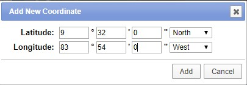
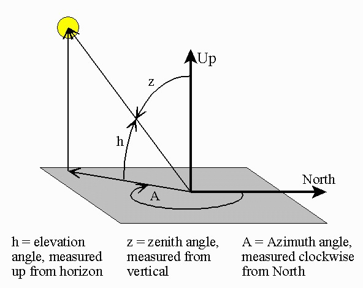
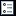
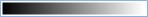
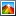

Lab 7: Introduction to Raster Analysis.
=======================================

**Purpose** At the end of this lab, students will learn:

1.  How to download spatial raster information from public repositories.
2.  How to align raster data with different coordinate systems and pixel resolutions.
3.  How to convert vector files into aligned raster files.
4.  How to exclude undesired pixels from raster analyses through masking operations.
5.  How to perform basic raster algebra operations.
6.  How to summarize statistics in a raster file for different regions specified in another raster file.
7.  How sun illumination conditions interact with topography to affect the detection of vegetation properties.

This lab exercise will be more time-consuming than most of the previous labs. Thus, there is no separate assignment at the end. The tutorial *is* the assignment. Answer the questions throughout, and report the answeres in the Discussion section of the lab report you will submit.

Data
====

The data are from Costa Rica:

-   [LosSantosNR](data/LosSantosNR.zip) - A zipped shapefile of the boundaries of the Los Santos Natural reserve in Costa Rica.
-   Please list satelite datasets with short description.

The Los Santos National Reserve shapefile can be downloaded from the link above. Satellite imagery will be obtained from the [USGS EarthExplorer website](http://earthexplorer.usgs.gov). To download the satellite data:

1.  Go to <http://earthexplorer.usgs.gov>. The Search Criteria tab should be active (upper left), but if it isn't, click on it to select it.
2.  In the Coordinates tab, click Add Coordinate. Enter the coordinates 9° 32' North, 83° 54' West, as shown below:

    
3.  Click the `Data Sets >>` button at the bottom, and check the boxes for the following datasets:
    1.  Landsat Archive/Collection 1 Level-1/L8 OLI/TIRS C1 Level-1
    2.  Digital Elevation/SRTM/SRTM 1 Arc-Second Global

4.  Go to the results tab and select the L8 OLI/TIRS C1 Level-1 option from the drop down menu. Search for and download the file named LC08\_L1TP\_015053\_20170126\_20170218\_01\_T1
5.  Select the SRTM 1 Arc-Second Global option from the drop down menu and download the file with the entity id: SRTM1N09W084V3.
    1.  What is a digital elevation model?

6.  The Landsat file is a in a zip archive having the extension `.tar.gz`. Use 7-Zip to extract it. It may have a nested archive, meaning you will have to extract it twice.

Opening and Aligning Raster Data
--------------------------------

Zoom in to one of the corners of the DEM file to a point were you can distinguish individual pixels. You will notice that the edge of the DEM pixels do not match exactly the edge of the Landsat pixel. Right click on the DEM file and select zoom to layer. You will also notice that the extent covered by both files vary. Right click on the DEM and one of the Landsat files. Go to the "Source" tab and take note of the coordinate system. You will notice that the DEM file is in a geographic coordinate system while the Landsat files are in a UTM projection. In order to perform operations involving different raster files it is essential to have all the files aligned with the same pixel size, coordinate system and extent.

1.  In ArcGIS, open the DEM file. Then open the Landsat bands 4 and 5. These files end with the suffix B4.tif and B5.tif.
2.  Search for the Raster Calculator tool and multiply the DEMfile by 1.
3.  Go to "Environments…" and set the Output Coordinates/Output Coordinate System, Processing Extent/Extent, Cartography/Cartographic Coordinate System and the Raster Analysis/Cell Size. Although they can be specified directly, it is easier to set these to the value of a loaded raster. You can use any of the Landsat bands.
4.  Specify the output raster location and name, and click OK.
5.  Zoom to the edge of the Landsat and the SRTM datasets and compare the location of the pixels of the SRTM files after processing with the location of the pixels in the Landsat file.
    1.  What can you see compared to the unprocessed DEM file?

Masking the Pixels of Interest
==============================

A raster mask is a file that allows you to select only the pixels that you are interested for performing raster calculations. Here, we will select only the pixels that are within the Los Santos Natural Reserve in Costa Rica for further analysis.

To create a raster mask:

1.  Go to the ArcToolbox and select Conversion Tools/To Raster/Polygon to Raster
2.  Select LosSantosNR as the input feature and PA\_DEF as the value field. The value field determines the values in the attribute to be assigned to each pixel in the rasterized file. In this case the value is equal to 1 as you can see by opening the attribute table of the vector file.
3.  Click on environments and repeat the steps described in step 10, 11
4.  Open the raster calculator and separately multiply the two Landsat files opened in step 8 and the realigned DEM file in steps 10,11 by the mask created in step 14. At the end you should have three raster filew with all the pixels outside the study area excluded.

Create a Hillshade from a DEM
=============================

A hillshade model represents the shadows in the landscape at the time and location where the satellite image was acquired. The model requires a file representing the elevation of each point in the landscape (the DEM model) and data about the elevation of the sun and its position with respect to the north at the moment the satellite image was acquired. These are called the sun elevation and sun azimuth angles respectively:

 

Source: <https://www.esrl.noaa.gov/gmd/grad/solcalc/azelzen.gif>

1.  Click on Windows/Image Analysis in the main menu
2.  Select the masked DEM file created as part of step 16.
3.  Click the Image Analysis Options button  and then click on the Hillshade tab. Adjust the illumination properties. For this purpose, open the metadata text file that comes with the landsat image (LC08\_L1TP\_015053\_20170126\_20170218\_01\_T1\_MTL). Search for the sun\_azimuth and sun\_elevation angles and enter them as Azimuth and Altitude in the Image Analysis Options window. Enter the values in your report.
4.  In the Processing section, change the color ramp to greyscale. 
5.  Click on the Shade relief button next to the color ramp . This will create a hillshade raster model based on the sun azimuth and elevation angles specified in step 19 and the topography obtained from the DEM. Click on the shaded and unshaded areas in the hillshade raster and identify the approximate range of values for the shaded and unshaded areas. a.What number you consider a good threshold to differentiate between shaded and unshaded areas?. Attach a map layout image with the hillshade model to your lab report.

Evaluate the Effect of Shadows on the Detection of Vegetation Properties
------------------------------------------------------------------------

Shadows are artifacts that can distort the representation of reflective properties of the landscape derived from satellite images. The Normalized Difference Vegetation Index (NDVI) is one of the most widely used indices in remote sensing to characterize vegetation greenness. This index is used to study different vegetation processes including productivity, health and phenology among others. The formula of the NDVI is:

*N**D**V**I* = (*N**I**R*—*V**I**S*)/(*N**I**R* + *V**I**S*)

*V**I**S* is a band recording the reflectance in the visible region of the electromagnetic spectrum and *N**I**R* is the reflectance registered in the near infrared region. You will learn about this in more detail in the remote sensing class.

A big issue with the NDVI values derived from a satellite image is that they can be distorted by different effects that have nothing to do with the characteristics of the vegetation itself. In the remote sensing class, students will learn different techniques to mitigate these undesired effects. For now, we will assess the extent to which the NDVI can change due to topographic and illumination effects.

1.  Calculate NDVI based on bands 4 (*B*4) and 5 (*B*5) from the masked Landsat files in step 16. For that purpose open the raster calculator and enter the expression:

<!-- -->

    (Float(B5) - Float(B4))/(Float(B5) + Float(B4))

where *B*5 and *B*4 are the file names of bands 5 and 4 from landast. Band 5 in the Landsat 8 satellite represents the reflectance in the NIR while band 4 represents the reflectance in the VIS. 23. Open the reclassify tool. Enter the hillshade model created in step 21 as the Input raster and then convert the ranges of values representing shaded pixels into 1s and the unshaded pixels into 2s using the Reclassification table. The values described below are suggested:

    +--------------------------+-----------------------+
    | Old values               | New values            |
    +==========================+=======================+
    | 0 - 200                  | 1                     |
    +--------------------------+-----------------------+
    | 200 - 300                | 2                     |
    +--------------------------+-----------------------+
    | NoData                   | NoData                |
    +--------------------------+-----------------------+

1.  Calculate the mean NDVI values for shaded and unshaded areas. For that purpose, open the zonal Statistics as Table tool. Enter as the Input Raster or feature zone data, the output from step 23 and the NDVI file created in step 22 as the Input value raster. Enter the output filename and "All" as the statistics type. This will result into a Table added to the table of contents. Right click on the table and select "Open". The table represent statistics derived from the NDVI pixels located in shaded and unshaded areas.
    1.  What is the mean NDVI values for shaded and unshaded areas? How do you interpret these results?

Assignment, Objectives, and Deliverables
========================================

**Introduction** State the research question.

**Data and Methods** State the data used, from where it was acquired, the GIS operations employed to do the analysis, and the mapping techniques employed.

**Results** Report on the expected deliverables noted above.

**Discussion** Interpret your results and answer the questions asked throughout the lab.

**Tables and Figures** Insert all tables and figures (including maps) at the end of the report, each on a separate page, with a label (e.g. Figure 1). Be sure to cite each table and figure included in the body of the report text.
