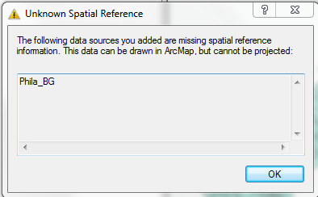
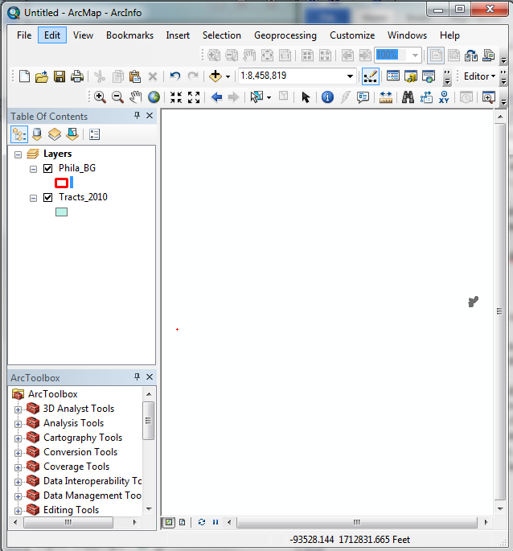
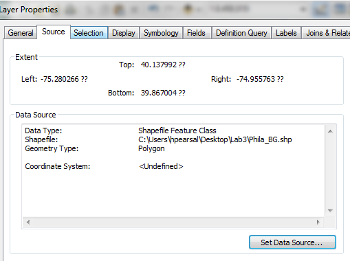
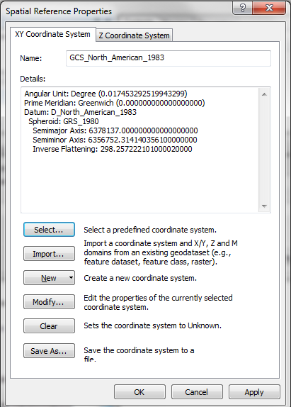
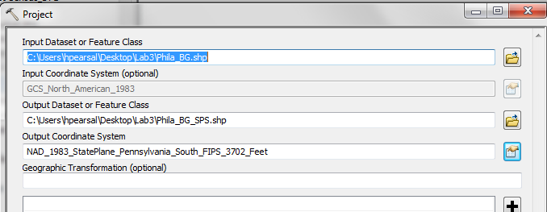
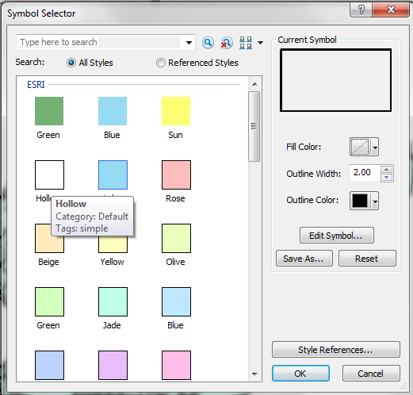
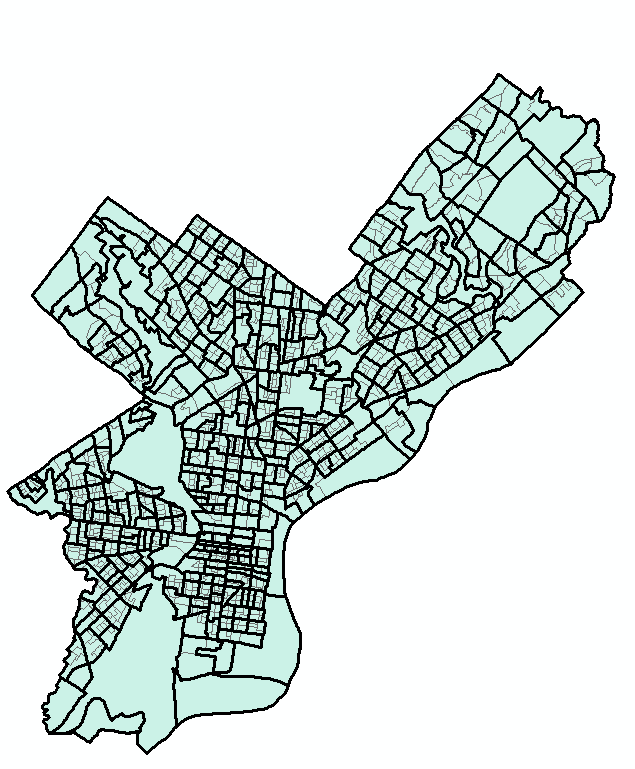

Managing Coordinate Systems in ArcGIS
=====================================

Version 1.1
-----------

Purpose of the lab:

-   To learn how to manage projections and coordinate systems in ArcGIS.

Tutorial
========

Getting Your Data
-----------------

You will be using data in the `Lab_data` folder. I suggest your workspace be a portable data storage device such as a USB flash drive. See previous lab exercises for a longer discussion of data storage options.

For this lab, you will be using the following shapefiles, located in the `Philadelphia_only` subfolder of your `Lab_data` folder:

-   `Tracts_2010.shp`: This is the same tracts shapefile that you used in the exercise “Mapping in ArcGIS”; a data dictionary follows
-   `Phila_BG.shp`: Census Block Groups
-   `neighborhoods_NAD.shp`: Philadelphia neighborhoods

<table>
<colgroup>
<col width="12%" />
<col width="87%" />
</colgroup>
<thead>
<tr class="header">
<th align="left">Field Name</th>
<th align="left">Description</th>
</tr>
</thead>
<tbody>
<tr class="odd">
<td align="left">
<code>GEO_ID2</code>
</td>
<td align="left">
Unique identifying number for each Census Tract
</td>
</tr>
<tr class="even">
<td align="left">
<code>GEO_DISPLA</code>
</td>
<td align="left">
The descriptive name of each Census Tract
</td>
</tr>
<tr class="odd">
<td align="left">
<code>ALAND10</code>
</td>
<td align="left">
Area of each Census Tract (square feet)
</td>
</tr>
<tr class="even">
<td align="left">
<code>TOTALPOP</code>
</td>
<td align="left">
2010, Population, Number - Total population in 2010.
</td>
</tr>
<tr class="odd">
<td align="left">
<code>MEDIANAGE</code>
</td>
<td align="left">
2010,Median Age – The median age of all people living in each Census Tract, 2010
</td>
</tr>
<tr class="even">
<td align="left">
<code>_1RACE</code>
</td>
<td align="left">
2010, One Race - Total population that identifies with one race in 2010
</td>
</tr>
<tr class="odd">
<td align="left">
<code>WHITE</code>
</td>
<td align="left">
2010, Whites, Number - Total number of White people in 2010
</td>
</tr>
<tr class="even">
<td align="left">
<code>BLACK</code>
</td>
<td align="left">
2010, Black or African-American, Number - Total number of Black or African-American people in 2010
</td>
</tr>
<tr class="odd">
<td align="left">
<code>AMINDIAN</code>
</td>
<td align="left">
2010, American Indian, Number - Total number of American Indian people in 2010
</td>
</tr>
<tr class="even">
<td align="left">
<code>ASIAN</code>
</td>
<td align="left">
2010, Asian, Number - Total number of Asian people in 2010
</td>
</tr>
<tr class="odd">
<td align="left">
<code>OTHER</code>
</td>
<td align="left">
2010, Other race, Number - Total number that identify with a race other than those listed above in 2010
</td>
</tr>
<tr class="even">
<td align="left">
<code>_2RACES</code>
</td>
<td align="left">
2010, Two Races - Total population that identifies with more than one race in 2010
</td>
</tr>
<tr class="odd">
<td align="left">
<code>HISPANIC</code>
</td>
<td align="left">
2010, Hispanic, Number - Total number of Hispanic people in 2010
</td>
</tr>
<tr class="even">
<td align="left">
<code>NONHISPANI</code>
</td>
<td align="left">
2010, Nonhispanic, Number - Total number of Nonhispanic people in 2010
</td>
</tr>
<tr class="odd">
<td align="left">
<code>TOTHOUSING</code>
</td>
<td align="left">
2010, Housing units, Total number of housing units in 2010
</td>
</tr>
<tr class="even">
<td align="left">
<code>OCCUPIED</code>
</td>
<td align="left">
2010, Occupied housing units, Total number of occupied housing units in 2010
</td>
</tr>
<tr class="odd">
<td align="left">
<code>VACANT</code>
</td>
<td align="left">
2010, Vacant housing units, Total number of vacant housing units in 2010
</td>
</tr>
</tbody>
</table>

Transforming Projections and Coordinate Systems
-----------------------------------------------

Open ArcMap and first add `Tracts_2010`. Next, try to add `Phila_BG` to your screen. The “Unknown Spatial Reference” dialog should appear.

 

Click OK to display `Phila_BG`. Note that even though tracts and neighborhoods describe the same area, they are in different coordinate systems (the two layers are not registered) and may not display (correctly) as overlaid upon one another. To further see this, right click on `Phila_BG` and go to Zoom to Layer. Now you should see the neighborhoods shapefile for Philadelphia. If you press the Full Extent button (with the globe on it) in the tool bar, ArcMap will zoom out to show both shapefiles.

 

Familiarize yourself with the `Tracts_2010` shapefile. View its spatial data components by opening Properties and viewing the Source tab. What is the coordinate system of the `Tracts_2010` shapefile?

 

Repeat the same process for the `Phila_BG` shapefile.

The `Phila_BG` shapefile, although currently “undefined” in the software, is actually stored in latitude and longitude coordinates, sometimes referred to as “geographic” projection or “unprojected” and uses the 1983 North American Datum (NAD83).

 

Making maps with data in latitude and longitude coordinates introduces distortion into the map. Here, we will transform the `Phila_BG` shapefile into the State Plane (SPS) projection and coordinate system. The first step is to define the projection—to tell the software the current projection of the `Phila_BG` shapefile.

1.  Remove the `Phila_BG` layer from ArcMap.
2.  In ArcCatalog, open ArcToolbox (if it’s not open already), by pressing the button with the red toolbox on it. Open Data Management Tools-&gt;Projections and Transformations-&gt;Define Projection.
3.  Select the `Phila_BG` shapefile from ArcCatalog in the top text box of the Define Projection dialog box.
4.  Click the button to the right of the Coordinate System text box (this opens the Spatial Reference Properties dialog box)

    
5.  In the Spatial Reference Properties dialog box, press the Select button.
6.  Navigate to `Coordinate Systems->Geographic Coordinate Systems->North America->NAD 1983.prj`.
7.  Press Add.
8.  Press OK twice.

     

A small box will pop up indicating (hopefully) that the operation was completed successfully. Close it when the operation has completed.

The second step is to create a new `Phila_BG` shapefile in the Pennsylvania State Plane coordinate system, the same coordinate system as `Tracts_2010`.

1.  Open Data Management Tools-&gt;Projections and Transformations-&gt;Feature-&gt;Project
2.  Add the `Phila_BG` shapefile into the top text box of the Project dialog box.
3.  In the second text box, enter a path and the file name `Phila_BG_SPS.shp` for the shapefile you will be creating. Select the browse button and navigate to your workspace. For example, you might enter `F:\Lab2\Phila_BG_SPS.shp`. **This step is important for making sure you save your new shapefile to your workspace and not a temporary folder on the computer.**
4.  Click the button to the right of the Coordinate System text box (this opens the Spatial Reference Properties dialog box)
5.  In the Spatial Reference Properties dialog box, press the Select button.
6.  Navigate to `Coordinate Systems->Projected Coordinate Systems->State Plane->NAD 1983 (US feet)->NAD_1983_StatePlane_Pennsylvania_South_FIPS_3702_Feet.prj`.
7.  Press Add
8.  Press OK twice

     

A small box will pop up if the operation was completes successfully. Close it when the operation has completed.

In ArcCatalog, examine the differences between the shapefile in NAD1983 and the Pennsylvania State Plane coordinate systems by selecting the preview tab in ArcCatalog. Notice that the NAD1983 shapefile seems to “squish” Philadelphia. The Pennsylvania State Plane Coordinate System is a better CS for this region and creates less distortion.

Next, add `Phila_BG_SPS.shp` and `Tracts_2010.shp` to ArcMap. Drag the `Tracts_2010.shp` on top of `Phila_BG.shp`. Right-click on `Phila_BG_SPS.shp` and click zoom to layer. Check the visibility of `Phila_BG_SPS.shp` on and off. The `Tracts_2010` and `Phila_BG_SPS` shapefiles should be registered and graphically overlay in the view window.

Change the symbology of `Tracts_2010` to “hollow” and increase the outline with to 2.0. Click OK and you should be able to view both files simultaneously.

 

 

ASSIGNMENT
==========

Objective
---------

The objective of this assignment is

1.  to consider whether demographic trends align with the specified neighborhood boundaries in Philadelphia
2.  to describe the rationale behind using dot mapping to show demographic transitions in Philadelphia

Please watch the following video by Bill Rankin on neighborhood boundaries, urban transitions, and mapping techniques: <https://www.youtube.com/watch?t=2&v=8pRcdMVkA3k>

Deliverables
------------

Turn in a report addressing this objective. The report should include two maps:

1.  a dot density map that includes the number of African-American, Asian, American Indian, and White residents on a single map, similar to the New York Times map that we’ve viewed in class.
2.  a choropleth map of median age that uses the class breaks method that you think is most effective for displaying the data.

**Both maps should have the neighborhoods of Philadelphia graphically overlaid on top of the Census Tracts and symbolized using the “hollow” option (as shown on the previous page) to allow you to evaluate whether economic and demographic trends align with neighborhood boundaries.** Both maps should be properly formatted and include a legend, north arrow, scale bar, title, and credits (e.g. data source and spatial reference information), and your name.

Getting Started
---------------

Use the `Tracts_2010` shapefile to create the dot density and choropleth maps. Refer to the instructions in Lab 2 if you need additional step-by-step instruction for creating these maps.

Note that you will need to follow some of the steps in the tutorial above to graphically overlay the `neighborhoods_NAD.shp` and `Tracts_2010.shp`. The coordinate system of `neighborhoods_NAD.shp` is currently undefined but the file is in the North American Datum 1983 (NAD1983) geographic projection, similar to the `Phila_BG.shp` that you worked with in the tutorial.

Refer back to the instructions above to first define the projection of neighborhoods\_NAD and then project the shapefile into the SPS projection so that it will graphically overlay with the tracts shapfile.

Grading Rubric
--------------

To be marked complete, your report must meet the followign requirements:

-   **Analysis**: Report includes a detailed explanation of the rationale behind using dot mapping to show demographic transitions and a discussion of whether demographic and economic indicators align with neighborhood boundaries in Philadelphia.
-   **Writing**: Report thoroughly addresses all sections, employs appropriate technical language, and is free of grammatical mistakes.
-   **Figures**: Report includes two maps that correctly display the requested information.

