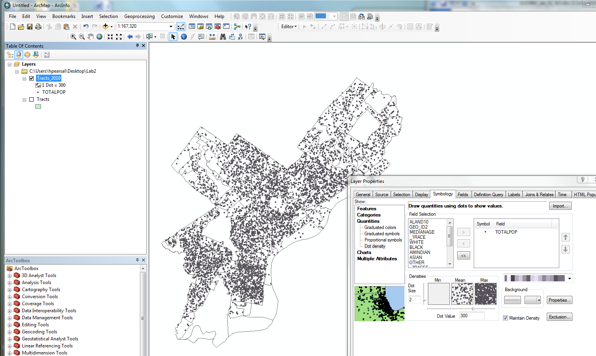
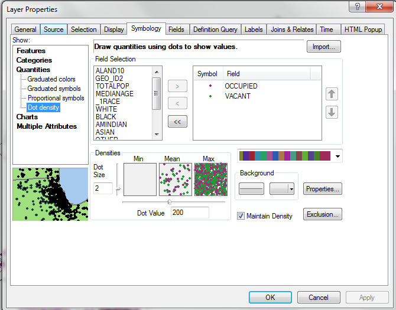
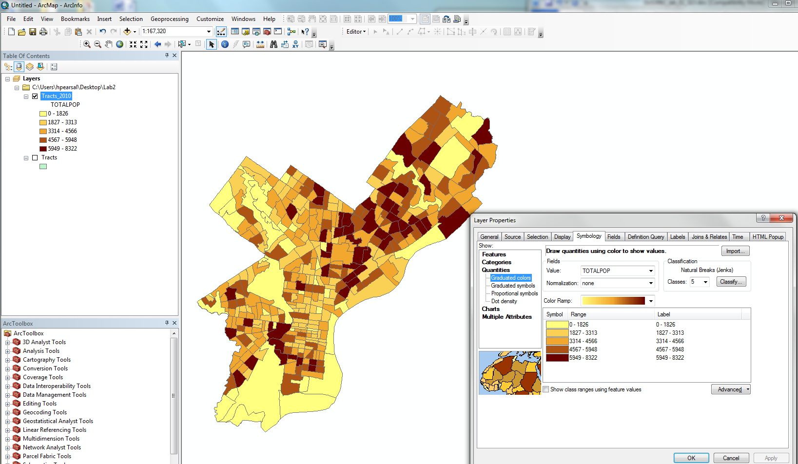
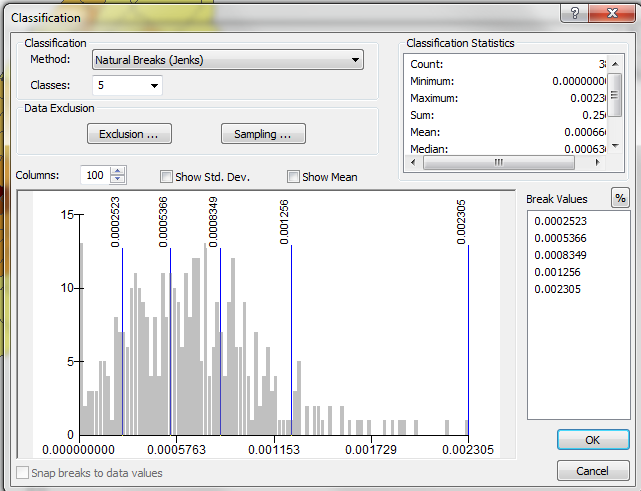
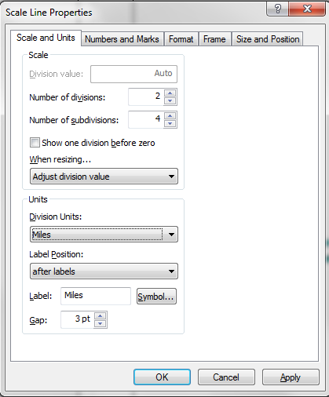
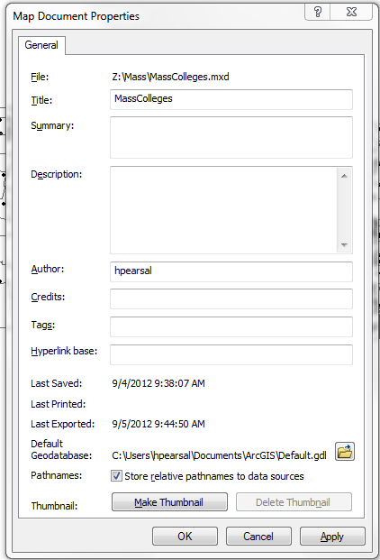

Mapping in ArcGIS
=================

Version 1.1
-----------

Purpose of the lab:

-   Introduce the principles and techniques of dot density and choropleth mapping using ArcGIS
-   Examine the impact of data classification on data visualization
-   Design professional map layouts

Tutorial
========

Getting Your Data
-----------------

For this lab and all future labs, you should not work directly on the data stored on the S-drive. For each lab, use ArcCatalog to copy the data you need to work with to another space from which you will work, your "workspace". You will use this workspace to save data and project files you create as you work through the lab assignments

I suggest your workspace be a portable data storage device such as a USB flash drive. It is also possible to use a local directory for temporary storage during an individual class session. If you do so, you ***must*** remember to copy your work files off of the lab computer, as user data may be deleted from these computers at any time. I have had students do most of their work on the lab computer, then realize after one lab session that they forgot to copy their work, only to return to the lab to find that their data was not longer there (computer removed for service, university reimaged the disk, etc.). There is *nothing I can do* if that happens to you. **You are responsible for your own data and project storage and management.**

The easiest thing to do will be to copy the entire `Lab_Data` folder to your flash drive, and work out of a parent or sibling directory named something like `Lab_Exercises`. The `Lab_Data` folder is approximately 1GB, but storage is cheap.

For this lab, you will be using the Census tracts shapefiles from the US Census. A tract is a spatial unit developed by the Census Bureau to store data population-related data. Although the Census has data on individuals, it provides data to the public in aggregated form to preserve privacy. Aggregated data are summarized, so that instead of providing, say, the locations of individual people, the Census provides the total population of spatial units such as counties and tracts. Neighborhoods describe different "communities" based on similar geographies.

If you do not have room to copy the entire `Lab_Data` folder to your flash drive, using ArcCatalog, copy only the `Tracts_2010` shapefile located in `[...]\Lab_Data\Philadelphia_only` to your workspace.

All further instructions refer to shapefiles in your workspace.

Exploring your data
-------------------

Here, you will learn dot density and choropleth mapping using tract-level population data.

Open ArcMap and add the `Tracts_2010` shapefile. Open the attribute table. Note the columns (referred to technically as "fields") in the attribute table. These fields contain data on the following:

<table>
<colgroup>
<col width="12%" />
<col width="87%" />
</colgroup>
<thead>
<tr class="header">
<th align="left">Field Name</th>
<th align="left">Description</th>
</tr>
</thead>
<tbody>
<tr class="odd">
<td align="left">
<code>GEO_ID2</code>
</td>
<td align="left">
Unique identifying number for each Census Tract
</td>
</tr>
<tr class="even">
<td align="left">
<code>GEO_DISPLA</code>
</td>
<td align="left">
The descriptive name of each Census Tract
</td>
</tr>
<tr class="odd">
<td align="left">
<code>ALAND10</code>
</td>
<td align="left">
Area of each Census Tract (square feet)
</td>
</tr>
<tr class="even">
<td align="left">
<code>TOTALPOP</code>
</td>
<td align="left">
2010, Population, Number - Total population in 2010.
</td>
</tr>
<tr class="odd">
<td align="left">
<code>MEDIANAGE</code>
</td>
<td align="left">
2010,Median Age – The median age of all people living in each Census Tract, 2010
</td>
</tr>
<tr class="even">
<td align="left">
<code>_1RACE</code>
</td>
<td align="left">
2010, One Race - Total population that identifies with one race in 2010
</td>
</tr>
<tr class="odd">
<td align="left">
<code>WHITE</code>
</td>
<td align="left">
2010, Whites, Number - Total number of White people in 2010
</td>
</tr>
<tr class="even">
<td align="left">
<code>BLACK</code>
</td>
<td align="left">
2010, Black or African-American, Number - Total number of Black or African-American people in 2010
</td>
</tr>
<tr class="odd">
<td align="left">
<code>AMINDIAN</code>
</td>
<td align="left">
2010, American Indian, Number - Total number of American Indian people in 2010
</td>
</tr>
<tr class="even">
<td align="left">
<code>ASIAN</code>
</td>
<td align="left">
2010, Asian, Number - Total number of Asian people in 2010
</td>
</tr>
<tr class="odd">
<td align="left">
<code>OTHER</code>
</td>
<td align="left">
2010, Other race, Number - Total number that identify with a race other than those listed above in 2010
</td>
</tr>
<tr class="even">
<td align="left">
<code>_2RACES</code>
</td>
<td align="left">
2010, Two Races - Total population that identifies with more than one race in 2010
</td>
</tr>
<tr class="odd">
<td align="left">
<code>HISPANIC</code>
</td>
<td align="left">
2010, Hispanic, Number - Total number of Hispanic people in 2010
</td>
</tr>
<tr class="even">
<td align="left">
<code>NONHISPANI</code>
</td>
<td align="left">
2010, Nonhispanic, Number - Total number of Nonhispanic people in 2010
</td>
</tr>
<tr class="odd">
<td align="left">
<code>TOTHOUSING</code>
</td>
<td align="left">
2010, Housing units, Total number of housing units in 2010
</td>
</tr>
<tr class="even">
<td align="left">
<code>OCCUPIED</code>
</td>
<td align="left">
2010, Occupied housing units, Total number of occupied housing units in 2010
</td>
</tr>
<tr class="odd">
<td align="left">
<code>VACANT</code>
</td>
<td align="left">
2010, Vacant housing units, Total number of vacant housing units in 2010
</td>
</tr>
</tbody>
</table>

Right click on the word `TOTALPOP` and choose "Sort Descending". You can see the range in population values by scrolling down the table. Do an attribute query on `TOTALPOP` selecting the highest population tracts, say, those tracts with `TOTALPOP` values greater than 7000. Do you see a spatial pattern, or clustering, of high population tracts?

Close the table and clear your selection.

Dot Density Mapping
-------------------

Go to the Properties window by right clicking on the data layer in the Table of Contents and choosing Properties.

Click the Symbology tab.

Select Quantitites→Dot Density on the left side of the Symbology window. For the Value drop down menu select `TOTALPOP`. Specify in the Dot Value 300 (this specifies that each dot will represent 300 people).

Check out your ArcMap window. It may look something like the image below. (The color scheme may differ.)

 

Which areas of Philadelphia have the highest population density? The lowest population density?

Note that you can simultaneously map multiple attributes in the dot density function by adding multiple attributes in the right-hand box.

Try mapping `VACANT` and `OCCUPIED` housing together. You properties window should look similar this:

 

Choropleth Mapping
------------------

Choropleth mapping provides another way to visualize population density. Select Quantitites→Graduated Colors on the left side of the Symbology window. For the Value drop down menu select `TOTALPOP`.

Press OK.

Check out your ArcMap window. It may look something like this:

 

Note that tracts vary greatly in size. Thus, to see the variation in concentration of population it is better to map population density (people per unit area) rather than raw population. You can do this automatically in ArcMap, if you have a field (column in your attribute table) that encodes the area of each tract. The `ALAND10` field in the Tracts\_2010 table does just that---it is the area of land in each tract in square feet

Open the Symbology window again. Make sure that `TOTALPOP` is selected for the Values option. Below, select `ALAND10` for the normalization option. This will divide the population by the land area for each tract, thus mapping the population density (people/ft2). View your map to see how it is different from the map of raw population values.

Note that the class intervals are reported in the ArcMap table of contents. These can be adjusted either automatically or manually.

Go back to the Symbology window and note the Classification section (at the top right). Press the Classify button. At the top, under the Classification header, you can choose a variety of automated methods for creating class intervals. The graph on the bottom shows you where in the distribution of the variable the breaks are enforced. The break values themselves are reported on the right side of the window.

 

In the Method dropdown (top left), choose Manual. This setting allows you to "grab" the break lines on the graph with your mouse and drag them to specific positions.

Now choose Equal Interval (under Method). Under classes choose `4`. Press OK back through the two open dialog boxes. Return to your ArcMap view window to see how the display has changed.

For more information on class breaks, go to the Help menu and choose `ArcGIS Desktop Help`. Type in "data classification" to find that topic in the index, then double click it. Also read the topic "Classifying numerical fields for graduated symbology."

Try a number of different manual and automatic classification methods, using a variety of different number of class settings, to see the effect on the display.

You can also choose different color schemes using the Color Ramp drop down menu in the Symbology window.

Making a Printable Map
----------------------

Here, you will learn how to generate a map with generic map composition elements such as a title, scale bar, north arrow, and legend.

Go to the View menu and choose `Layout View`. This is the map making component of ArcMap. Note the menu items have changed slightly and rulers appear in the view window.

Go to the Insert menu and choose `Scale Bar`. Choose a particular scale bar style in the Scale Bar Selection window by clicking on it once. Press the Properties button. Here, you can change various settings. Change the Division Units to either miles or kilometers, a more appropriate unit for a map of Philadelphia than feet.

 

A scale bar should appear in the window. Grab it with your mouse and move it below your map. Note that you can revise any properties of the scale bar by double clicking it.

Insert a North arrow by going to the Insert menu and choosing `North Arrow` and pressing OK.

Now insert a legend by going to the Insert menu and choosing `Legend`. A wizard appears to walk you through a series of choices.

1.  Press Next
2.  In the Legend Title box type "People/sq. feet"
3.  Press Next
4.  Press Next
5.  Press Next
6.  Press Finish

Note you can change any of these settings by double clicking the legend in the view window.

Insert a title by going to the Insert menu and choosing `Title`. In the box that appears type in "Population Density by Tract".

Arrange your map, north arrow, legend, and scale bar on the page.

Go to the File menu and choose `Print Preview` to see how your map will look printed.

You can also save your map settings as a file. Go to the File menu and choose `Save As`. Then select a path and file name. Your map will be saved as a file with the suffix `.mxd`.

***Please read the next part VERY CAREFULLY and commit these steps to memory.***

Note that `.mxd` documents are instructions for generating a display, including the paths and file names of data and the rules for displaying those data. They do not include the data themselves! So, if you take your `.mxd` file to another computer where your data are not accessible via the same path, the `.mxd` file will fail to display your data.

Also, if you intend to work on a different computer, you need to set the pathnames to your data sources as "relative," rather than the default option of "absolute." The relative pathname refers to a location that is relative to the current directory. If you do not change the setting to relative, the `.mxd` might not be able to display your data if opened on a different machine. To set relative paths, select File→Map Document Properties. Check the box to store relative pathnames. (See below.)

 

Once you are happy with your map layout, you can export map as a standalone graphic, like a JPEG file. To do this, go to File→Export Map and you have the option of exporting the map to a variety of file formats. The JPEG can be inserted into your lab document.

ASSIGNMENT
==========

Objective
---------

The objective of this assignment is to

1.  Describe the spatial distribution of median age in Philadelphia in Philadelphia using choropleth mapping
2.  Examine the effect of using different class break schemes in choropleth mapping

Deliverables
------------

Turn in a report addressing these objectives. The report should include three choropleth maps of median age for Philadelphia, each with a different class break scheme:

1.  equal interval classification scheme with five classes and Yellow-Brown color ramp
2.  quantile classification scheme with five classes and Yellow-Green-Blue color ramp
3.  any other automated or manual class break scheme with the color ramp of your choosing.

Each map should be properly formatted and include a legend, north arrow, scale bar, title, and credits (e.g. data source and spatial reference information). Your name should appear in the credits as the Cartographer. Please note that these data were downloaded from the US Census American Factfinder website.

In your report describe the spatial distribution of median age---i.e. where is it high and where is it low---as well as the power of the different types of class break methods in capturing this distribution.

Getting Started
---------------

Use the settings in the Symbology window to experiment with different automated and manual class break settings. As you experiment look at the graph and the class break lines. Think about which class break method does the best job of grouping tracts with similar median household income values together in the same class.

Requirements
------------

1.  Analysis: Report includes a detailed explanation of the power of different types of class break methods for capturing the distribution of median age.
2.  Writing: Report thoroughly addresses all sections, employs appropriate technical language, and is free of grammatical mistakes.
3.  Figures: Report includes three choropleth maps that correctly display median age with each class break method. Each map should be well formatted to include all map layout components.

