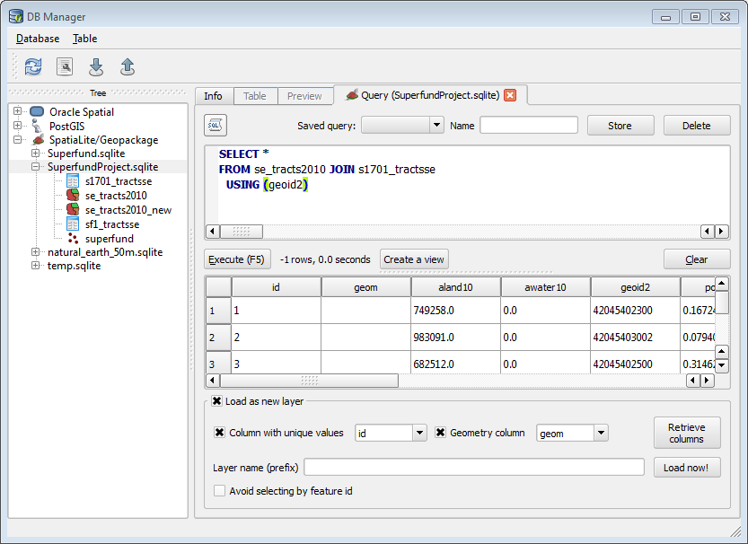

# SQL Database Query in QGIS

## Version 1.0

Purpose of the lab:

* Introduce basic SQL syntax
* Introduce joins and spatial joins in SpatiaLite
* Become familiar with QGIS DB Manager

# Tutorial

## Background on Data Formats

The shapefile format is widely supported, but this is about the only thing it has going for it. Shapefiles have, in my opinion, three strikes against them:

1. It is a multi-file format, and worse contains an inconsistent number of files, so one shapefile is actually 3 to 12 filesystem files with the same base name (although in practice most shapefiles will contain 5ish filesystem files).
2. Attribute field names are limited to ten characters because it uses DBF to store attribute data.
3. Support for the DBF format is declining. Microsoft Excel can read DBF, but dropped support for edit/save as far back as version 2007. DBF is now virtually unused outside of its legacy role in GIS.

Geodatabase formats (including SpatiaLite as well as the ESRI personal geodatabase format) have a major advantage, which is that they allow combining several data sources (like shapefiles) into one database file---one SQLite file or one Microsoft Access file. This helps keep project folders tidy and makes it easy to transport or share project data. An added advantage is that it is often faster and easier to edit or query attribute data using standard database tools or by writing a lightweight application, rather than resorting to a full-fledged GIS. For example, Microsoft Access forms can be created to edit attribute data for a project, so that you don't have to use ArcGIS's somewhat clunky table editing tools. 

SpatiaLite is a free and open source geodatabase built on top of SQLite, itself a FOSS database. As a lightweight, "server-less" database, SQLite is frequently used as an embedded database by other applications, including Firefox, Google Chrome, Skype, iTunes, Clementine, and Dropbox. ArcGIS has had the ability to read from the SpatiaLite format since 10.2. QGIS, which will be used for this lab exercise, has full support for the SpatiaLite format, including creating a SpatiaLite database, adding layers, querying, and adding query results to the map canvas.

## Converting Shapefiles to SpatiaLite

### About the Data

We will be working with the following files, all in `Lab_data\SE_Pennsylvania` which you should have copied to a flash drive.

* Data files:
    * `SE_tracts2010.shp`
    * `Superfund.shp`
    * `sf1_tractsSE.dbf`
    * `S1701_tractsSE.dbf`
* Metadata files:
    * `ACS_10_5YR_S1701_metadata.csv`
    * `DEC_10_SF1_P1_metadata.csv`

The `SE_tracts2010.shp` includes all Census Tracts in southeastern Pennsylvania, including Philadelphia, Delaware, Bucks, Chester, and Montgomery counties.  The other two data files, `sf1_tractsSE.dbf` and `S1701_tractsSE.dbf`, contain attribute data from the 2010 U.S. Census. These data are stored as tables without any attached spatial data.

The `sf1_tractsSE.dbf` file contains data from Summary File 1, which contains data gathered from questions asked of all people in the Decennial Census in 2010.  The `S1701_tractsSE.dbf` file contains data from the American Community Survey 5-year estimates, which contains data gathered from questions given to a sample of the population.

`Superfund.shp` is a point layer of Superfund sites which will be used in the Assignment.

### Creating an Empty SpatiaLite Database

We're going to load these data files into a SpatiaLite database using QGIS. Before we do so, we need to initialize the SpatiaLite database.

1. Launch QGIS.
2. Use Layer→Create Layer→New SpatiaLite Layer, or hit the  button.
3. To the right of the Database dropdown list, hit the button displaying `...`.
4. Browse to your data folder. Name your database `SuperfundProject.sqlite`.^[There is no "standard" SQLite file extension. `.db` and `.sqlite` are commonly used.] Hit Save.
5. You should get a notice saying "Registered new database!" Hit OK, then hit **Cancel** (not OK).

### Loading Nonspatial Tables

Now we can load our spatial layers and attribute data into our database. We will start with the attribute tables. First, open DB Manager by selecting Database→DB Manager→DB Manager from the menu. Expand the tree on the left by clicking the plus sign (+) next to the word SpatiaLite. The new `SuperfundProject.sqlite` database should be listed there. Click the plus sign next to it to connect to the database.

\ 

Now choose Import layer/file from the toolbar or the Table menu. In the Input field, click `...` to navigate to and select the `sf1_tractsSE.dbf` file. Assign a name, such as `sf1_tractsse`^[As a convention, SQL developers usually only use lowercase for table and column names. The import process will automatically do this for column names, but table names will use whatever case you type in during import.] to your table. Since this is not a spatial layer, you don't need to adjust anything else. Hit OK. 

After you see the success dialog, hit Refresh on the toolbar. The table you just imported should appear in the database tree. If you select it and go to the Table tab, you should see the contents of the table.

\ 

Now do the same thing to import `S1701_tractsSE.dbf`.

> **IMPORTANT NOTE:** QGIS registers a specific path to the SpatiaLite database.^[This is similar to the Connect To Folder concept in ArcGIS.] If you change computers (for example, if you do not complete the lab in one sitting), when you open DB Manager you will not see your `SuperfundProject.sqlite` database. In order to connect to the database, do the following:
>
> 1. Choose Layer→Add Layer→Add SpatiaLite Layer, or press the Add SpatiaLite Layer  button.
> 2. In the Add SpatiaLite Tables(s) dialog, click the New button.
> 3. Navigate to the file `SuperfundProject.sqlite`.
> 4. Hit Open.
> 
> You can now hit Connect to add layers from this database, or just hit Close. The database is now registered, and you can open DB Manager to continue to the lab exercise.

### Loading Spatial Tables

Importing the spatial layers requires more care than nonspatial tables. First, we need to know what spatial reference system the layer uses. In your lab folder, you will notice that some of the shapefiles have an associated PRJ file. This file is the file that contains the spatial reference system (PRJ stands for "projection"). You will notice that this file is present for the tracts layer (`SE_tracts2010.prj`), but missing for the Superfund layer.

We will start with the Superfund layer. 

1. Again, click Import layer/file. Browse to and select the `Superfund.shp` file.
2. Browse to and select `Superfund.shp`.
3. Assign a table name.
4. Make sure to check Create spatial index. Do this whenever you import a spatial layer, as it will speed up spatial queries.
5. Hit OK. 
6. Since the PRJ file is missing, you should immediately see the Coordinate Reference System Selector dialog.^[Note: This is a difference between QGIS and ArcGIS. ArcMap will give you an "Unknown Spatial Reference" warning, but will then just add the layer to the map canvas, assuming that the coordinates match whatever CRS the data frame is currently using. This behavior is less than helpful, and is probably responsible for considerable confusion on the part of students.] The coordinates are in lat-long using NAD83 (North American Datum 1983). QGIS, and most (maybe even all) open source geospatial projects use EPSG Spatial Reference IDs, so you can find the correct CRS by typing `NAD83` in the Filter textbox, or by typing in the code `4269`:

    \ 

7. After selecting the CRS in the lower pane, hit OK.

> **IMPORTANT NOTE:** DB Manager does allow you to delete layers from a SpatiaLite database. Unfortunately, it doesn't correctly update metadata in the database. Therefore, if you make a mistake during the import, do *not* delete the layer and attempt to re-import it. Instead, without deleting the table, redo the import steps, but make sure to check the box labelled "Replace destination table (if exists)".

Importing the tracts layer is more problematic. The layer has a PRJ file, but the format ESRI uses for projection information is nonstandard, and won't be recognized by QGIS. What is the correct coordinate reference system? In your lab data folder, find the file `SE_tracts2010.prj` and open it with Notepad. You will see the following text:

```
PROJCS[
  "NAD_1983_StatePlane_Pennsylvania_South_FIPS_3702_Feet",
  GEOGCS[
    "GCS_North_American_1983",
    DATUM[
      "D_North_American_1983",
      SPHEROID["GRS_1980",6378137.0,298.257222101]
      ],
    PRIMEM["Greenwich",0.0],
    UNIT["Degree",0.0174532925199433]
    ],
  PROJECTION["Lambert_Conformal_Conic"],
  PARAMETER["False_Easting",1968500.0],
  PARAMETER["False_Northing",0.0],
  PARAMETER["Central_Meridian",-77.75],
  PARAMETER["Standard_Parallel_1",39.93333333333333],
  PARAMETER["Standard_Parallel_2",40.96666666666667],
  PARAMETER["Latitude_Of_Origin",39.33333333333334],
  UNIT["Foot_US",0.3048006096012192]
  ]
```

As you can see, this contains many of the parameters discussed during the lecture on Projections. But how do we share this information with QGIS?

A useful tool that can decode this and tell us the EPSG SRID is the Prj2EPSG web site. Go to [http://prj2epsg.org/search](http://prj2epsg.org/search). There you can paste the above text from the PRJ file, or just click the Choose File button and select the PRJ file from the file browser. Then click Convert. The web app will tell you the correct SRID (usually 4 or 5 digits) to use for the State Plane Pennsylvania South projection. Make a note of it.

Now lets import the tracts layer.

1. Back in QGIS DB Manager, choose Import layer/file.
2. Browse to and select `SE_tracts2010.shp`.
3. Assign a table name.
4. Make sure to check Create spatial index. Do this whenever you import a spatial layer, as it will speed up spatial queries.
5. Click the checkbox next to Source SRID, and set the value to the SRID that you determined by Prj2EPSG.
5. Hit OK. 

Refresh the `SuperfundProject.sqlite` database. You should now see all of the tables that you added. The attribute data (for spatial or nonspatial tables) can be viewed by selecting the table and clicking the Table tab. For spatial layers you can also preview the geometries by selecting the Preview tab.

## Basic SQL `SELECT` Statements

Open the `ACS_10_5YR_S1701_metadata.csv` and `DEC_10_SF1_P1_metadata.csv` files.^[On many Windows computers, these files will open automatically in Microsoft Excel. You can also open them with a text editor such as Notepad.] These are documentation files that provide metadata, or data about the data, for each of the respective data files. They describe the data and tell you about each of the variables contained in the data files.  To learn more about the data in general, open the `DEC_10_SF1_P1_metadata.csv`. The left-most column provides the variable code, and the second column to the left provides the description.

Preview `sf1_tractsse` and `s1701_tractsse` (or whatever you named your tables during import) in DB Manager. Note that each record represents an individual tract.  The field `geoid2` is a unique identifier for each tract.  Note that `se_tracts2010` has the same field.

In DB Manager, open the SQL window from the Database menu, or by clicking the toolbar button. You will see a code pane above and a results pane below. The code window allows you to type and submit SQL statements. The basic parts of a SQL statement are as follows:^[In the following statement, brackets \[\] are used to indicate a placeholder for something that the user should fill in. Do *not* actually put brackets in your SQL statement!]

```sql
SELECT [column list, or use the asterisk (*) to return all columns]
FROM [table name] --multiple tables can be specified, as we will see
--optional:
WHERE [criteria]
--optional:
ORDER BY [column list]
--optional:
LIMIT [maximum number of rows to return]
```

`SELECT` is where you list the columns you want to display. You can also include expression, such as `100 * part_count / total_count` to convert the field `part_count` into a percentage of `total_count`. The `FROM` clause is where you name the table or tables you are selecting columns from. SQL statements follow a rigid progression: `SELECT` *must* come first and `FROM` *must* come next. The optional `WHERE` clause *must* come after the `FROM` clause. The optional `ORDER BY` and `LIMIT` clauses *must* come at then end.

The `WHERE` clause can include many standard comparison operators, such as 

```sql
WHERE population > 1000
```
or
```sql
WHERE name = 'Smith'
```

The percent sign (`%`) in a string is a wildcard, meaning "match any number of characters", so `WHERE name LIKE 'Sm%th%'` will return variant spellings such as "Smith" or "Smythe".

Now that your data are in SpatiaLite, you can query it using SQL. Type or copy-paste the following in the code window:


```sql
SELECT * FROM sf1_tractsse
```

Hit the Execute button or the `F5` key. You will see all columns and all rows in the table. If you only want to display certain columns, you can name them in the `SELECT` list. You can also order your output using the `ORDER BY` clause:

```sql
SELECT geoid2, totpop FROM sf1_tractsse ORDER BY totpop DESC
```

The `DESC` keyword lists the tracts by population in descending order. If you omit it, `ORDER BY totpop` will produce a resultset in ascending order.

In order to return the top 5 most populous census tracts, use the `LIMIT` clause. Try adding `LIMIT 5` at the end of the previous SQL statement. What happens? What happens if you include a `LIMIT` but remove the `DESC` keyword?

`WHERE` clauses work the same way they do in ArcGIS's "Select by Attribute" and QGIS's "Select by Expression". In order to select only the census tracts with population of 4000 or more persons, run the following SQL statement:


```sql
SELECT * FROM sf1_tractsse
WHERE totpop >= 4000
```

Now let's look at the `s1701_tractsse` table, which has information on poverty rate.  The field `hc01_vc01` encodes the number of people for whom poverty status was checked (roughly equivalent to the total population).  The field `hc02_vc01` encodes the number of people with income below the poverty level.  Thus, the poverty percentage for each tract can be calculated as `100.0 * hc02_vc01 / nullif(hc01_vc01, 0)`.^[The `nullif()` is necessary to avoid a division by zero error for tracts with no population.] We can put this in our select list. When we create calculated fields like this, we usually *alias* them to give them a more user-friendly name:

```sql
SELECT geoid2, 100.0 * hc02_vc01 / nullif(hc01_vc01, 0) AS poverty_pct
FROM s1701_tractsse
```

Now add a `WHERE` clause to only return those tracts where the poverty rate is 20% or more. How many rows (tracts) are in the resultset? **HINT:** Since you have aliased your expression calculating the poverty rate, you can use the name `poverty_pct` in the `WHERE` clause.^[**NOTE:** The ability to use an alias in the `WHERE` clause is a nonstandard feature of SpatiaLite's implementation of SQL, and will not work in all SQL database implementations.]

## Spatial Functions

The reason we use a spatial database is because of the spatial capabilities. So, the same way you can select census tracts with certain attributes, you can also select census tracts satisfying certain spatial conditions.^[We are going to barely scratch the surface of the number of possible spatial functions. The full reference for these spatial functions is available at [http://www.gaia-gis.it/gaia-sins/spatialite-sql-4.2.0.html](http://www.gaia-gis.it/gaia-sins/spatialite-sql-4.2.0.html).] By default, when we imported the shapefiles, SpatiaLite stored all of the actual geometries---the features' actual shapes and locations---in a column named `geom`. This name is arbitrary---other common names are `Geometry` or `the_geom`---but it does make spatial SQL easier to write when you know you can rely on the column name being consistent. As a simple example, what is the result of the following queries:

```sql
SELECT GeometryType(geom) FROM se_tracts2010
```

and

```sql
SELECT GeometryType(geom) FROM superfund
```

Now try:

```sql
SELECT geoid2, Area(geom) FROM se_tracts2010
```

The numbers are pretty large, because `se_tracts2010` uses a foot-based coordinate reference system, so the results are in square feet. In order to get a more manageable number, we can convert from square feet to acres by dividing by 43,560. We also *alias* the column to provide a more meaninful names:

```sql
SELECT geoid2, Area(geom) / 43560 AS acres FROM se_tracts2010
```

## Attribute Joins

We frequently want to join data from related tables. Often, we want to join attribute data that is not yet in a spatial data format, but pertains to a geographic entity (such as counties or ZIP codes), to a matching spatial layer, so that we can map the new data. In this example, the `sf1_tractsse` table will be joined onto the `se_tracts2010` table in order to associate the census data in `sf1_tracts` table with tract polygons stored in the tracts layer.

In order to do the join you need to know what **key field** can be matched between the tables. Look at the attribute data (Table tab) for both tables. Can you identify a field that can be used to match records between the tracts shapefile and sf1_tracts? 

It should become clear that both tables have an 11-digit code beginning with `42` (the FIPS code for Pennsylvania) in a field names `geoid2`. This is our join field. The join is done in the `FROM` clause, as follows:

```sql
FROM table1 [LEFT] JOIN table2
  ON table1.key1 = table2.key2
```

WHERE `key1` and `key2` are the names of the columns that match. *If* the matching columns have the same name in both tables (as they do in the case of `geoid2`) an alternate form can be used:

```sql
FROM table1 [LEFT] JOIN table2
  USING (keyfield)
```

What's going on with the `LEFT` keyword? Without `LEFT`, you are performing an "inner join", which *only* returns records that match. If one or both tables have records where the key field doesn't match, those records won't appear in the resultset. *With* the `LEFT` keyword, you are performing an "outer join", which tells the SQL parser to return *all* records from the left table---literally, the table listed on the left (`table1` in the hypothetical example)---whether or not there are matching rows in the right table.^[`RIGHT JOIN`s are also possible. For the sake of clarity, database analysts will almost always use only `LEFT JOIN`s, even if that necessitates rewriting the order of the tables in the `FROM` clause. In the GIS world, if we need to use an outer join, we usually want to retain all records from the spatial table rather than the nonspatial table. So, in practice, you should usually list the spatial table first, giving you the option of quickly changing an (inner) `JOIN` to a `LEFT JOIN`, and vice versa.]

Putting it all together, our SQL statement looks like this:

```sql
SELECT *
FROM se_tracts2010 JOIN s1701_tractsse
  USING (geoid2)
```

You can execute this to see the resulting table, but what we really want is to be able to map this. To add the resulting table to the map canvas, check "Load as new layer" at the bottom.

When you check "Load as new layer", some additional options becoem available. Pick the "Column with unique values" from the dropdown. Depending on your version of QGIS, it might will default to `id` or `pk`, or it might have a different name if you overrode the default when you imported the tables. Make sure "Geometry columns" is set to `geom`. (DB Manager will make some reasonable guesses, so it is possible that these will already be set correctly.) Optionally, assign a layer name. (Otherwise, DB Manager will just assign the generic name "QueryLayer".) Then hit the Load now! button.

\ 

At this point, make a choropleth map of poverty by tract in SE Pennsylvania. You can do this one of two ways.

1. Since the layer is in QGIS, you can try making your choropleth in QGIS. As in ArcGIS, you can control they visual symbology by opening the layer properties. If you want to explore this option, refer to the QGIS docs on the "Graduated Renderer" at [http://docs.qgis.org/2.8/en/docs/user_manual/working_with_vector/vector_properties.html#style-menu](http://docs.qgis.org/2.8/en/docs/user_manual/working_with_vector/vector_properties.html#style-menu). Use the expression editor to have set the value to `100.0 * hc02_vc01 / hc01_vc01`. *If you use QGIS to make your map, you can export your map **without** the legend, scalebar, credits, etc., using Project→Save As Image.*
2. If you prefer to continue to work in ArcGIS, then use QGIS to export the data joined table to shapefile. Right-click the layer name in the the Layers Panel and choose Save As. Set the Format to ESRI Shapefile, assign a file name, and make sure to save it to your flash drive. Then, open ArcGIS and load the new shapefile. On the Symbology tab, choose `hc02_vc01` as your mapped value and use `hc01_vc01` for normalization.

Save your map document, as for the final assignment you will add the point layer of Superfund sets so that you can visually compare Superfund locations with poverty rates.

## Spatial Joins

We already have experience with Select By Location, which allows us to select geometries from one layers (e.g. parks) based on a spatial relationship (such as intersection or containment) with another layer (e.g. ZIP Codes). A spatial *join* works like an attribute join, in that it combines data from multiple tables. But instead of those tables being joined based on a common key field, they are joined based on a common location.

For the final assignment we want to calculate poverty rates for Southeast Pennsylvania tracts containing and not containing Superfund sites. So the first step, is to determine which tracts contain those sites, which we do with a spatial join. The spatial join uses the same syntax as the attribute join, but uses a spatial comparison instead of a quantitative or textual comparison. Run the following SQL:

```sql
SELECT geoid2
FROM se_tracts2010 AS t JOIN superfund AS s
  ON (Within(Transform(s.geom, 2272), t.geom))
```

Some notes:

1. As with aliasing columns, I have aliased the table names so as to avoid having to retype them when I refer to them elsewhere in the query. By writing `se_tracts2010 AS t`, I can then use `t` instead of `se_tracts2010` when I refer to the geometry column as `t.geom`.
2. For the spatial join to work, the layers have to be in the same spatial reference system. Since the Superfunds layer is in NAD83, I use the function `Transform(s.geom, 2272)` to transform the layer to the same projection as the tracts layer, SRID 2272 = State Plane Pennsylvania South.
3. Finally, if you scan the resultset, you may notice that some tracts appear more than once. note that some tracts appear more than once. This is because the `JOIN` operation returns one row for *each* row of the left table that matches *each* row of the right table on the `JOIN` operator. Since some tracts have more than one Superfund site in them, they will appear more than once. We will correct this later by using the `DISTINCT` keyword to make sure that each tract id only appears once.

## SQL `GROUP BY` and Aggregate Functions

SQL also allows us to use the `GROUP BY` clause to determine aggregate values (sums, averages, etc.) for groups of rows. Let's say we want to know the poverty rate for all of Southeast Pennsylvania. We would add up all the people living in poverty, and divide it by our population (optionally, multiply by 100 to convert to a percentage). SQL lets us do this in one simple statement:

```sql
SELECT sum(hc02_vc01) AS poverty_count, sum(hc01_vc01) AS total_pop, 100.0 * sum(hc02_vc01) / sum(hc01_vc01) AS poverty_pct
FROM s1701_tractsse
```

Combining all of our previous work, we can join by attribute to the tracts, join by location to the Superfund sites, and calculate the poverty rate for *only those tracts which contain Superfund sites*:

```sql
SELECT sum(hc02_vc01) AS poverty_count, sum(hc01_vc01) AS total_pop, 100.0 * sum(hc02_vc01) / sum(hc01_vc01) AS poverty_pct
FROM s1701_tractsse JOIN (
  SELECT DISTINCT geoid2
  FROM se_tracts2010 AS t JOIN superfund AS s
    ON (Within(Transform(s.geom, 2272), t.geom))
  ) USING (geoid2)
```

Make note of these results, as you will use them in the assignment.

# ASSIGNMENT

## Objective

A 2007 study by Sandra George O'Neil indicates that the Superfund program does not adequately serve minority and low-income populations. The objective of this assignment is to explore the distribution of poverty rate in southeast Pennsylvania as it relates to Superfund sites [http://www.epa.gov/superfund/](http://www.epa.gov/superfund/). 

Your report should answer the following questions:

1. What is the mean poverty rate in southeastern Pennsylvania?
2. What is the mean poverty rate of Census Tracts that contain a Superfund site?
3. Based on your findings, do you think low-income populations benefit from the Superfund program?

I strongly recommend reading the following article by Sand George O’Neil to provide context for addressing question 3:

> O’Neil, S. G. (2007). Superfund: evaluating the impact of Executive Order 12898. Environmental Health Perspectives, 115(7), 1087. [http://www.ncbi.nlm.nih.gov/pmc/articles/PMC1913562/](http://www.ncbi.nlm.nih.gov/pmc/articles/PMC1913562/)

## Deliverables

Turn in a report addressing the questions listed above.  The report should include a brief write-up with Introduction, Methods, Results, and Conclusion section.  The report should include one map. The map should include Superfund sites and census tracts. The tract layer should be a choropleth of the poverty rate (percentage of persons living below the poverty line) in southeast Pennsylvania. **I encourage you to try using QGIS to create the map.** As indicated above, your QGIS map can sacrifice the usual title, legend, etc. If you prefer to continue to work in ArcGIS (or if you want to figure out how to do this in QGIS), this map should include title, scale bar, north arrow, legend, and credits (including your name as the cartographer).

Your report should be submitted as one document with the map embedded as a graphic.

## Getting Started

Moreso than in previous labs, the tutorial has walked you through everything that you need to do. Therefore, focus on a strong writeup of your analysis.

## Grading Rubric

To be marked complete, your report must meet the following requirements:

* **Analysis**: Report includes information on the mean poverty rate for all Census Tracts in southeastern PA, the mean poverty rate for all Census Tracts that intersect a Superfund site, and a discussion of the relationship between poverty and Superfund sites.
* **Writing**: Report thoroughly addresses all sections, employs appropriate technical language, and is free of grammatical mistakes.
* **Figures**: Report includes one map that correctly display the requested information.


