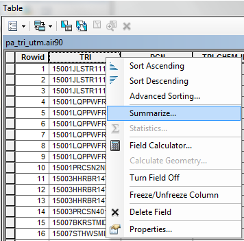
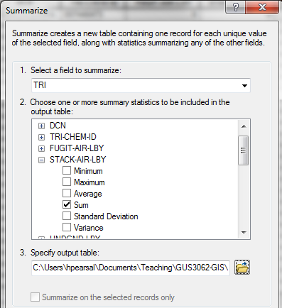
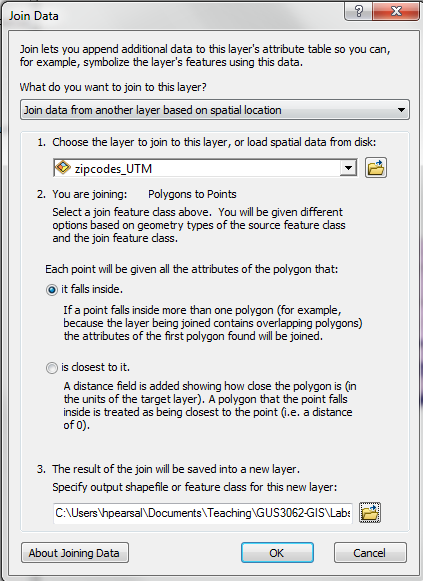

# Vector Data Analysis

## Version 1.1

Purpose of the lab: To introduce the principles of the vector data model and emphasize basic projection transformation, table, and vector data analysis operations.

# Tutorial

## Data 

We will be working with the following files, all in `Lab_data\SE_Pennsylvania` which you should have copied to a flash drive.

* `zipcodes.shp`
* `PA_TRI_new/pa_tri_utm`
* `rivers.shp` (used when you get to the Assignment)

##  Explore Your Data

Use MyComputer to look in your workspace folder.  You can see the zipcodes shapefile, composed of multiple files with the same base name and extensions including `.shp`, `.shx`, `.dbf`, `.prj`, and others. (The number is inconsistent for the shapefile format, and the first three are the only ones that are required.) You can also see the two folders that compose the `pa_tri_utm` coverage: `pa_tri_utm` and `info`.  Look at (but do not try to open) the files in each folder.  The `pa_tri_utm` files contain the spatial data.  The `info` files containing the attribute data.  However, you cannot view these files properly without using ESRI software.  

Preview the `pa_tri_utm` coverage in ArcCatalog using both the Geography and Table modes. Note that ArcCatalog indicates that there are many tables contained in the folder `pa_tri_utm`, but when you go to MyComputer and look in the same folder they are not there!  This is because these tables are contained in the `info` folder, but they cannot be seen directly using MyComputer.

The names of the tables indicate what kind of data they contain.  For instance, the table named `a_tri_utm.lnd90` contains toxic release information for toxics released in Pennsylvania on land in 1990.  The table named `pa_tri_utm.air88` contains toxic release information for toxics released in Pennsylvania to the air in 1988.  Specific information on these tables is contained in the metadata document.

##  Transform Projections

Consider a situation in which we are interested in investigating the distribution of environmental risk associated with TRI facilities in southeast Pennsylvania.  We will summarize air and water toxic release data and associate these data with ZIP Codes. We may, for example, want to group people by nearby addresses (same ZIP Code) so that they can be contacted via mass mailings concerning environmental issues.

The first step is to reproject the `zipcodes` data to the UTM Zone 18N coordinate system.  Check to make sure that the `zipcodes` layer has a coordinate system defined! (What is it?) Now use ArcToolbox to reproject the `zipcodes` shapefile to UTM Zone 18N. It can be selected using the following path: Projected Coordinate Systems→UTM→NAD 1983→NAD 1983 UTM Zone 18N

Call the new shapefile `zipcodes_utm.shp`. 

The `pa_tri_utm` coverage is already in UTM 18N so there is no need to transform it.

## Using Spatial Selection to Eliminate Unwanted Data

The next step is to eliminate the data that is not necessary for the analysis at hand.  This reduces processing time.

Add the `zipcodes_utm` and `pa_tri_utm` layers to ArcMap.  Note that many of the TRI sites are located outside the zipcode boundaries. Use Select by Location to select only those `pa_tri_utm` points that intersect zip codes. (This is something you have done in previous lab exercises.) Then use the Data→Export Data option to export only the selected `pa_tri_utm` points to a new shapefile called `sepa_tri_utm.shp`. **Make sure to set the "Save as type:" dropdown to Shapefile *and* make sure to save it to your flash drive, not the default geodatabase.** Add the new shapefile to ArcMap (you should be prompted to do so). Remove `pa_tri_utm`.

Open the attribute table for `sepa_tri_utm`. There should be 335 records.  Note that the field `TRI` is a unique identifier for each TRI facility.

## Summarizing One Field by Another: Pounds of Release by Facility

Here, we will summarize the total pounds of air releases for each individual facility.

Add the `pa_tri_utm.air90` table to ArcMap and open the table.  This table contains 1990 air release data for the TRI. Note that there are 3540 records, far more than the number of TRI facilities in Pennsylvania.  That's because each record in this table represents an individual chemical released by an individual facility (i.e. one facility may release many different chemicals). We are interested in the total pounds of release for each facility for all chemicals.  To find this information, we need to add up the total pounds for multiple chemicals for each individual facility.

Note that the field `TRI` is a unique identifier for each facility.  The field `Stack-Air-Lby` is the "estimated release of chemical in stack air in lbs/yr". Right click on the TRI field name and choose Summarize.  

\ 

Use the following settings for the three input options:

1. "Select a field to summarize:" Choose `TRI`.
2. Unfold `STACK-AIR-LBY` and check "Sum".
3. Call the new output table `air_by_tri.dbf`.

\ 

Run and choose Yes to "Do you want to add the result table in the map?" Note that we are creating a new table that sums all the `STACK-AIR-LBY` values for each unique `TRI` value, i.e. the total pounds of air releases by stack for each TRI facility.

Open the new table.  There should be 1095 records.  The total pounds of all chemicals released for each facility is reported in the field `Sum_STACK_AIR_LBY`.

## Spatial and Attribute Joins to Link the TRI location, Zip Code location, and Release Data

Now we need to figure out which ZIP code each TRI facility is located in, so that we can ultimately summarize the total pounds of release per ZIP code.  We will do this using a spatial join. A spatial join is similar to an attribute join except that the join is based on the location of the spatial feature. A spatial join can use either a containment criterion (one feature falls inside the other) or a proximity criterion (on feature is close to another). When working in ArcGIS (rather than in a spatial database), a spatial join creates a new shapefile. The new shapefile retains the features from the destination layer and appends the attribute information from the source layer. The two original shapesfiles are not affected by the operation.

Right click on the `sepa_tri_utm` layer and choose Joins and Relates→Join

In the top drop down box, choose "Join data from another layer based on spatial location", and set the following options:

1. Choose `zipcodes_utm`.
2. Choose "it falls inside".
3. Name the output file `tri_in_zip`.

\ 

Press OK. The new shapefile should be automatically added to the map. The points should be in the same location as `sepa_tri_utm`.  Open the attribute table of `tri_in_zip` and note that the fields from `zipcode_utm` have been appended to the table.  

Now join the `air_by_tri` table onto the `tri_in_zip` layer table using the TRI field as the join field for both tables. Start the join by right-clicking `tri_in_zip`. Change the dropdown menu in the Join Data window to "join attributes from a table". (This is not always necessary, but since your last join was a spatial join, the dropdown will probably still be set to do a spatial join instead of an attribute join.)

Open the attribute table for `tri_in_zip` and confirm that this table now contains the TRI identifier, ZIP Code, and total pounds of air release by stack for each TRI facility.  

## Summarizing One Field by Another: Pounds of Release by ZIP Code

Now, we'll sum the total pounds of air release by individual ZIP code, as some ZIP codes contain multiple TRI facilities.  

Open the `tri_in_zip` attribute table.  Right-click on the field name `ZIP` and choose Summarize.  For the summary statistics (#2 in the dialog box) choose to sum the field `air_by_tri.Sum_STACK_`.  Call the new table `air_by_zip.dbf` and choose to add it to ArcMap.

Open the new table.  There should be 112 records. Join the new field to the `zipcodes_utm` attribute table using the ZIP field as the join field for both tables.

## Mapping TRI Air Stack Releases by Zip Code

Export the `zipcodes_utm` layer as a new shapefile called `zip_w_air`. Then add the `zip_w_air` shapefile to ArcMap. Note that the purpose of this export is to generate a new shapefile with the joined fields as a permanent part of the attribute table of the shapefile, rather than as a temporary join.

Create a choropleth map of TRI air stack releases by ZIP code by assigning a color ramp to the field `Sum_Sum_ST`.  

View the attribute table and sort the records by the  `Sum_Sum_ST` field.  You will see that the majority of ZIP codes have zero pounds of releases.  There are only a handful of zip codes with very large release amounts.

It may also make sense to map not only the total pounds of release per ZIP code but the pounds of release per unit area of ZIP code, since some ZIP codes are much larger than others.  To do this, in the Symbology window normalize the `Sum_Sum_ST` field by the `AREA` field (note that the units of area are in decimal degrees---derived from the original projection of the data---which is awkward, but OK for the purpose of this exercise).  

# ASSIGNMENT

## Objective

The objective of this assignment is to identify ZIP codes that are within 500 meters of TRI facilities that: 

1. have over 10,000 lbs of total water releases for 1990, and
2. are within 100 meters of a river in southeast Pennsylvania.  

## Deliverables

Turn in a report addressing this objective.  This report should contain a map of the TRI facilities and zip codes that meet the above criteria.  This map must be in UTM 18N!  This report should also contain a list of those zip codes (i.e. the zip code) and those facilities (i.e. the unique identifier listed in the TRI field).

For all shapefilefiles, please be sure to check the coordinate system. All coordinate systems are in NAD 1983. If the coordinate systems are undefined, you will need to 1) Define Projection, to define the coordinate system as NAD 1983, and 2) Use the Project tool to reroject the coordinate system into UTM 18N. If you need additional step-by-step instructions, please refer to previous exercises.

Your report should be submitted as one document with the map embedded as a graphic. The map should conform to the standards from previous labs (e.g., scale bar, name, etc.).

## Getting Started

The key to this lab is becoming familiar with the Select by Attributes and Select by Location dialog boxes.  Note that the Select by Attribute box has options for whether you want to "Select from Current Selection", "Create a New Selection", etc.  The Select by Location box has options for selecting features by a variety of spatial relationships, including "Are within a distance of" and "Intersect".  

Use the `tri_in_zip` layer you generated previously.  Think about the order of your operations to complete this analysis.  I suggest you summarize your water release data by TRI facility (release data contained in the table `pa_tri_utm.wtr90` and the field `WATER-LBY`).  Then join the resulting summary table to your TRI data.

To be marked as complete, the report must meet the following requirements:

1. Analysis: Report includes the correct list of ZIP Codes and describes the correct approach
2. Writing: Report thoroughly addresses all sections, employs appropriate technical language, and is free of grammatical mistakes.
3. Report includes one map that correctly displays the requested information 
