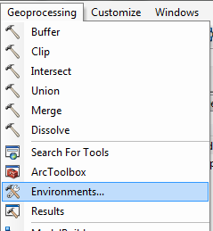
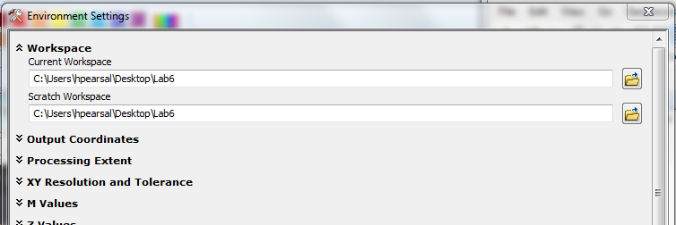
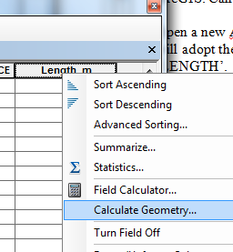
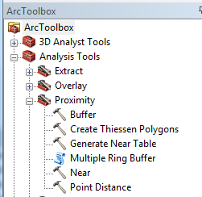

# Vector Operations and Spatial Analysis

## Version 1.1

Purpose of the lab: To introduce vector operations, including buffer, map dissolve, and overlay operations.  

# Tutorial

## Data 

> **Note:** The tutorial portion of this lab uses a variety of data layers, in a somewhat random way, to demonstrate how each of the functions work. After each section, remove all layers or close ArcMap. Also, the assignment uses a completely different set of layers.

We will continue to work on data that you have already copied from the netowrk drive. Please remember to conduct all operations on *your* data, as you do not have write access to the network drive.

For this lab exercise, you will be working with the following data, all located in the `Lab_data\SE_Pennsylvania` folder: 

* `countiesSE.shp`
* `railroads.shp`
* `zipcodes.shp`
* `SEtracts2010.shp`
* `educ_utm.shp`

Next, set up your Environment in ArcCatalog and ArcMap. This will specify a location for all of your outputs when running different operations. Select the Geoprocessing file menu, and choose Environments.

\ 

Set the Current and Scratch Workspace to your Workspace, as shown below, and click OK. You do not need to modify any of the other fields. Each time you run an operation, the output will be saved to your workspace. Be sure to set up your Environment in ArcMap and/or ArcCatalog each time you begin working.

\ 

## Retrieve Line Length and Polygon Area Measurements

Here, you will learn how to use ArcMap to calculate line length and polygon area and encode these values in an attribute table. 

In ArcCatalog, transform the `counties`, `railroads`, `zipcodes`, and `tracts` shapefiles into UTM18N. Revisit earlier labs if you need a refresher or step-by-step instructions on managing coordinate systems in ArcGIS. Call the new shapefiles `counties_utm`, `railroads_utm`, `zipcodes_utm`, and `tracts_utm` respectively.

Open a new ArcMap window and add the railroads_utm shapefile.  Remember, the data frame in ArcGIS will adopt the coordinate system of the first layer added. Open the attribute table and find the field `LENGTH`.  This is the length of each individual line segment.  It is in decimal degrees---not a very intuitive nor practical spatial unit.

Here, we will add a new field and populate the field with new length values in meters.  

Add a new field and call it `Length_m`.  Make it a float, and press OK.

Right click on the name of the field at the top of the column and go to Calculate Geometry.  

Click Yes to confirm you want to edit this field.  In the Calculate Geometry dialog box make sure the Units: reads `Meters [m]`.  Click OK.

You should see the new length values appear in the new field.    

Add the `zipcodes_utm` shapefile to ArcMap and open its attribute table.

Find the `AREA` field.  This field encodes the area of each zip code but it is in square decimal degrees.  Create a new field called `Area_m` and calculate its value to be the area in square meters.  Follow the same procedures as for the railroads but choose to calculate Area in square meters. 

Remove all data layers from ArcMap.

## Buffer

Here, you will learn how to use ArcMap to perform a buffer operation on points and lines.

1. Add `educ_utm.shp` to ArcMap.  

2. The Buffer tool can be accessed two ways. For quick access, from the Geoprocessing menu, select Buffer. 
    
    The Buffer tool can also be accessed from the ArcToolbox. Open ArcToolbox in ArcMap, and go to Analysis Tools→Proximity→Buffer. 
    
    \ 
    
3. Drag `educ_utm` into the input features box. Call the output shapefile `educ_buf5k` and make sure it saves to your workspace (which  might or might not be the default location). For the Distance box, under Linear Unit, enter 5000 meters. For Dissolve Type choose `ALL`. Leave the rest of the options as the defaults. Press OK.

4. View the new `educ_buf5k`  shapefile in ArcMap.  Zoom in to where there are clusters of schools to see how the buffers merge together (i.e. are dissolved as single polygons in these locations).  

5. Repeat the buffer operation with this shapefile (`educ_utm`), experimenting with different settings in the Buffer tool. For example, change the distance in the Linear Unit option to a larger value and try the `NONE` dissolve option. Note that the operation can take a lot of time given certain settings.  These types of operations can require significant processing power.  

6. Open the attribute table for `educ_buf5k`. Note that although there are multiple polygons displayed on screen, there is only a single record in the attribute table. This is because in a shapefile (ESRI's implementation of the spaghetti vector data model) multiple features can be associated with a single record. It is often better to have an individual record for each feature. To make this conversion, where each polygon is represented as a single record in the attribute table, go to ArcToolbox→Data Management Tools→Features→Multipart to Singlepart and input `edu_buf5k` and name the output `edu_buf5k_single`.  Open the output table from the resulting shapefile and confirm that it has multiple records---one for each feature.

When you are finished, close ArcMap.

## Map Dissolve

Here, you will learn how to use ArcMap to generalize a data layer by dissolving adjacent polygons with identical values.

Add the tracts_utm shapefile.  Open the attribute table and find the field `FIPSSTCO`.  This field is an identifier for each individual state (42) and county (e.g. 091 for Montgomery County).  Of course, many individual tracts share the same value for this field.  It is thus possible to perform a map dissolve operation on the tracts_utm shapefile, using the `FIPSSTCO` field as the dissolve field.

Go to the Geoprocessing file menu and select Dissolve. Note that the Dissolve tool can also be accessed from ArcToolbox (ArcToolbox→Data Management Tools→Generalization→Dissolve)

Drag the tracts_utm shapefile into the input box.
Name the output shapefile tracts_dis.shp.
Under the Dissolve Field option click `FIPSSTCO`.
Press OK.

View the resulting shapefile in ArcMap.  It should appear just as the counties shapefile does.  Add the `counties_UTM` file to ArcMap for comparison.

Remove all layers from ArcMap.

## Point in Polygon Overlay

Here, you will learn how to use ArcMap to perform a point in polygon overlay.

Point in polygon overlay is accomplished using a spatial join operation.  You have already done a point in polygon overlay in last week’s lab when combining the TRI facility and zip code data.

As a demonstration of the point in polygon overlay, add the `educ_utm` point shapefile and the polygon `zipcodes_utm` shapefile to a new ArcMap window.  Review each of their attribute tables.

Right click the educ_utm shapefile and choose Joins and Relates→Join.  In the new window, the top drop down menu should read "Join data from another based on spatial location".  

1. choose zipcodes_utm.
2. you are given a choice of how to associate each polygon with a given point.  Here, choose "it falls inside".  
3. choose a name for your new shapefile.

View the new shapefile confirm that its table contains attributes of both the educ_utm and zipcodes_utm shapefiles.  

You can also join points to polygons.  The problem, however, is that many points can fall within a single polygon.  Since we cannot store multiple values of a single attribute for a single polygon (a violation of first normal form), the software provides a few options for transforming potentially multiple point values to a single value for each polygon.

Right click on zipcodes and choose Joins and Relates→Join.  In the new window, the top drop down menu should read "Join data from another based on spatial location".  

1. choose `educ_utm`.
2. note that it now reads "You are joining: points to polygons".  You are given a choice for how to summarize the point data.  Option one counts the number of points within each polygon and then offers some statistical functions.  Option two simply takes the point nearest the polygon, or if many points fall within a single polygon, it takes the first point that the algorithm comes to.  Here, choose the first option (you don’t have to choose any statistical summary option).
3. choose a name for your new shapefile.

View the new shapefile and open its attribute table.  You should see a new field called `Count` that contains the number of educational points that fall within each polygon.

Remove all the layers from ArcMap.

## Line in Polygon Overlay

Here, you will learn how to use ArcMap to perform a line in polygon overlay.

You can also do a line in polygon overlay in a manner analogous to the point in polygon overlay demonstrated above.  Here, however, multiple lines can fall within a single polygon, and multiple polygons can fall across a single line.  Thus, the user must supply the method of summarizing multiple values for both spatial joins from polygon onto line layers and from line onto polygon layers.

Use the `railroads_utm` and `zipcodes_utm` shapefiles in ArcMap to experiment with different line in polygon overlay parameterizations. 

Remove all the layers from ArcMap.

## Polygon Overlay: Clip

Here, you will learn how to use ArcMap to perform a clip operation.

A Clip operation is akin to a "cookie cutter" operation whereby one layer is clipped to the boundaries of another.  

For instance, say you were interested in the railroads of Montgomery County only.  Add the counties and railroads shapefiles to ArcMap.  Create a new shapefile that represents only Montgomery County.  You can do this by performing a manual selection or by using a Select by Attributes operation.  After only Montgomery County is selected, export the selected features to a new shapefile called montco. Make sure the file exports to your workspace (again, this location might not be the default) and is specified to export as a shapefile. 

Go to the Geoprocessing file menu and select Clip. Note that the clip tool can also be accessed from ArcToolbox (ArcToolbox→Analysis Tools→Extract→Clip).

Drag railroad_utm into the input features box.
Drag montco into the clip features box.
Name the output shapefile rail_clip.

View the new shapefile.  It should encode only those railroads within the boundaries of Montgomery County.

Close ArcMap.

## Polygon Overlay: Intersection and Union

Here, you will learn how to use ArcMap to perform an intersection polygon overlay operation.

Intersection creates a new data layer from the area that is spatially coincident to two polygon data layers.  

Open ArcMap add zipcodes_utm and the educ_buf5k and that you created earlier.  Say you were interested in finding the zipcodes of the areas within 5 km of a school 

Go to the Geoprocessing file menu and select Intersect. Note that this tool can also be accessed from ArcToolbox (ArcToolbox→Analysis Tools→Overlay→Intersect).  

Drag `educ_buf5k` and `zipcodes_utm` into the input features box. Call the output `zipedubufint.shp`

View the resulting shapefile.  It should include the area spatially coincident to both layers.  Now view the attribute table.  It should also contain attributes of both input shapefiles. Note that the `Area_M` file is no longer up to date and would need to be re-calculated (if used for subsequent analysis). In geodatabases, area and length fields are updated automatically.

Now use the Union tool (see the Geoprocessing file menu).  Choose the `educ_buf5k` and `zipcodes_utm` shapefiles again and call the output `zipedubufun.shp`. View the result.  The resulting shapefile should contain those areas that are within 5 km of a school or are in a zip code (i.e. all the area covered by both polygon data layers).  The resulting attribute table should also contain attributes of both input shapefiles.

In the attribute table, find the field that begins `FID_`.  Note that there are different values for this field, including `-1`.  The values that are greater than `-1` indicate that this polygon is inside the `educ_buf5k` buffer, while a value of `-1` indicates the polygon is outside the buffer.  This is how ArcGIS keeps track of what is inside or outside of a buffer.  To demonstrate this, perform a selection selecting those polygons that are greater than `-1` for this field.  You should see polygons within the education shapefile buffer selected.  Switch selection to see the polygons outside the educational shapefile buffer selected.  

# ASSIGNMENT

## Objectives

Biking has become an increasingly popular mode of transportation in Philadelphia, and bike advocacy organizations have started to lobby for the City to install additional bike racks. A number of bike racks have been installed along the sidewalks with heavy bike traffic. Although the number of bike racks in Center City has increased substantially over the past 3 years, there are still some heavily biked areas with few bike racks.

The objective of this assignment is to identify locations in the Center City East and Center City West neighborhoods that need additional bike racks AND select the 3 largest areas in Center City without bike racks. These bike racks should be:

1. Within 75 feet of a bike network
2. Within 20 feet of a building
3. Not within 200 feet of an existing bike rack.

## Deliverables

Turn in a report addressing this objective.  This report should include a map of the potential area(s) in which to add a bike rack. All shapefiles should be in StatePlane Pennsylvania South.  Your lab should also include a flow chart/cartographic model to illustrate your methodology.

## Getting Started

You should use the following data from the `Lab_data/Philadelphia_only` folder:

* `neighborhoods_NAD` (neighborhood boundaries in Philadelphia)
* `Phila_BikeRacks` (locations of existing bike racks in Philadelphia)
* `Phila_BikeNetwork` (existing bike network in Philadelphia)
* `CCBuildings` (existing buildings in Center City)

When you perform spatial operations, the measurements are calculated in terms of the measurement units of the assigned coordinate reference system. *Therefore, before you begin working, make sure all layers are in State Plane Pennsylvania South coordinates.* The layer `neighborhoods_NAD` was used in a previous lab. Therefore you may already have it in the desired output format. If not, you may need to use the Project tool and/or the Define Projection tool (and please keep in mind the difference).

Begin your analysis by using the Buffer tool (Analysis Tools→Proximity→Buffer) to calculate the buffers around the bike network, buildings, and existing bike racks. Choose Dissolve Type = `ALL` when you buffer. Additionally, when you are buffering the buildings, please choose the Side Type to be `OUTSIDE_ONLY` so that your buffer does not include the building footprint.

Once you have your buffers, please use a combination of the intersect and union tools to select areas that are within 75 feet of a bike network and 20 feet of a building but NOT within 200 feet of an existing bike rack.

Once you have selected the suitable bike rack areas, you may need to use the Multipart to Single Part tool to create a new record for each polygon. You will then need to calculate the area for each of the polygons. 

All of the tools that you need to complete the lab are described in the lab tutorial. If you are unsure of where to find a tool or how to use it, please refer back to the description in the tutorial or ask the instructor.

## Requirements

1. Analysis: Report describes the correct approach.
2. Writing: Report thoroughly addresses all sections, employs appropriate technical language, and is free of grammatical mistakes.
3. Figures: Report includes one map that correctly displays the requested information *and* one flow chart that documents each of the steps followed.

